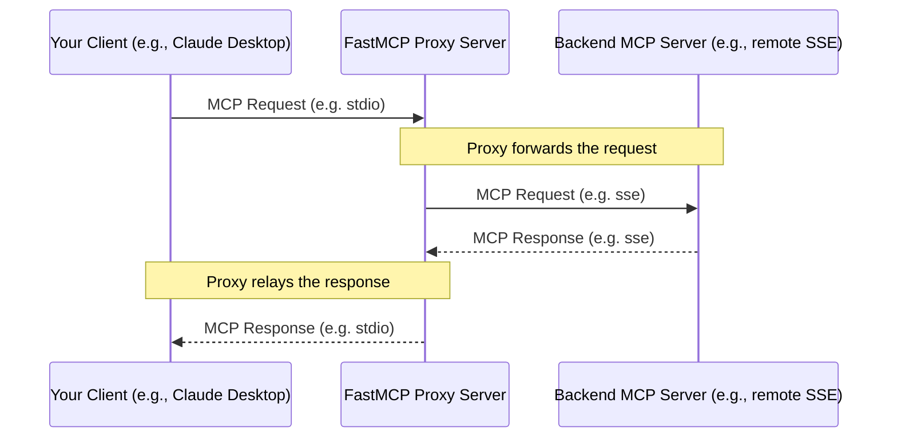

# Advanced Features
Source: https://gofastmcp.com/clients/advanced-features

Learn about the advanced features of the FastMCP Client.

export const VersionBadge = ({version}) => {
  return <code className="version-badge-container">
            <div className="version-badge">
                <span className="version-badge-label">New in version:</span> 
                <span className="version-badge-version">{version}</span>
            </div>
        </code>;
};

In addition to basic server interaction, FastMCP clients can also handle more advanced features and server interaction patterns. The `Client` constructor accepts additional configuration to handle these server requests.

<Tip>
  To enable many of these features, you must provide an appropriate handler or callback function. For example. In most cases, if you do not provide a handler, FastMCP's default handler will emit a `DEBUG` level log.
</Tip>

## Logging and Notifications

<VersionBadge version="2.0.0" />

MCP servers can emit logs to clients. To process these logs, you can provide a `log_handler` to the client.

The `log_handler` must be an async function that accepts a single argument, which is an instance of `fastmcp.client.logging.LogMessage`. This has attributes like `level`, `logger`, and `data`.

```python {2, 12}
from fastmcp import Client
from fastmcp.client.logging import LogMessage

async def log_handler(message: LogMessage):
    level = message.level.upper()
    logger = message.logger or 'default'
    data = message.data
    print(f"[Server Log - {level}] {logger}: {data}")

client_with_logging = Client(
    ...,
    log_handler=log_handler,
)
```

## Progress Monitoring

<VersionBadge version="2.3.5" />

MCP servers can report progress during long-running operations. The client can set a progress handler to receive and process these updates.

```python {2, 13}
from fastmcp import Client
from fastmcp.client.progress import ProgressHandler

async def my_progress_handler(
    progress: float, 
    total: float | None, 
    message: str | None
) -> None:
    print(f"Progress: {progress} / {total} ({message})")

client = Client(
    ...,
    progress_handler=my_progress_handler
)
```

By default, FastMCP uses a handler that logs progress updates at the debug level. This default handler properly handles cases where `total` or `message` might be None.

You can override the progress handler for specific tool calls:

```python
# Client uses the default debug logger for progress
client = Client(...)

async with client:
    # Use default progress handler (debug logging)
    result1 = await client.call_tool("long_task", {"param": "value"})
    
    # Override with custom progress handler just for this call
    result2 = await client.call_tool(
        "another_task", 
        {"param": "value"}, 
        progress_handler=my_progress_handler
    )
```

A typical progress update includes:

* Current progress value (e.g., 2 of 5 steps completed)
* Total expected value (may be None)
* Status message (may be None)

## LLM Sampling

<VersionBadge version="2.0.0" />

MCP Servers can request LLM completions from clients. The client can provide a `sampling_handler` to handle these requests. The sampling handler receives a list of messages and other parameters from the server, and should return a string completion.

The following example uses the `marvin` library to generate a completion:

```python {8-17, 21}
import marvin
from fastmcp import Client
from fastmcp.client.sampling import (
    SamplingMessage,
    SamplingParams,
    RequestContext,
)

async def sampling_handler(
    messages: list[SamplingMessage],
    params: SamplingParams,
    context: RequestContext
) -> str:
    return await marvin.say_async(
        message=[m.content.text for m in messages],
        instructions=params.systemPrompt,
    )

client = Client(
    ...,
    sampling_handler=sampling_handler,
)
```

## Roots

<VersionBadge version="2.0.0" />

Roots are a way for clients to inform servers about the resources they have access to or certain boundaries on their access. The server can use this information to adjust behavior or provide more accurate responses.

Servers can request roots from clients, and clients can notify servers when their roots change.

To set the roots when creating a client, users can either provide a list of roots (which can be a list of strings) or an async function that returns a list of roots.

<CodeGroup>
  ```python Static Roots {5}
  from fastmcp import Client

  client = Client(
      ..., 
      roots=["/path/to/root1", "/path/to/root2"],
  )
  ```

  ```python Dynamic Roots Callback {4-6, 10}
  from fastmcp import Client
  from fastmcp.client.roots import RequestContext

  async def roots_callback(context: RequestContext) -> list[str]:
      print(f"Server requested roots (Request ID: {context.request_id})")
      return ["/path/to/root1", "/path/to/root2"]

  client = Client(
      ..., 
      roots=roots_callback,
  )
  ```
</CodeGroup>


# Bearer Token Authentication
Source: https://gofastmcp.com/clients/auth/bearer

Authenticate your FastMCP client using pre-existing OAuth 2.0 Bearer tokens.

export const VersionBadge = ({version}) => {
  return <code className="version-badge-container">
            <div className="version-badge">
                <span className="version-badge-label">New in version:</span> 
                <span className="version-badge-version">{version}</span>
            </div>
        </code>;
};

<VersionBadge version="2.6.0" />

<Tip>
  Bearer Token authentication is only relevant for HTTP-based transports.
</Tip>

You can configure your FastMCP client to use **bearer authentication** by supplying a valid access token. This is most appropriate for service accounts, long-lived API keys, CI/CD, applications where authentication is managed separately, or other non-interactive authentication methods.

A Bearer token is a JSON Web Token (JWT) that is used to authenticate a request. It is most commonly used in the `Authorization` header of an HTTP request, using the `Bearer` scheme:

```http
Authorization: Bearer <token>
```

## Client Usage

The most straightforward way to use a pre-existing Bearer token is to provide it as a string to the `auth` parameter of the `fastmcp.Client` or transport instance. FastMCP will automatically format it correctly for the `Authorization` header and bearer scheme.

<Tip>
  If you're using a string token, do not include the `Bearer` prefix. FastMCP will add it for you.
</Tip>

```python {5}
from fastmcp import Client

async with Client(
    "https://fastmcp.cloud/mcp", 
    auth="<your-token>",
) as client:
    await client.ping()
```

You can also supply a Bearer token to a transport instance, such as `StreamableHttpTransport` or `SSETransport`:

```python {6}
from fastmcp import Client
from fastmcp.client.transports import StreamableHttpTransport

transport = StreamableHttpTransport(
    "http://fastmcp.cloud/mcp", 
    auth="<your-token>",
)

async with Client(transport) as client:
    await client.ping()
```

## `BearerAuth` Helper

If you prefer to be more explicit and not rely on FastMCP to transform your string token, you can use the `BearerAuth` class yourself, which implements the `httpx.Auth` interface.

```python {6}
from fastmcp import Client
from fastmcp.client.auth import BearerAuth

async with Client(
    "https://fastmcp.cloud/mcp", 
    auth=BearerAuth(token="<your-token>"),
) as client:
    await client.ping()
```

## Custom Headers

If the MCP server expects a custom header or token scheme, you can manually set the client's `headers` instead of using the `auth` parameter:

```python {5}
from fastmcp import Client

async with Client(
    "https://fastmcp.cloud/mcp", 
    headers={"X-API-Key": "<your-token>"},
) as client:
    await client.ping()
```


# OAuth Authentication
Source: https://gofastmcp.com/clients/auth/oauth

Authenticate your FastMCP client with servers using the OAuth 2.0 Authorization Code Grant, including user interaction via a web browser.

export const VersionBadge = ({version}) => {
  return <code className="version-badge-container">
            <div className="version-badge">
                <span className="version-badge-label">New in version:</span> 
                <span className="version-badge-version">{version}</span>
            </div>
        </code>;
};

<VersionBadge version="2.6.0" />

<Tip>
  OAuth authentication is only relevant for HTTP-based transports and requires user interaction via a web browser.
</Tip>

When your FastMCP client needs to access an MCP server protected by OAuth 2.0, and the process requires user interaction (like logging in and granting consent), you should use the Authorization Code Flow. FastMCP provides the `fastmcp.client.auth.OAuth` helper to simplify this entire process.

This flow is common for user-facing applications where the application acts on behalf of the user.

## Client Usage

### Default Configuration

The simplest way to use OAuth is to pass the string `"oauth"` to the `auth` parameter of the `Client` or transport instance. FastMCP will automatically configure the client to use OAuth with default settings:

```python {4}
from fastmcp import Client

# Uses default OAuth settings
async with Client("https://fastmcp.cloud/mcp", auth="oauth") as client:
    await client.ping()
```

### `OAuth` Helper

To fully configure the OAuth flow, use the `OAuth` helper and pass it to the `auth` parameter of the `Client` or transport instance. `OAuth` manages the complexities of the OAuth 2.0 Authorization Code Grant with PKCE (Proof Key for Code Exchange) for enhanced security, and implements the full `httpx.Auth` interface.

```python {2, 4, 6}
from fastmcp import Client
from fastmcp.client.auth import OAuth

oauth = OAuth(mcp_url="https://fastmcp.cloud/mcp")

async with Client("https://fastmcp.cloud/mcp", auth=oauth) as client:
    await client.ping()
```

#### `OAuth` Parameters

* **`mcp_url`** (`str`): The full URL of the target MCP server endpoint. Used to discover OAuth server metadata
* **`scopes`** (`str | list[str]`, optional): OAuth scopes to request. Can be space-separated string or list of strings
* **`client_name`** (`str`, optional): Client name for dynamic registration. Defaults to `"FastMCP Client"`
* **`token_storage_cache_dir`** (`Path`, optional): Token cache directory. Defaults to `~/.fastmcp/oauth-mcp-client-cache/`
* **`additional_client_metadata`** (`dict[str, Any]`, optional): Extra metadata for client registration

## OAuth Flow

The OAuth flow is triggered when you use a FastMCP `Client` configured to use OAuth.

<Steps>
  <Step title="Token Check">
    The client first checks the `token_storage_cache_dir` for existing, valid tokens for the target server. If one is found, it will be used to authenticate the client.
  </Step>

  <Step title="OAuth Server Discovery">
    If no valid tokens exist, the client attempts to discover the OAuth server's endpoints using a well-known URI (e.g., `/.well-known/oauth-authorization-server`) based on the `mcp_url`.
  </Step>

  <Step title="Dynamic Client Registration">
    If the OAuth server supports it and the client isn't already registered (or credentials aren't cached), the client performs dynamic client registration according to RFC 7591.
  </Step>

  <Step title="Local Callback Server">
    A temporary local HTTP server is started on an available port. This server's address (e.g., `http://127.0.0.1:<port>/callback`) acts as the `redirect_uri` for the OAuth flow.
  </Step>

  <Step title="Browser Interaction">
    The user's default web browser is automatically opened, directing them to the OAuth server's authorization endpoint. The user logs in and grants (or denies) the requested `scopes`.
  </Step>

  <Step title="Authorization Code & Token Exchange">
    Upon approval, the OAuth server redirects the user's browser to the local callback server with an `authorization_code`. The client captures this code and exchanges it with the OAuth server's token endpoint for an `access_token` (and often a `refresh_token`) using PKCE for security.
  </Step>

  <Step title="Token Caching">
    The obtained tokens are saved to the `token_storage_cache_dir` for future use, eliminating the need for repeated browser interactions.
  </Step>

  <Step title="Authenticated Requests">
    The access token is automatically included in the `Authorization` header for requests to the MCP server.
  </Step>

  <Step title="Refresh Token">
    If the access token expires, the client will automatically use the refresh token to get a new access token.
  </Step>
</Steps>

## Token Management

### Token Storage

OAuth access tokens are automatically cached in `~/.fastmcp/oauth-mcp-client-cache/` and persist between application runs. Files are keyed by the OAuth server's base URL.

### Managing Cache

To clear the tokens for a specific server, instantiate a `FileTokenStorage` instance and call the `clear` method:

```python
from fastmcp.client.auth import FileTokenStorage

storage = FileTokenStorage(server_url="https://fastmcp.cloud/mcp")
await storage.clear()
```

To clear *all* tokens for all servers, call the `clear_all` method on the `FileTokenStorage` class:

```python
from fastmcp.client.auth import FileTokenStorage

FileTokenStorage.clear_all()
```


# Client Overview
Source: https://gofastmcp.com/clients/client

Learn how to use the FastMCP Client to interact with MCP servers.

export const VersionBadge = ({version}) => {
  return <code className="version-badge-container">
            <div className="version-badge">
                <span className="version-badge-label">New in version:</span> 
                <span className="version-badge-version">{version}</span>
            </div>
        </code>;
};

<VersionBadge version="2.0.0" />

The `fastmcp.Client` provides a high-level, asynchronous interface for interacting with any Model Context Protocol (MCP) server, whether it's built with FastMCP or another implementation. It simplifies communication by handling protocol details and connection management.

## FastMCP Client

The FastMCP Client architecture separates the protocol logic (`Client`) from the connection mechanism (`Transport`).

* **`Client`**: Handles sending MCP requests (like `tools/call`, `resources/read`), receiving responses, and managing callbacks.
* **`Transport`**: Responsible for establishing and maintaining the connection to the server (e.g., via WebSockets, SSE, Stdio, or in-memory).

### Transports

Clients must be initialized with a `transport`. You can either provide an already instantiated transport object, or provide a transport source and let FastMCP attempt to infer the correct transport to use.

The following inference rules are used to determine the appropriate `ClientTransport` based on the input type:

1. **`ClientTransport` Instance**: If you provide an already instantiated transport object, it's used directly.
2. **`FastMCP` Instance**: Creates a `FastMCPTransport` for efficient in-memory communication (ideal for testing). This also works with a **FastMCP 1.0 server** created via `mcp.server.fastmcp.FastMCP`.
3. **`Path` or `str` pointing to an existing file**:
   * If it ends with `.py`: Creates a `PythonStdioTransport` to run the script using `python`.
   * If it ends with `.js`: Creates a `NodeStdioTransport` to run the script using `node`.
4. **`AnyUrl` or `str` pointing to a URL that begins with `http://` or `https://`**:
   * Creates a `StreamableHttpTransport`
5. **`MCPConfig` or dictionary matching MCPConfig schema**: Creates a client that connects to one or more MCP servers specified in the config.
6. **Other**: Raises a `ValueError` if the type cannot be inferred.

```python
import asyncio
from fastmcp import Client, FastMCP

# Example transports (more details in Transports page)
server_instance = FastMCP(name="TestServer") # In-memory server
http_url = "https://example.com/mcp"        # HTTP server URL
server_script = "my_mcp_server.py"         # Path to a Python server file

# Client automatically infers the transport type
client_in_memory = Client(server_instance)
client_http = Client(http_url)

client_stdio = Client(server_script)

print(client_in_memory.transport)
print(client_http.transport)
print(client_stdio.transport)

# Expected Output (types may vary slightly based on environment):
# <FastMCP(server='TestServer')>
# <StreamableHttp(url='https://example.com/mcp')>
# <PythonStdioTransport(command='python', args=['/path/to/your/my_mcp_server.py'])>
```

You can also initialize a client from an MCP configuration dictionary or `MCPConfig` file:

```python
from fastmcp import Client

config = {
    "mcpServers": {
        "local": {"command": "python", "args": ["local_server.py"]},
        "remote": {"url": "https://example.com/mcp"},
    }
}

client_config = Client(config)
```

<Tip>
  For more control over connection details (like headers for SSE, environment variables for Stdio), you can instantiate the specific `ClientTransport` class yourself and pass it to the `Client`. See the [Transports](/clients/transports) page for details.
</Tip>

### Multi-Server Clients

<VersionBadge version="2.4.0" />

FastMCP supports creating clients that connect to multiple MCP servers through a single client interface using a standard MCP configuration format (`MCPConfig`). This configuration approach makes it easy to connect to multiple specialized servers or create composable systems with a simple, declarative syntax.

<Note>
  The MCP configuration format follows an emerging standard and may evolve as the specification matures. FastMCP will strive to maintain compatibility with future versions, but be aware that field names or structure might change.
</Note>

When you create a client with an `MCPConfig` containing multiple servers:

1. FastMCP creates a composite client that internally mounts all servers using their config names as prefixes
2. Tools and resources from each server are accessible with appropriate prefixes in the format `servername_toolname` and `protocol://servername/resource/path`
3. You interact with this as a single unified client, with requests automatically routed to the appropriate server

```python
from fastmcp import Client

# Create a standard MCP configuration with multiple servers
config = {
    "mcpServers": {
        # A remote HTTP server
        "weather": {
            "url": "https://weather-api.example.com/mcp",
            "transport": "streamable-http"
        },
        # A local server running via stdio
        "assistant": {
            "command": "python",
            "args": ["./my_assistant_server.py"],
            "env": {"DEBUG": "true"}
        }
    }
}

# Create a client that connects to both servers
client = Client(config)

async def main():
    async with client:
        # Access tools from different servers with prefixes
        weather_data = await client.call_tool("weather_get_forecast", {"city": "London"})
        response = await client.call_tool("assistant_answer_question", {"question": "What's the capital of France?"})
        
        # Access resources with prefixed URIs
        weather_icons = await client.read_resource("weather://weather/icons/sunny")
        templates = await client.read_resource("resource://assistant/templates/list")
        
        print(f"Weather: {weather_data}")
        print(f"Assistant: {response}")

if __name__ == "__main__":
    asyncio.run(main())
```

If your configuration has only a single server, FastMCP will create a direct client to that server without any prefixing.

## Client Usage

### Connection Lifecycle

The client operates asynchronously and must be used within an `async with` block. This context manager handles establishing the connection, initializing the MCP session, and cleaning up resources upon exit.

```python
import asyncio
from fastmcp import Client

client = Client("my_mcp_server.py") # Assumes my_mcp_server.py exists

async def main():
    # Connection is established here
    async with client:
        print(f"Client connected: {client.is_connected()}")

        # Make MCP calls within the context
        tools = await client.list_tools()
        print(f"Available tools: {tools}")

        if any(tool.name == "greet" for tool in tools):
            result = await client.call_tool("greet", {"name": "World"})
            print(f"Greet result: {result}")

    # Connection is closed automatically here
    print(f"Client connected: {client.is_connected()}")

if __name__ == "__main__":
    asyncio.run(main())
```

You can make multiple calls to the server within the same `async with` block using the established session.

### Client Methods

The `Client` provides methods corresponding to standard MCP requests:

<Warning>
  The standard client methods return user-friendly representations that may change as the protocol evolves. For consistent access to the complete data structure, use the `*_mcp` methods described later.
</Warning>

#### Tool Operations

* **`list_tools()`**: Retrieves a list of tools available on the server.
  ```python
  tools = await client.list_tools()
  # tools -> list[mcp.types.Tool]
  ```
* **`call_tool(name: str, arguments: dict[str, Any] | None = None, timeout: float | None = None, progress_handler: ProgressHandler | None = None)`**: Executes a tool on the server.
  ```python
  result = await client.call_tool("add", {"a": 5, "b": 3})
  # result -> list[mcp.types.TextContent | mcp.types.ImageContent | ...]
  print(result[0].text) # Assuming TextContent, e.g., '8'

  # With timeout (aborts if execution takes longer than 2 seconds)
  result = await client.call_tool("long_running_task", {"param": "value"}, timeout=2.0)

  # With progress handler (to track execution progress)
  result = await client.call_tool(
      "long_running_task",
      {"param": "value"},
      progress_handler=my_progress_handler
  )
  ```
  * Arguments are passed as a dictionary. FastMCP servers automatically handle JSON string parsing for complex types if needed.
  * Returns a list of content objects (usually `TextContent` or `ImageContent`).
  * The optional `timeout` parameter limits the maximum execution time (in seconds) for this specific call, overriding any client-level timeout.
  * The optional `progress_handler` parameter receives progress updates during execution, overriding any client-level progress handler.

#### Resource Operations

* **`list_resources()`**: Retrieves a list of static resources.
  ```python
  resources = await client.list_resources()
  # resources -> list[mcp.types.Resource]
  ```
* **`list_resource_templates()`**: Retrieves a list of resource templates.
  ```python
  templates = await client.list_resource_templates()
  # templates -> list[mcp.types.ResourceTemplate]
  ```
* **`read_resource(uri: str | AnyUrl)`**: Reads the content of a resource or a resolved template.
  ```python
  # Read a static resource
  readme_content = await client.read_resource("file:///path/to/README.md")
  # readme_content -> list[mcp.types.TextResourceContents | mcp.types.BlobResourceContents]
  print(readme_content[0].text) # Assuming text

  # Read a resource generated from a template
  weather_content = await client.read_resource("data://weather/london")
  print(weather_content[0].text) # Assuming text JSON
  ```

#### Prompt Operations

* **`list_prompts()`**: Retrieves available prompt templates.
* **`get_prompt(name: str, arguments: dict[str, Any] | None = None)`**: Retrieves a rendered prompt message list.

### Raw MCP Protocol Objects

<VersionBadge version="2.2.7" />

The FastMCP client attempts to provide a "friendly" interface to the MCP protocol, but sometimes you may need access to the raw MCP protocol objects. Each of the main client methods that returns data has a corresponding `*_mcp` method that returns the raw MCP protocol objects directly.

<Warning>
  The standard client methods (without `_mcp`) return user-friendly representations of MCP data, while `*_mcp` methods will always return the complete MCP protocol objects. As the protocol evolves, changes to these user-friendly representations may occur and could potentially be breaking. If you need consistent, stable access to the full data structure, prefer using the `*_mcp` methods.
</Warning>

```python
# Standard method - returns just the list of tools
tools = await client.list_tools()
# tools -> list[mcp.types.Tool]

# Raw MCP method - returns the full protocol object
result = await client.list_tools_mcp()
# result -> mcp.types.ListToolsResult
tools = result.tools
```

Available raw MCP methods:

* **`list_tools_mcp()`**: Returns `mcp.types.ListToolsResult`
* **`call_tool_mcp(name, arguments)`**: Returns `mcp.types.CallToolResult`
* **`list_resources_mcp()`**: Returns `mcp.types.ListResourcesResult`
* **`list_resource_templates_mcp()`**: Returns `mcp.types.ListResourceTemplatesResult`
* **`read_resource_mcp(uri)`**: Returns `mcp.types.ReadResourceResult`
* **`list_prompts_mcp()`**: Returns `mcp.types.ListPromptsResult`
* **`get_prompt_mcp(name, arguments)`**: Returns `mcp.types.GetPromptResult`
* **`complete_mcp(ref, argument)`**: Returns `mcp.types.CompleteResult`

These methods are especially useful for debugging or when you need to access metadata or fields that aren't exposed by the simplified methods.

### Additional Features

#### Pinging the Server

The client can be used to ping the server to verify connectivity.

```python
async with client:
    await client.ping()
    print("Server is reachable")
```

#### Session Management

When using stdio transports, clients support a `keep_alive` feature (enabled by default) that maintains subprocess sessions between connection contexts. You can manually control this behavior using the client's `close()` method.

When `keep_alive=False`, the client will automatically close the session when the context manager exits.

```python
from fastmcp import Client

client = Client("my_mcp_server.py")  # keep_alive=True by default

async def example():
    async with client:
        await client.ping()
    
    async with client:
        await client.ping()  # Same subprocess as above
```

<Note>
  For detailed examples and configuration options, see [Session Management in Transports](/clients/transports#session-management).
</Note>

#### Timeouts

<VersionBadge version="2.3.4" />

You can control request timeouts at both the client level and individual request level:

```python
from fastmcp import Client
from fastmcp.exceptions import McpError

# Client with a global 5-second timeout for all requests
client = Client(
    my_mcp_server,
    timeout=5.0  # Default timeout in seconds
)

async with client:
    # This uses the global 5-second timeout
    result1 = await client.call_tool("quick_task", {"param": "value"})
    
    # This specifies a 10-second timeout for this specific call
    result2 = await client.call_tool("slow_task", {"param": "value"}, timeout=10.0)
    
    try:
        # This will likely timeout
        result3 = await client.call_tool("medium_task", {"param": "value"}, timeout=0.01)
    except McpError as e:
        # Handle timeout error
        print(f"The task timed out: {e}")
```

<Warning>
  Timeout behavior varies between transport types:

  * With **SSE** transport, the per-request (tool call) timeout **always** takes precedence, regardless of which is lower.
  * With **HTTP** transport, the **lower** of the two timeouts (client or tool call) takes precedence.

  For consistent behavior across all transports, we recommend explicitly setting timeouts at the individual tool call level when needed, rather than relying on client-level timeouts.
</Warning>

#### Error Handling

When a `call_tool` request results in an error on the server (e.g., the tool function raised an exception), the `client.call_tool()` method will raise a `fastmcp.exceptions.ClientError`.

```python
async def safe_call_tool():
    async with client:
        try:
            # Assume 'divide' tool exists and might raise ZeroDivisionError
            result = await client.call_tool("divide", {"a": 10, "b": 0})
            print(f"Result: {result}")
        except ClientError as e:
            print(f"Tool call failed: {e}")
        except ConnectionError as e:
            print(f"Connection failed: {e}")
        except Exception as e:
            print(f"An unexpected error occurred: {e}")

# Example Output if division by zero occurs:
# Tool call failed: Division by zero is not allowed.
```

Other errors, like connection failures, will raise standard Python exceptions (e.g., `ConnectionError`, `TimeoutError`).

<Tip>
  The client transport often has its own error-handling mechanisms, so you can not always trap errors like those raised by `call_tool` outside of the `async with` block. Instead, you can use `call_tool_mcp()` to get the raw `mcp.types.CallToolResult` object and handle errors yourself by checking its `isError` attribute.
</Tip>


# Client Transports
Source: https://gofastmcp.com/clients/transports

Understand the different ways FastMCP Clients can connect to servers.

export const VersionBadge = ({version}) => {
  return <code className="version-badge-container">
            <div className="version-badge">
                <span className="version-badge-label">New in version:</span> 
                <span className="version-badge-version">{version}</span>
            </div>
        </code>;
};

<VersionBadge version="2.0.0" />

The FastMCP `Client` relies on a `ClientTransport` object to handle the specifics of connecting to and communicating with an MCP server. FastMCP provides several built-in transport implementations for common connection methods.

While the `Client` often infers the correct transport automatically (see [Client Overview](/clients/client#transport-inference)), you can also instantiate transports explicitly for more control.

<Tip>
  Clients are lightweight objects, so don't hesitate to create new ones as needed. However, be mindful of the context management - each time you open a client context (`async with client:`), a new connection or process starts. For best performance, keep client contexts open while performing multiple operations rather than repeatedly opening and closing them.
</Tip>

## Choosing a Transport

Choose the transport that best fits your use case:

* **Connecting to Remote/Persistent Servers:** Use `StreamableHttpTransport` (recommended, default for HTTP URLs) or `SSETransport` (legacy option) for web-based deployments.

* **Local Development/Testing:** Use `FastMCPTransport` for in-memory, same-process testing of your FastMCP servers.

* **Running Local Servers:** Use `UvxStdioTransport` (Python/uv) or `NpxStdioTransport` (Node/npm) if you need to run MCP servers as packaged tools.

## Network Transports

These transports connect to servers running over a network, typically long-running services accessible via URLs.

### Streamable HTTP

<VersionBadge version="2.3.0" />

Streamable HTTP is the recommended transport for web-based deployments, providing efficient bidirectional communication over HTTP.

#### Overview

* **Class:** `fastmcp.client.transports.StreamableHttpTransport`
* **Inferred From:** URLs starting with `http://` or `https://` (default for HTTP URLs since v2.3.0) that do not contain `/sse/` in the path
* **Server Compatibility:** Works with FastMCP servers running in `streamable-http` mode

#### Basic Usage

The simplest way to use Streamable HTTP is to let the transport be inferred from a URL:

```python
from fastmcp import Client
import asyncio

# The Client automatically uses StreamableHttpTransport for HTTP URLs
client = Client("https://example.com/mcp")

async def main():
    async with client:
        tools = await client.list_tools()
        print(f"Available tools: {tools}")

asyncio.run(main())
```

You can also explicitly instantiate the transport:

```python
from fastmcp.client.transports import StreamableHttpTransport

transport = StreamableHttpTransport(url="https://example.com/mcp")
client = Client(transport)
```

#### Authentication with Headers

For servers requiring authentication:

```python
from fastmcp import Client
from fastmcp.client.transports import StreamableHttpTransport

# Create transport with authentication headers
transport = StreamableHttpTransport(
    url="https://example.com/mcp",
    headers={"Authorization": "Bearer your-token-here"}
)

client = Client(transport)
```

### SSE (Server-Sent Events)

<VersionBadge version="2.0.0" />

Server-Sent Events (SSE) is a transport that allows servers to push data to clients over HTTP connections. While still supported, Streamable HTTP is now the recommended transport for new web-based deployments.

#### Overview

* **Class:** `fastmcp.client.transports.SSETransport`
* **Inferred From:** HTTP URLs containing `/sse/` in the path
* **Server Compatibility:** Works with FastMCP servers running in `sse` mode

#### Basic Usage

The simplest way to use SSE is to let the transport be inferred from a URL with `/sse/` in the path:

```python
from fastmcp import Client
import asyncio

# The Client automatically uses SSETransport for URLs containing /sse/ in the path
client = Client("https://example.com/sse")

async def main():
    async with client:
        tools = await client.list_tools()
        print(f"Available tools: {tools}")

asyncio.run(main())
```

You can also explicitly instantiate the transport for URLs that do not contain `/sse/` in the path or for more control:

```python
from fastmcp.client.transports import SSETransport

transport = SSETransport(url="https://example.com/sse")
client = Client(transport)
```

#### Authentication with Headers

SSE transport also supports custom headers for authentication:

```python
from fastmcp import Client
from fastmcp.client.transports import SSETransport

# Create SSE transport with authentication headers
transport = SSETransport(
    url="https://example.com/sse",
    headers={"Authorization": "Bearer your-token-here"}
)

client = Client(transport)
```

#### When to Use SSE vs. Streamable HTTP

* **Use Streamable HTTP when:**
  * Setting up new deployments (recommended default)
  * You need bidirectional streaming
  * You're connecting to FastMCP servers running in `streamable-http` mode

* **Use SSE when:**
  * Connecting to legacy FastMCP servers running in `sse` mode
  * Working with infrastructure optimized for Server-Sent Events

## Local Transports

These transports manage an MCP server running as a subprocess, communicating with it via standard input (stdin) and standard output (stdout). This is the standard mechanism used by clients like Claude Desktop.

### Session Management

All stdio transports support a `keep_alive` parameter (default: `True`) that controls session persistence across multiple client context managers:

* **`keep_alive=True` (default)**: The subprocess and session are maintained between client context exits and re-entries. This improves performance when making multiple separate connections to the same server.
* **`keep_alive=False`**: A new subprocess is started for each client context, ensuring complete isolation between sessions.

When `keep_alive=True`, you can manually close the session using `await client.close()` if needed. This will terminate the subprocess and require a new one to be started on the next connection.

<CodeGroup>
  ```python keep_alive=True
  from fastmcp import Client

  # Client with keep_alive=True (default)
  client = Client("my_mcp_server.py")

  async def example():
      # First session
      async with client:
          await client.ping()

      # Second session - uses the same subprocess
      async with client:
          await client.ping()

      # Manually close the session
      await client.close()

      # Third session - will start a new subprocess
      async with client:
          await client.ping()

  asyncio.run(example())
  ```

  ```python keep_alive=False
  from fastmcp import Client

  # Client with keep_alive=False
  client = Client("my_mcp_server.py", keep_alive=False)

  async def example():
      # First session
      async with client:
          await client.ping()
      
      # Second session - will start a new subprocess
      async with client:
          await client.ping()

      # Third session - will start a new subprocess
      async with client:
          await client.ping()

  asyncio.run(example())
  ```
</CodeGroup>

### Python Stdio

* **Class:** `fastmcp.client.transports.PythonStdioTransport`
* **Inferred From:** Paths to `.py` files
* **Use Case:** Running a Python-based MCP server script in a subprocess

This is the most common way to interact with local FastMCP servers during development or when integrating with tools that expect to launch a server script.

```python
from fastmcp import Client
from fastmcp.client.transports import PythonStdioTransport

server_script = "my_mcp_server.py" # Path to your server script

# Option 1: Inferred transport
client = Client(server_script)

# Option 2: Explicit transport with custom configuration
transport = PythonStdioTransport(
    script_path=server_script,
    python_cmd="/usr/bin/python3.11", # Optional: specify Python interpreter
    # args=["--some-server-arg"],      # Optional: pass arguments to the script
    # env={"MY_VAR": "value"},         # Optional: set environment variables
)
client = Client(transport)

async def main():
    async with client:
        tools = await client.list_tools()
        print(f"Connected via Python Stdio, found tools: {tools}")

asyncio.run(main())
```

<Warning>
  The server script must include logic to start the MCP server and listen on stdio, typically via `mcp.run()` or `fastmcp.server.run()`. The Client only launches the script; it doesn't inject the server logic.
</Warning>

### Node.js Stdio

* **Class:** `fastmcp.client.transports.NodeStdioTransport`
* **Inferred From:** Paths to `.js` files
* **Use Case:** Running a Node.js-based MCP server script in a subprocess

Similar to the Python transport, but for JavaScript servers.

```python
from fastmcp import Client
from fastmcp.client.transports import NodeStdioTransport

node_server_script = "my_mcp_server.js" # Path to your Node.js server script

# Option 1: Inferred transport
client = Client(node_server_script)

# Option 2: Explicit transport
transport = NodeStdioTransport(
    script_path=node_server_script,
    node_cmd="node", # Optional: specify path to Node executable
)
client = Client(transport)

async def main():
    async with client:
        tools = await client.list_tools()
        print(f"Connected via Node.js Stdio, found tools: {tools}")

asyncio.run(main())
```

### UVX Stdio (Experimental)

* **Class:** `fastmcp.client.transports.UvxStdioTransport`
* **Inferred From:** Not automatically inferred
* **Use Case:** Running an MCP server packaged as a Python tool using [`uvx`](https://docs.astral.sh/uv/reference/cli/#uvx)

This is useful for executing MCP servers distributed as command-line tools or packages without installing them into your environment.

```python
from fastmcp import Client
from fastmcp.client.transports import UvxStdioTransport

# Run a hypothetical 'cloud-analyzer-mcp' tool via uvx
transport = UvxStdioTransport(
    tool_name="cloud-analyzer-mcp",
    # from_package="cloud-analyzer-cli", # Optional: specify package if tool name differs
    # with_packages=["boto3", "requests"] # Optional: add dependencies
)
client = Client(transport)

async def main():
    async with client:
        result = await client.call_tool("analyze_bucket", {"name": "my-data"})
        print(f"Analysis result: {result}")

asyncio.run(main())
```

### NPX Stdio (Experimental)

* **Class:** `fastmcp.client.transports.NpxStdioTransport`
* **Inferred From:** Not automatically inferred
* **Use Case:** Running an MCP server packaged as an NPM package using `npx`

Similar to `UvxStdioTransport`, but for the Node.js ecosystem.

```python
from fastmcp import Client
from fastmcp.client.transports import NpxStdioTransport

# Run an MCP server from an NPM package
transport = NpxStdioTransport(
    package="mcp-server-package",
    # args=["--port", "stdio"] # Optional: pass arguments to the package
)
client = Client(transport)

async def main():
    async with client:
        result = await client.call_tool("get_npm_data", {})
        print(f"Result: {result}")

asyncio.run(main())
```

## In-Memory Transports

### FastMCP Transport

* **Class:** `fastmcp.client.transports.FastMCPTransport`
* **Inferred From:** An instance of `fastmcp.server.FastMCP` or a **FastMCP 1.0 server** (`mcp.server.fastmcp.FastMCP`)
* **Use Case:** Connecting directly to a FastMCP server instance in the same Python process

This is extremely useful for testing your FastMCP servers.

```python
from fastmcp import FastMCP, Client
import asyncio

# 1. Create your FastMCP server instance
server = FastMCP(name="InMemoryServer")

@server.tool()
def ping(): 
    return "pong"

# 2. Create a client pointing directly to the server instance
client = Client(server)  # Transport is automatically inferred

async def main():
    async with client:
        result = await client.call_tool("ping")
        print(f"In-memory call result: {result}")

asyncio.run(main())
```

Communication happens through efficient in-memory queues, making it very fast and ideal for unit testing.

## Configuration-Based Transports

### MCPConfig Transport

<VersionBadge version="2.4.0" />

* **Class:** `fastmcp.client.transports.MCPConfigTransport`
* **Inferred From:** An instance of `MCPConfig` or a dictionary matching the MCPConfig schema
* **Use Case:** Connecting to one or more MCP servers defined in a configuration object

MCPConfig follows an emerging standard for MCP server configuration but is subject to change as the specification evolves. The standard supports both local servers (running via stdio) and remote servers (accessed via HTTP).

```python
from fastmcp import Client

# Configuration for multiple MCP servers (both local and remote)
config = {
    "mcpServers": {
        # Remote HTTP server
        "weather": {
            "url": "https://weather-api.example.com/mcp",
            "transport": "streamable-http"
        },
        # Local stdio server
        "assistant": {
            "command": "python",
            "args": ["./assistant_server.py"],
            "env": {"DEBUG": "true"}
        },
        # Another remote server
        "calendar": {
            "url": "https://calendar-api.example.com/mcp",
            "transport": "streamable-http"
        }
    }
}

# Create a transport from the config (happens automatically with Client)
client = Client(config)

async def main():
    async with client:
        # Tools are accessible with server name prefixes
        weather = await client.call_tool("weather_get_forecast", {"city": "London"})
        answer = await client.call_tool("assistant_answer_question", {"query": "What is MCP?"})
        events = await client.call_tool("calendar_list_events", {"date": "2023-06-01"})
        
        # Resources use prefixed URI paths
        icons = await client.read_resource("weather://weather/icons/sunny")
        docs = await client.read_resource("resource://assistant/docs/mcp")

asyncio.run(main())
```

If your configuration has only a single server, the client will connect directly to that server without any prefixing. This makes it convenient to switch between single and multi-server configurations without changing your client code.

<Note>
  The MCPConfig format is an emerging standard for MCP server configuration and may change as the MCP ecosystem evolves. While FastMCP aims to maintain compatibility with future versions, be aware that field names or structure might change.
</Note>


# Integrating FastMCP in ASGI Applications
Source: https://gofastmcp.com/deployment/asgi

Integrate FastMCP servers into existing Starlette, FastAPI, or other ASGI applications

export const VersionBadge = ({version}) => {
  return <code className="version-badge-container">
            <div className="version-badge">
                <span className="version-badge-label">New in version:</span> 
                <span className="version-badge-version">{version}</span>
            </div>
        </code>;
};

While FastMCP provides standalone server capabilities, you can also integrate your FastMCP server into existing web applications. This approach is useful for:

* Adding MCP functionality to an existing website or API
* Mounting MCP servers under specific URL paths
* Combining multiple services in a single application
* Leveraging existing authentication and middleware

Please note that all FastMCP servers have a `run()` method that can be used to start the server. This guide focuses on integration with broader ASGI frameworks.

## ASGI Server

FastMCP servers can be created as [Starlette](https://www.starlette.io/) ASGI apps for straightforward hosting or integration into existing applications.

The first step is to obtain a Starlette application instance from your FastMCP server using the `http_app()` method:

<Tip>
  The `http_app()` method is new in FastMCP 2.3.2. In older versions, use `sse_app()` for SSE transport or `streamable_http_app()` for Streamable HTTP transport.
</Tip>

```python
from fastmcp import FastMCP

mcp = FastMCP("MyServer")

@mcp.tool()
def hello(name: str) -> str:
    return f"Hello, {name}!"

# Get a Starlette app instance for Streamable HTTP transport (recommended)
http_app = mcp.http_app()

# For legacy SSE transport (deprecated)
sse_app = mcp.http_app(transport="sse")
```

Both approaches return a Starlette application that can be integrated with other ASGI-compatible web frameworks.

The returned app stores the `FastMCP` instance on `app.state.fastmcp_server`, so you
can access it from custom middleware or routes via `request.app.state.fastmcp_server`.

The MCP server's endpoint is mounted at the root path `/mcp` for Streamable HTTP transport, and `/sse` for SSE transport, though you can change these paths by passing a `path` argument to the `http_app()` method:

```python
# For Streamable HTTP transport
http_app = mcp.http_app(path="/custom-mcp-path")

# For SSE transport (deprecated)
sse_app = mcp.http_app(path="/custom-sse-path", transport="sse")
```

### Running the Server

To run the FastMCP server, you can use the `uvicorn` ASGI server:

```python
from fastmcp import FastMCP
import uvicorn

mcp = FastMCP("MyServer")

http_app = mcp.http_app()

if __name__ == "__main__":
    uvicorn.run(http_app, host="0.0.0.0", port=8000)
```

Or, from the command line:

```bash
uvicorn path.to.your.app:http_app --host 0.0.0.0 --port 8000
```

### Custom Middleware

<VersionBadge version="2.3.2" />

You can add custom Starlette middleware to your FastMCP ASGI apps by passing a list of middleware instances to the app creation methods:

```python
from fastmcp import FastMCP
from starlette.middleware import Middleware
from starlette.middleware.cors import CORSMiddleware

# Create your FastMCP server
mcp = FastMCP("MyServer")

# Define custom middleware
custom_middleware = [
    Middleware(CORSMiddleware, allow_origins=["*"]),
]

# Create ASGI app with custom middleware
http_app = mcp.http_app(middleware=custom_middleware)
```

## Starlette Integration

<VersionBadge version="2.3.1" />

You can mount your FastMCP server in another Starlette application:

```python
from fastmcp import FastMCP
from starlette.applications import Starlette
from starlette.routing import Mount

# Create your FastMCP server as well as any tools, resources, etc.
mcp = FastMCP("MyServer")

# Create the ASGI app
mcp_app = mcp.http_app(path='/mcp')

# Create a Starlette app and mount the MCP server
app = Starlette(
    routes=[
        Mount("/mcp-server", app=mcp_app),
        # Add other routes as needed
    ],
    lifespan=mcp_app.lifespan,
)
```

The MCP endpoint will be available at `/mcp-server/mcp` of the resulting Starlette app.

<Warning>
  For Streamable HTTP transport, you **must** pass the lifespan context from the FastMCP app to the resulting Starlette app, as nested lifespans are not recognized. Otherwise, the FastMCP server's session manager will not be properly initialized.
</Warning>

### Nested Mounts

You can create complex routing structures by nesting mounts:

```python
from fastmcp import FastMCP
from starlette.applications import Starlette
from starlette.routing import Mount

# Create your FastMCP server as well as any tools, resources, etc.
mcp = FastMCP("MyServer")

# Create the ASGI app
mcp_app = mcp.http_app(path='/mcp')

# Create nested application structure
inner_app = Starlette(routes=[Mount("/inner", app=mcp_app)])
app = Starlette(
    routes=[Mount("/outer", app=inner_app)],
    lifespan=mcp_app.lifespan,
)
```

In this setup, the MCP server is accessible at the `/outer/inner/mcp` path of the resulting Starlette app.

<Warning>
  For Streamable HTTP transport, you **must** pass the lifespan context from the FastMCP app to the *outer* Starlette app, as nested lifespans are not recognized. Otherwise, the FastMCP server's session manager will not be properly initialized.
</Warning>

## FastAPI Integration

<VersionBadge version="2.3.1" />

FastAPI is built on Starlette, so you can mount your FastMCP server in a similar way:

```python
from fastmcp import FastMCP
from fastapi import FastAPI
from starlette.routing import Mount

# Create your FastMCP server as well as any tools, resources, etc.
mcp = FastMCP("MyServer")

# Create the ASGI app
mcp_app = mcp.http_app(path='/mcp')

# Create a FastAPI app and mount the MCP server
app = FastAPI(lifespan=mcp_app.lifespan)
app.mount("/mcp-server", mcp_app)
```

The MCP endpoint will be available at `/mcp-server/mcp` of the resulting FastAPI app.

<Warning>
  For Streamable HTTP transport, you **must** pass the lifespan context from the FastMCP app to the resulting FastAPI app, as nested lifespans are not recognized. Otherwise, the FastMCP server's session manager will not be properly initialized.
</Warning>

## Custom Routes

In addition to adding your FastMCP server to an existing ASGI app, you can also add custom web routes to your FastMCP server, which will be exposed alongside the MCP endpoint. To do so, use the `@custom_route` decorator. Note that this is less flexible than using a full ASGI framework, but can be useful for adding simple endpoints like health checks to your standalone server.

```python
from fastmcp import FastMCP
from starlette.requests import Request
from starlette.responses import PlainTextResponse

mcp = FastMCP("MyServer")

@mcp.custom_route("/health", methods=["GET"])
async def health_check(request: Request) -> PlainTextResponse:
    return PlainTextResponse("OK")
```

These routes will be included in the FastMCP app when mounted in your web application.


# Running Your FastMCP Server
Source: https://gofastmcp.com/deployment/running-server

Learn how to run and deploy your FastMCP server using various transport protocols like STDIO, Streamable HTTP, and SSE.

export const VersionBadge = ({version}) => {
  return <code className="version-badge-container">
            <div className="version-badge">
                <span className="version-badge-label">New in version:</span> 
                <span className="version-badge-version">{version}</span>
            </div>
        </code>;
};

FastMCP servers can be run in different ways depending on your application's needs, from local command-line tools to persistent web services. This guide covers the primary methods for running your server, focusing on the available transport protocols: STDIO, Streamable HTTP, and SSE.

## The `run()` Method

FastMCP servers can be run directly from Python by calling the `run()` method on a `FastMCP` instance.

<Tip>
  For maximum compatibility, it's best practice to place the `run()` call within an `if __name__ == "__main__":` block. This ensures the server starts only when the script is executed directly, not when imported as a module.
</Tip>

```python {9-10} my_server.py
from fastmcp import FastMCP

mcp = FastMCP(name="MyServer")

@mcp.tool()
def hello(name: str) -> str:
    return f"Hello, {name}!"

if __name__ == "__main__":
    mcp.run()
```

You can now run this MCP server by executing `python my_server.py`.

MCP servers can be run with a variety of different transport options, depending on your application's requirements. The `run()` method can take a `transport` argument and other transport-specific keyword arguments to configure how the server operates.

## The FastMCP CLI

FastMCP also provides a command-line interface for running servers without modifying the source code. After installing FastMCP, you can run your server directly from the command line:

```bash
fastmcp run server.py
```

<Tip>
  **Important**: When using `fastmcp run`, it **ignores** the `if __name__ == "__main__"` block entirely. Instead, it looks for a FastMCP object named `mcp`, `server`, or `app` and calls its `run()` method directly with the transport options you specify.

  This means you can use `fastmcp run` to override the transport specified in your code, which is particularly useful for testing or changing deployment methods without modifying the code.
</Tip>

You can specify transport options and other configuration:

```bash
fastmcp run server.py --transport sse --port 9000
```

For development and testing, you can use the `dev` command to run your server with the MCP Inspector:

```bash
fastmcp dev server.py
```

See the [CLI documentation](/deployment/cli) for detailed information about all available commands and options.

## Transport Options

Below is a comparison of available transport options to help you choose the right one for your needs:

| Transport           | Use Cases                                                                            | Recommendation                                                |
| ------------------- | ------------------------------------------------------------------------------------ | ------------------------------------------------------------- |
| **STDIO**           | Local tools, command-line scripts, and integrations with clients like Claude Desktop | Best for local tools and when clients manage server processes |
| **Streamable HTTP** | Web-based deployments, microservices, exposing MCP over a network                    | Recommended choice for web-based deployments                  |
| **SSE**             | Existing web-based deployments that rely on SSE                                      | Deprecated - prefer Streamable HTTP for new projects          |

### STDIO

The STDIO transport is the default and most widely compatible option for local MCP server execution. It is ideal for local tools, command-line integrations, and clients like Claude Desktop. However, it has the disadvantage of having to run the MCP code locally, which can introduce security concerns with third-party servers.

STDIO is the default transport, so you don't need to specify it when calling `run()`. However, you can specify it explicitly to make your intent clear:

```python {6}
from fastmcp import FastMCP

mcp = FastMCP()

if __name__ == "__main__":
    mcp.run(transport="stdio")
```

When using Stdio transport, you will typically *not* run the server yourself as a separate process. Rather, your *clients* will spin up a new server process for each session. As such, no additional configuration is required.

### Streamable HTTP

<VersionBadge version="2.3.0" />

Streamable HTTP is a modern, efficient transport for exposing your MCP server via HTTP. It is the recommended transport for web-based deployments.

To run a server using Streamable HTTP, you can use the `run()` method with the `transport` argument set to `"streamable-http"`. This will start a Uvicorn server on the default host (`127.0.0.1`), port (`8000`), and path (`/mcp`).

<CodeGroup>
  ```python {6} server.py
  from fastmcp import FastMCP

  mcp = FastMCP()

  if __name__ == "__main__":
      mcp.run(transport="streamable-http")
  ```

  ```python {5} client.py
  import asyncio
  from fastmcp import Client

  async def example():
      async with Client("http://127.0.0.1:8000/mcp") as client:
          await client.ping()

  if __name__ == "__main__":
      asyncio.run(example())
  ```
</CodeGroup>

To customize the host, port, path, or log level, provide appropriate keyword arguments to the `run()` method.

<CodeGroup>
  ```python {8-11} server.py
  from fastmcp import FastMCP

  mcp = FastMCP()

  if __name__ == "__main__":
      mcp.run(
          transport="streamable-http",
          host="127.0.0.1",
          port=4200,
          path="/my-custom-path",
          log_level="debug",
      )
  ```

  ```python {5} client.py
  import asyncio
  from fastmcp import Client

  async def example():
      async with Client("http://127.0.0.1:4200/my-custom-path") as client:
          await client.ping()

  if __name__ == "__main__":
      asyncio.run(example())
  ```
</CodeGroup>

### SSE

<Warning>
  The SSE transport is deprecated and may be removed in a future version.
  New applications should use Streamable HTTP transport instead.
</Warning>

Server-Sent Events (SSE) is an HTTP-based protocol for server-to-client streaming. While FastMCP still supports SSE, it is deprecated and Streamable HTTP is preferred for new projects.

To run a server using SSE, you can use the `run()` method with the `transport` argument set to `"sse"`. This will start a Uvicorn server on the default host (`127.0.0.1`), port (`8000`), and with default SSE path (`/sse`) and message path (`/messages/`).

<CodeGroup>
  ```python {6} server.py
  from fastmcp import FastMCP

  mcp = FastMCP()

  if __name__ == "__main__":
      mcp.run(transport="sse")
  ```

  ```python {3,7} client.py
  import asyncio
  from fastmcp import Client
  from fastmcp.client.transports import SSETransport

  async def example():
      async with Client(
          transport=SSETransport("http://127.0.0.1:8000/sse")
      ) as client:
          await client.ping()

  if __name__ == "__main__":
      asyncio.run(example())
  ```
</CodeGroup>

<Tip>
  Notice that the client in the above example uses an explicit `SSETransport` to connect to the server. FastMCP will attempt to infer the appropriate transport from the provided configuration, but HTTP URLs are assumed to be Streamable HTTP (as of FastMCP 2.3.0).
</Tip>

To customize the host, port, or log level, provide appropriate keyword arguments to the `run()` method. You can also adjust the SSE path (which clients should connect to) and the message POST endpoint (which clients use to send subsequent messages).

<CodeGroup>
  ```python {8-12} server.py
  from fastmcp import FastMCP

  mcp = FastMCP()

  if __name__ == "__main__":
      mcp.run(
          transport="sse",
          host="127.0.0.1",
          port=4200,
          log_level="debug",
          path="/my-custom-sse-path",
      )
  ```

  ```python {7} client.py
  import asyncio
  from fastmcp import Client
  from fastmcp.client.transports import SSETransport

  async def example():
      async with Client(
          transport=SSETransport("http://127.0.0.1:4200/my-custom-sse-path")
      ) as client:
          await client.ping()

  if __name__ == "__main__":
      asyncio.run(example())
  ```
</CodeGroup>

## Async Usage

FastMCP provides both synchronous and asynchronous APIs for running your server. The `run()` method seen in previous examples is a synchronous method that internally uses `anyio.run()` to run the asynchronous server. For applications that are already running in an async context, FastMCP provides the `run_async()` method.

```python {10-12}
from fastmcp import FastMCP
import asyncio

mcp = FastMCP(name="MyServer")

@mcp.tool()
def hello(name: str) -> str:
    return f"Hello, {name}!"

async def main():
    # Use run_async() in async contexts
    await mcp.run_async(transport="streamable-http")

if __name__ == "__main__":
    asyncio.run(main())
```

<Warning>
  The `run()` method cannot be called from inside an async function because it already creates its own async event loop internally. If you attempt to call `run()` from inside an async function, you'll get an error about the event loop already running.

  Always use `run_async()` inside async functions and `run()` in synchronous contexts.
</Warning>

Both `run()` and `run_async()` accept the same transport arguments, so all the examples above apply to both methods.

## Custom Routes

You can also add custom web routes to your FastMCP server, which will be exposed alongside the MCP endpoint. To do so, use the `@custom_route` decorator. Note that this is less flexible than using a full ASGI framework, but can be useful for adding simple endpoints like health checks to your standalone server.

```python
from fastmcp import FastMCP
from starlette.requests import Request
from starlette.responses import PlainTextResponse

mcp = FastMCP("MyServer")

@mcp.custom_route("/health", methods=["GET"])
async def health_check(request: Request) -> PlainTextResponse:
    return PlainTextResponse("OK")

if __name__ == "__main__":
    mcp.run()
```


# Installation
Source: https://gofastmcp.com/getting-started/installation


## Install FastMCP

We recommend using [uv](https://docs.astral.sh/uv/getting-started/installation/) to install and manage FastMCP.

If you plan to use FastMCP in your project, you can add it as a dependency with:

```bash
uv add fastmcp
```

Alternatively, you can install it directly with `pip` or `uv pip`:

<CodeGroup>
  ```bash uv
  uv pip install fastmcp
  ```

  ```bash pip
  pip install fastmcp
  ```
</CodeGroup>

### Verify Installation

To verify that FastMCP is installed correctly, you can run the following command:

```bash
fastmcp version
```

You should see output like the following:

```bash
$ fastmcp version

FastMCP version:   0.4.2.dev41+ga077727.d20250410
MCP version:                                1.6.0
Python version:                            3.12.2
Platform:            macOS-15.3.1-arm64-arm-64bit
FastMCP root path:            ~/Developer/fastmcp
```

## Upgrading from the Official MCP SDK

Upgrading from the official MCP SDK's FastMCP 1.0 to FastMCP 2.0 is generally straightforward. The core server API is highly compatible, and in many cases, changing your import statement from `from mcp.server.fastmcp import FastMCP` to `from fastmcp import FastMCP` will be sufficient.

```python {1-5}
# Before
# from mcp.server.fastmcp import FastMCP

# After
from fastmcp import FastMCP

mcp = FastMCP("My MCP Server")
```

<Warning>
  Prior to `fastmcp==2.3.0` and `mcp==1.8.0`, the 2.x API always mirrored the 1.0 API. However, as the projects diverge, this can not be guaranteed. You may see deprecation warnings if you attempt to use 1.0 APIs in FastMCP 2.x. Please refer to this documentation for details on new capabilities.
</Warning>

## Versioning and Breaking Changes

While we make every effort not to introduce backwards-incompatible changes to our public APIs and behavior, FastMCP exists in a rapidly evolving MCP landscape. We're committed to bringing the most cutting-edge features to our users, which occasionally necessitates changes to existing functionality.

As a practice, breaking changes will only occur on minor version changes (e.g., 2.3.x to 2.4.0). A minor version change indicates either:

* A significant new feature set that warrants a new minor version
* Introducing breaking changes that may affect behavior on upgrade

For users concerned about stability in production environments, we recommend pinning FastMCP to a specific version in your dependencies.

Whenever possible, FastMCP will issue deprecation warnings when users attempt to use APIs that are either deprecated or destined for future removal. These warnings will be maintained for at least 1 minor version release, and may be maintained longer.

Note that the "public API" includes the core functionality of the `FastMCP` server and its methods. It does not include private methods or objects that are stored as private attributes, as we do not expect users to rely on those implementation details.

## Installing for Development

If you plan to contribute to FastMCP, you should begin by cloning the repository and using uv to install all dependencies (development dependencies are installed automatically):

```bash
git clone https://github.com/jlowin/fastmcp.git
cd fastmcp
uv sync
```

This will install all dependencies, including ones for development, and create a virtual environment, which you can activate and use as normal.

### Unit Tests

FastMCP has a comprehensive unit test suite, and all PR's must introduce and pass appropriate tests. To run the tests, use pytest:

```bash
pytest
```

### Pre-Commit Hooks

FastMCP uses pre-commit to manage code quality, including formatting, linting, and type-safety. All PRs must pass the pre-commit hooks, which are run as a part of the CI process. To install the pre-commit hooks, run:

```bash
uv run pre-commit install
```

Alternatively, to run pre-commit manually at any time, use:

```bash
pre-commit run --all-files
```


# Quickstart
Source: https://gofastmcp.com/getting-started/quickstart


Welcome! This guide will help you quickly set up FastMCP and run your first MCP server.

If you haven't already installed FastMCP, follow the [installation instructions](/getting-started/installation).

## Creating a FastMCP Server

A FastMCP server is a collection of tools, resources, and other MCP components. To create a server, start by instantiating the `FastMCP` class.

Create a new file called `my_server.py` and add the following code:

```python my_server.py
from fastmcp import FastMCP

mcp = FastMCP("My MCP Server")
```

That's it! You've created a FastMCP server, albeit a very boring one. Let's add a tool to make it more interesting.

## Adding a Tool

To add a tool that returns a simple greeting, write a function and decorate it with `@mcp.tool` to register it with the server:

```python my_server.py {5-7}
from fastmcp import FastMCP

mcp = FastMCP("My MCP Server")

@mcp.tool()
def greet(name: str) -> str:
    return f"Hello, {name}!"
```

## Testing the Server

To test the server, create a FastMCP client and point it at the server object.

```python my_server.py {1-2, 10-17}
import asyncio
from fastmcp import FastMCP, Client

mcp = FastMCP("My MCP Server")

@mcp.tool()
def greet(name: str) -> str:
    return f"Hello, {name}!"

client = Client(mcp)

async def call_tool(name: str):
    async with client:
        result = await client.call_tool("greet", {"name": name})
        print(result)

asyncio.run(call_tool("Ford"))
```

There are a few things to note here:

* Clients are asynchronous, so we need to use `asyncio.run` to run the client.
* We must enter a client context (`async with client:`) before using the client. You can make multiple client calls within the same context.

## Running the server

In order to run the server with Python, we need to add a `run` statement to the `__main__` block of the server file.

```python my_server.py {9-10}
from fastmcp import FastMCP

mcp = FastMCP("My MCP Server")

@mcp.tool()
def greet(name: str) -> str:
    return f"Hello, {name}!"

if __name__ == "__main__":
    mcp.run()
```

This lets us run the server with `python my_server.py`, using the default `stdio` transport, which is the standard way to expose an MCP server to a client.

<Tip>
  Why do we need the `if __name__ == "__main__":` block?

  Within the FastMCP ecosystem, this line may be unnecessary. However, including it ensures that your FastMCP server runs for all users and clients in a consistent way and is therefore recommended as best practice.
</Tip>

### Interacting with the Python server

Now that the server can be executed with `python my_server.py`, we can interact with it like any other MCP server.

In a new file, create a client and point it at the server file:

```python my_client.py
import asyncio
from fastmcp import Client

client = Client("my_server.py")

async def call_tool(name: str):
    async with client:
        result = await client.call_tool("greet", {"name": name})
        print(result)

asyncio.run(call_tool("Ford"))
```

### Using the FastMCP CLI

To have FastMCP run the server for us, we can use the `fastmcp run` command. This will start the server and keep it running until it is stopped. By default, it will use the `stdio` transport, which is a simple text-based protocol for interacting with the server.

```bash
fastmcp run my_server.py:mcp
```

Note that FastMCP *does not* require the `__main__` block in the server file, and will ignore it if it is present. Instead, it looks for the server object provided in the CLI command (here, `mcp`). If no server object is provided, `fastmcp run` will automatically search for servers called "mcp", "app", or "server" in the file.

<Tip>
  We pointed our client at the server file, which is recognized as a Python MCP server and executed with `python my_server.py` by default. This executes the `__main__` block of the server file. There are other ways to run the server, which are described in the [server configuration](/servers/fastmcp#running-the-server) guide.
</Tip>


# Welcome to FastMCP 2.0!
Source: https://gofastmcp.com/getting-started/welcome

The fast, Pythonic way to build MCP servers and clients.

The [Model Context Protocol](https://modelcontextprotocol.io/) (MCP) is a new, standardized way to provide context and tools to your LLMs, and FastMCP makes building MCP servers and clients simple and intuitive. Create tools, expose resources, define prompts, and more with clean, Pythonic code:

```python {1}
from fastmcp import FastMCP

mcp = FastMCP("Demo 🚀")

@mcp.tool()
def add(a: int, b: int) -> int:
    """Add two numbers"""
    return a + b

if __name__ == "__main__":
    mcp.run()
```

## Beyond the Protocol

FastMCP is the standard framework for working with the Model Context Protocol. FastMCP 1.0 was incorporated into the [official low-level Python SDK](https://github.com/modelcontextprotocol/python-sdk), and FastMCP 2.0 *(this project)* provides a complete toolkit for working with the MCP ecosystem.

FastMCP has a comprehensive set of features that go far beyond the core MCP specification, all in service of providing **the simplest path to production**. These include client support, server composition, auth, automatic generation from OpenAPI specs, remote server proxying, built-in testing tools, integrations, and more.

Ready to upgrade or get started? Follow the [installation instructions](/getting-started/installation), which include specific steps for upgrading from the official MCP SDK.

## What is MCP?

The Model Context Protocol lets you build servers that expose data and functionality to LLM applications in a secure, standardized way. It is often described as "the USB-C port for AI", providing a uniform way to connect LLMs to resources they can use. It may be easier to think of it as an API, but specifically designed for LLM interactions. MCP servers can:

* Expose data through `Resources` (think of these sort of like GET endpoints; they are used to load information into the LLM's context)
* Provide functionality through `Tools` (sort of like POST endpoints; they are used to execute code or otherwise produce a side effect)
* Define interaction patterns through `Prompts` (reusable templates for LLM interactions)
* And more!

FastMCP provides a high-level, Pythonic interface for building, managing, and interacting with these servers.

## Why FastMCP?

The MCP protocol is powerful but implementing it involves a lot of boilerplate - server setup, protocol handlers, content types, error management. FastMCP handles all the complex protocol details and server management, so you can focus on building great tools. It's designed to be high-level and Pythonic; in most cases, decorating a function is all you need.

FastMCP 2.0 has evolved into a comprehensive platform that goes far beyond basic protocol implementation. While 1.0 provided server-building capabilities (and is now part of the official MCP SDK), 2.0 offers a complete ecosystem including client libraries, authentication systems, deployment tools, integrations with major AI platforms, testing frameworks, and production-ready infrastructure patterns.

FastMCP aims to be:

🚀 **Fast**: High-level interface means less code and faster development

🍀 **Simple**: Build MCP servers with minimal boilerplate

🐍 **Pythonic**: Feels natural to Python developers

🔍 **Complete**: A comprehensive platform for all MCP use cases, from dev to prod

## `llms.txt`

This documentation is also available in [llms.txt format](https://llmstxt.org/), which is a simple markdown standard that LLMs can consume easily.

There are two ways to access the LLM-friendly documentation:

* [`llms.txt`](https://gofastmcp.com/llms.txt) is essentially a sitemap, listing all the pages in the documentation.
* [`llms-full.txt`](https://gofastmcp.com/llms-full.txt) contains the entire documentation. Note this may exceed the context window of your LLM.


# Anthropic
Source: https://gofastmcp.com/integrations/anthropic

Call FastMCP servers from the Anthropic API

export const VersionBadge = ({version}) => {
  return <code className="version-badge-container">
            <div className="version-badge">
                <span className="version-badge-label">New in version:</span> 
                <span className="version-badge-version">{version}</span>
            </div>
        </code>;
};

Anthropic supports MCP servers through the [MCP connector](https://docs.anthropic.com/en/docs/agents-and-tools/mcp-connector) feature in the Messages API, allowing you to extend AI capabilities with custom tools from remote MCP servers.

## Messages API

Anthropic's [Messages API](https://docs.anthropic.com/en/api/messages) supports MCP servers as remote tool sources. This tutorial will show you how to create a FastMCP server and deploy it to a public URL, then how to call it from the Messages API.

<Tip>
  Currently, the MCP connector only accesses **tools** from MCP servers—it queries the `list_tools` endpoint and exposes those functions to Claude. Other MCP features like resources and prompts are not currently supported. You can read more about the MCP connector in the [Anthropic documentation](https://docs.anthropic.com/en/docs/agents-and-tools/mcp-connector).
</Tip>

### Create a Server

First, create a FastMCP server with the tools you want to expose. For this example, we'll create a server with a single tool that rolls dice.

```python server.py
import random
from fastmcp import FastMCP

mcp = FastMCP(name="Dice Roller")

@mcp.tool()
def roll_dice(n_dice: int) -> list[int]:
    """Roll `n_dice` 6-sided dice and return the results."""
    return [random.randint(1, 6) for _ in range(n_dice)]

if __name__ == "__main__":
    mcp.run(transport="sse", port=8000)
```

### Deploy the Server

Your server must be deployed to a public URL in order for Anthropic to access it. The MCP connector supports both SSE and Streamable HTTP transports.

For development, you can use tools like `ngrok` to temporarily expose a locally-running server to the internet. We'll do that for this example (you may need to install `ngrok` and create a free account), but you can use any other method to deploy your server.

Assuming you saved the above code as `server.py`, you can run the following two commands in two separate terminals to deploy your server and expose it to the internet:

<CodeGroup>
  ```bash FastMCP server
  python server.py
  ```

  ```bash ngrok
  ngrok http 8000
  ```
</CodeGroup>

<Warning>
  This exposes your unauthenticated server to the internet. Only run this command in a safe environment if you understand the risks.
</Warning>

### Call the Server

To use the Messages API with MCP servers, you'll need to install the Anthropic Python SDK (not included with FastMCP):

```bash
pip install anthropic
```

You'll also need to authenticate with Anthropic. You can do this by setting the `ANTHROPIC_API_KEY` environment variable. Consult the Anthropic SDK documentation for more information.

```bash
export ANTHROPIC_API_KEY="your-api-key"
```

Here is an example of how to call your server from Python. Note that you'll need to replace `https://your-server-url.com` with the actual URL of your server. In addition, we use `/sse` as the endpoint because we deployed an SSE server with the default path; you may need to use a different endpoint if you customized your server's deployment. **At this time you must also include the `extra_headers` parameter with the `anthropic-beta` header.**

```python {5, 13-22}
import anthropic
from rich import print

# Your server URL (replace with your actual URL)
url = 'https://your-server-url.com'

client = anthropic.Anthropic()

response = client.beta.messages.create(
    model="claude-sonnet-4-20250514",
    max_tokens=1000,
    messages=[{"role": "user", "content": "Roll a few dice!"}],
    mcp_servers=[
        {
            "type": "url",
            "url": f"{url}/sse",
            "name": "dice-server",
        }
    ],
    extra_headers={
        "anthropic-beta": "mcp-client-2025-04-04"
    }
)

print(response.content)
```

If you run this code, you'll see something like the following output:

```text
I'll roll some dice for you! Let me use the dice rolling tool.

I rolled 3 dice and got: 4, 2, 6

The results were 4, 2, and 6. Would you like me to roll again or roll a different number of dice?
```

### Authentication

<VersionBadge version="2.6.0" />

The MCP connector supports OAuth authentication through authorization tokens, which means you can secure your server while still allowing Anthropic to access it.

#### Server Authentication

The simplest way to add authentication to the server is to use a bearer token scheme.

For this example, we'll quickly generate our own tokens with FastMCP's `RSAKeyPair` utility, but this may not be appropriate for production use. For more details, see the complete server-side [Bearer Auth](/servers/auth/bearer) documentation.

We'll start by creating an RSA key pair to sign and verify tokens.

```python
from fastmcp.server.auth.providers.bearer import RSAKeyPair

key_pair = RSAKeyPair.generate()
access_token = key_pair.create_token(audience="dice-server")
```

<Warning>
  FastMCP's `RSAKeyPair` utility is for development and testing only.
</Warning>

Next, we'll create a `BearerAuthProvider` to authenticate the server.

```python
from fastmcp import FastMCP
from fastmcp.server.auth import BearerAuthProvider

auth = BearerAuthProvider(
    public_key=key_pair.public_key,
    audience="dice-server",
)

mcp = FastMCP(name="Dice Roller", auth=auth)
```

Here is a complete example that you can copy/paste. For simplicity and the purposes of this example only, it will print the token to the console. **Do NOT do this in production!**

```python server.py [expandable]
from fastmcp import FastMCP
from fastmcp.server.auth import BearerAuthProvider
from fastmcp.server.auth.providers.bearer import RSAKeyPair
import random

key_pair = RSAKeyPair.generate()
access_token = key_pair.create_token(audience="dice-server")

auth = BearerAuthProvider(
    public_key=key_pair.public_key,
    audience="dice-server",
)

mcp = FastMCP(name="Dice Roller", auth=auth)

@mcp.tool()
def roll_dice(n_dice: int) -> list[int]:
    """Roll `n_dice` 6-sided dice and return the results."""
    return [random.randint(1, 6) for _ in range(n_dice)]

if __name__ == "__main__":
    print(f"\n---\n\n🔑 Dice Roller access token:\n\n{access_token}\n\n---\n")
    mcp.run(transport="sse", port=8000)
```

#### Client Authentication

If you try to call the authenticated server with the same Anthropic code we wrote earlier, you'll get an error indicating that the server rejected the request because it's not authenticated.

```python
Error code: 400 - {
    "type": "error", 
    "error": {
        "type": "invalid_request_error", 
        "message": "MCP server 'dice-server' requires authentication. Please provide an authorization_token.",
    },
}
```

To authenticate the client, you can pass the token using the `authorization_token` parameter in your MCP server configuration:

```python {8, 21}
import anthropic
from rich import print

# Your server URL (replace with your actual URL)
url = 'https://your-server-url.com'

# Your access token (replace with your actual token)
access_token = 'your-access-token'

client = anthropic.Anthropic()

response = client.beta.messages.create(
    model="claude-sonnet-4-20250514",
    max_tokens=1000,
    messages=[{"role": "user", "content": "Roll a few dice!"}],
    mcp_servers=[
        {
            "type": "url",
            "url": f"{url}/sse",
            "name": "dice-server",
            "authorization_token": access_token
        }
    ],
    extra_headers={
        "anthropic-beta": "mcp-client-2025-04-04"
    }
)

print(response.content)
```

You should now see the dice roll results in the output.


# Claude Desktop
Source: https://gofastmcp.com/integrations/claude-desktop

Call FastMCP servers from Claude Desktop

Claude Desktop supports MCP servers through local STDIO connections, allowing you to extend Claude's capabilities with custom tools, resources, and prompts from your FastMCP servers.

<Note>
  This guide focuses specifically on using FastMCP servers with Claude Desktop. For general Claude Desktop MCP setup and official examples, see the [official Claude Desktop quickstart guide](https://modelcontextprotocol.io/quickstart/user).
</Note>

## Requirements

Claude Desktop requires MCP servers to run locally using STDIO transport. This means your server will communicate with Claude through standard input/output rather than HTTP.

<Tip>
  If you need to connect to remote servers, you can create a **proxy server** that runs locally via STDIO and forwards requests to remote HTTP servers. See the [Proxy Servers](#proxy-servers) section below.
</Tip>

## Create a Server

The examples in this guide will use the following simple dice-rolling server, saved as `server.py`.

```python server.py
import random
from fastmcp import FastMCP

mcp = FastMCP(name="Dice Roller")

@mcp.tool()
def roll_dice(n_dice: int) -> list[int]:
    """Roll `n_dice` 6-sided dice and return the results."""
    return [random.randint(1, 6) for _ in range(n_dice)]

if __name__ == "__main__":
    mcp.run()
```

## Install the Server

### FastMCP CLI

The easiest way to install a FastMCP server in Claude Desktop is using the `fastmcp install` command. This automatically handles the configuration and dependency management.

```bash
fastmcp install server.py
```

The install command supports the same `file.py:object` notation as the `run` command. If no object is specified, it will automatically look for a FastMCP server object named `mcp`, `server`, or `app` in your file:

```bash
# These are equivalent if your server object is named 'mcp'
fastmcp install server.py
fastmcp install server.py:mcp

# Use explicit object name if your server has a different name
fastmcp install server.py:my_custom_server
```

After installation, restart Claude Desktop completely. You should see a hammer icon (🔨) in the bottom left of the input box, indicating that MCP tools are available.

#### Dependencies

If your server has dependencies, include them with the `--with` flag:

```bash
fastmcp install server.py --with pandas --with requests
```

Alternatively, you can specify dependencies directly in your server code:

```python server.py
from fastmcp import FastMCP

mcp = FastMCP(
    name="Dice Roller",
    dependencies=["pandas", "requests"]
)
```

#### Environment Variables

<Warning>
  Claude Desktop runs servers in a completely isolated environment with no access to your shell environment or locally installed applications. You must explicitly pass any environment variables your server needs.
</Warning>

If your server needs environment variables (like API keys), you must include them:

```bash
fastmcp install server.py --name "Weather Server" \
  --env-var API_KEY=your-api-key \
  --env-var DEBUG=true
```

Or load them from a `.env` file:

```bash
fastmcp install server.py --name "Weather Server" --env-file .env
```

<Warning>
  * **`uv` must be installed and available in your system PATH**. Claude Desktop runs in its own isolated environment and needs `uv` to manage dependencies.
  * **On macOS, it is recommended to install `uv` globally with Homebrew** so that Claude Desktop will detect it: `brew install uv`. Installing `uv` with other methods may not make it accessible to Claude Desktop.
</Warning>

### Manual Configuration

For more control over the configuration, you can manually edit Claude Desktop's configuration file. You can open the configuration file from Claude's developer settings, or find it in the following locations:

* **macOS**: `~/Library/Application Support/Claude/claude_desktop_config.json`
* **Windows**: `%APPDATA%\Claude\claude_desktop_config.json`

The configuration file is a JSON object with a `mcpServers` key, which contains the configuration for each MCP server.

```json
{
  "mcpServers": {
    "dice-roller": {
      "command": "python",
      "args": ["path/to/your/server.py"]
    }
  }
}
```

After updating the configuration file, restart Claude Desktop completely. Look for the hammer icon (🔨) to confirm your server is loaded.

#### Dependencies

If your server has dependencies, you can use `uv` or another package manager to set up the environment.

```json
{
  "mcpServers": {
    "dice-roller": {
      "command": "uv",
      "args": [
        "run",
        "--with", "pandas",
        "--with", "requests", 
        "python",
        "path/to/your/server.py"
      ]
    }
  }
}
```

<Warning>
  * **`uv` must be installed and available in your system PATH**. Claude Desktop runs in its own isolated environment and needs `uv` to manage dependencies.
  * **On macOS, it is recommended to install `uv` globally with Homebrew** so that Claude Desktop will detect it: `brew install uv`. Installing `uv` with other methods may not make it accessible to Claude Desktop.
</Warning>

#### Environment Variables

You can also specify environment variables in the configuration:

```json
{
  "mcpServers": {
    "weather-server": {
      "command": "python",
      "args": ["path/to/weather_server.py"],
      "env": {
        "API_KEY": "your-api-key",
        "DEBUG": "true"
      }
    }
  }
}
```

<Warning>
  Claude Desktop runs servers in a completely isolated environment with no access to your shell environment or locally installed applications. You must explicitly pass any environment variables your server needs.
</Warning>

## Remote Servers

Claude Desktop only supports local STDIO servers, but FastMCP can create a proxy server that forwards requests to a remote HTTP server. You can install the proxy server in Claude Desktop.

Create a proxy server that connects to a remote HTTP server:

```python proxy_server.py
from fastmcp import FastMCP

# Create a proxy to a remote server
proxy = FastMCP.as_proxy(
    "https://example.com/mcp/sse", 
    name="Remote Server Proxy"
)

if __name__ == "__main__":
    proxy.run()  # Runs via STDIO for Claude Desktop
```

### Authentication

For authenticated remote servers, create an authenticated client following the guidance in the [client auth documentation](/clients/auth/bearer) and pass it to the proxy:

```python auth_proxy_server.py {7}
from fastmcp import FastMCP, Client
from fastmcp.client.auth import BearerAuth

# Create authenticated client
client = Client(
    "https://api.example.com/mcp/sse",
    auth=BearerAuth(token="your-access-token")
)

# Create proxy using the authenticated client
proxy = FastMCP.as_proxy(client, name="Authenticated Proxy")

if __name__ == "__main__":
    proxy.run()
```


# Contrib Modules
Source: https://gofastmcp.com/integrations/contrib

Community-contributed modules extending FastMCP

export const VersionBadge = ({version}) => {
  return <code className="version-badge-container">
            <div className="version-badge">
                <span className="version-badge-label">New in version:</span> 
                <span className="version-badge-version">{version}</span>
            </div>
        </code>;
};

<VersionBadge version="2.2.1" />

FastMCP includes a `contrib` package that holds community-contributed modules. These modules extend FastMCP's functionality but aren't officially maintained by the core team.

Contrib modules provide additional features, integrations, or patterns that complement the core FastMCP library. They offer a way for the community to share useful extensions while keeping the core library focused and maintainable.

The available modules can be viewed in the [contrib directory](https://github.com/jlowin/fastmcp/tree/main/src/contrib).

## Usage

To use a contrib module, import it from the `fastmcp.contrib` package:

```python
from fastmcp.contrib import my_module
```

## Important Considerations

* **Stability**: Modules in `contrib` may have different testing requirements or stability guarantees compared to the core library.
* **Compatibility**: Changes to core FastMCP might break modules in `contrib` without explicit warnings in the main changelog.
* **Dependencies**: Contrib modules may have additional dependencies not required by the core library. These dependencies are typically documented in the module's README or separate requirements files.

## Contributing

We welcome contributions to the `contrib` package! If you have a module that extends FastMCP in a useful way, consider contributing it:

1. Create a new directory in `src/fastmcp/contrib/` for your module
2. Add proper tests for your module in `tests/contrib/`
3. Include comprehensive documentation in a README.md file, including usage and examples, as well as any additional dependencies or installation instructions
4. Submit a pull request

The ideal contrib module:

* Solves a specific use case or integration need
* Follows FastMCP coding standards
* Includes thorough documentation and examples
* Has comprehensive tests
* Specifies any additional dependencies


# Gemini SDK
Source: https://gofastmcp.com/integrations/gemini

Call FastMCP servers from the Google Gemini SDK

export const VersionBadge = ({version}) => {
  return <code className="version-badge-container">
            <div className="version-badge">
                <span className="version-badge-label">New in version:</span> 
                <span className="version-badge-version">{version}</span>
            </div>
        </code>;
};

Google's Gemini API includes built-in support for MCP servers in their Python and JavaScript SDKs, allowing you to connect directly to MCP servers and use their tools seamlessly with Gemini models.

## Gemini Python SDK

Google's [Gemini Python SDK](https://ai.google.dev/gemini-api/docs) can use FastMCP clients directly.

<Note>
  Google's MCP integration is currently experimental and available in the Python and JavaScript SDKs. The API automatically calls MCP tools when needed and can connect to both local and remote MCP servers.
</Note>

<Tip>
  Currently, Gemini's MCP support only accesses **tools** from MCP servers—it queries the `list_tools` endpoint and exposes those functions to the AI. Other MCP features like resources and prompts are not currently supported.
</Tip>

### Create a Server

First, create a FastMCP server with the tools you want to expose. For this example, we'll create a server with a single tool that rolls dice.

```python server.py
import random
from fastmcp import FastMCP

mcp = FastMCP(name="Dice Roller")

@mcp.tool()
def roll_dice(n_dice: int) -> list[int]:
    """Roll `n_dice` 6-sided dice and return the results."""
    return [random.randint(1, 6) for _ in range(n_dice)]

if __name__ == "__main__":
    mcp.run()
```

### Call the Server

To use the Gemini API with MCP, you'll need to install the Google Generative AI SDK:

```bash
pip install google-genai
```

You'll also need to authenticate with Google. You can do this by setting the `GEMINI_API_KEY` environment variable. Consult the Gemini SDK documentation for more information.

```bash
export GEMINI_API_KEY="your-api-key"
```

Gemini's SDK interacts directly with the MCP client session. To call the server, you'll need to instantiate a FastMCP client, enter its connection context, and pass the client session to the Gemini SDK.

```python {5, 9, 15}
from fastmcp import Client
from google import genai
import asyncio

mcp_client = Client("server.py")
gemini_client = genai.Client()

async def main():    
    async with client:
        response = await gemini_client.aio.models.generate_content(
            model="gemini-2.0-flash",
            contents="Roll 3 dice!",
            config=genai.types.GenerateContentConfig(
                temperature=0,
                tools=[mcp_client.session],  # Pass the FastMCP client session
            ),
        )
        print(response.text)

if __name__ == "__main__":
    asyncio.run(main())
```

If you run this code, you'll see output like:

```text
Okay, I rolled 3 dice and got a 5, 4, and 1.
```

### Remote & Authenticated Servers

In the above example, we connected to our local server using `stdio` transport. Because we're using a FastMCP client, you can also connect to any local or remote MCP server, using any [transport](/clients/transports) or [auth](/clients/auth) method supported by FastMCP, simply by changing the client configuration.

For example, to connect to a remote, authenticated server, you can use the following client:

```python
from fastmcp import Client
from fastmcp.client.auth import BearerAuth

client = Client(
    "https://my-server.com/sse",
    auth=BearerAuth("<your-token>"),
)
```

The rest of the code remains the same.


# OpenAI
Source: https://gofastmcp.com/integrations/openai

Call FastMCP servers from the OpenAI API

export const VersionBadge = ({version}) => {
  return <code className="version-badge-container">
            <div className="version-badge">
                <span className="version-badge-label">New in version:</span> 
                <span className="version-badge-version">{version}</span>
            </div>
        </code>;
};

OpenAI recently announced support for MCP servers in the Responses API. Note that at this time, MCP is not supported in ChatGPT.

## Responses API

OpenAI's [Responses API](https://platform.openai.com/docs/api-reference/responses) supports [MCP servers](https://platform.openai.com/docs/guides/tools-remote-mcp) as remote tool sources, allowing you to extend AI capabilities with custom functions.

<Note>
  The Responses API is a distinct API from OpenAI's Completions API, Assistants API, or ChatGPT. At this time, only the Responses API supports MCP.
</Note>

<Tip>
  Currently, the Responses API only accesses **tools** from MCP servers—it queries the `list_tools` endpoint and exposes those functions to the AI agent. Other MCP features like resources and prompts are not currently supported.
</Tip>

### Create a Server

First, create a FastMCP server with the tools you want to expose. For this example, we'll create a server with a single tool that rolls dice.

```python server.py
import random
from fastmcp import FastMCP

mcp = FastMCP(name="Dice Roller")

@mcp.tool()
def roll_dice(n_dice: int) -> list[int]:
    """Roll `n_dice` 6-sided dice and return the results."""
    return [random.randint(1, 6) for _ in range(n_dice)]

if __name__ == "__main__":
    mcp.run(transport="sse", port=8000)
```

### Deploy the Server

Your server must be deployed to a public URL in order for OpenAI to access it.

For development, you can use tools like `ngrok` to temporarily expose a locally-running server to the internet. We'll do that for this example (you may need to install `ngrok` and create a free account), but you can use any other method to deploy your server.

Assuming you saved the above code as `server.py`, you can run the following two commands in two separate terminals to deploy your server and expose it to the internet:

<CodeGroup>
  ```bash FastMCP server
  python server.py
  ```

  ```bash ngrok
  ngrok http 8000
  ```
</CodeGroup>

<Warning>
  This exposes your unauthenticated server to the internet. Only run this command in a safe environment if you understand the risks.
</Warning>

### Call the Server

To use the Responses API, you'll need to install the OpenAI Python SDK (not included with FastMCP):

```bash
pip install openai
```

You'll also need to authenticate with OpenAI. You can do this by setting the `OPENAI_API_KEY` environment variable. Consult the OpenAI SDK documentation for more information.

```bash
export OPENAI_API_KEY="your-api-key"
```

Here is an example of how to call your server from Python. Note that you'll need to replace `https://your-server-url.com` with the actual URL of your server. In addition, we use `/sse` as the endpoint because we deployed an SSE server with the default path; you may need to use a different endpoint if you customized your server's deployment.

```python {4, 11-16}
from openai import OpenAI

# Your server URL (replace with your actual URL)
url = 'https://your-server-url.com'

client = OpenAI()

resp = client.responses.create(
    model="gpt-4.1",
    tools=[
        {
            "type": "mcp",
            "server_label": "dice_server",
            "server_url": f"{url}/sse",
            "require_approval": "never",
        },
    ],
    input="Roll a few dice!",
)

print(resp.output_text)
```

If you run this code, you'll see something like the following output:

```text
You rolled 3 dice and got the following results: 6, 4, and 2!
```

### Authentication

<VersionBadge version="2.6.0" />

The Responses API can include headers to authenticate the request, which means you don't have to worry about your server being publicly accessible.

#### Server Authentication

The simplest way to add authentication to the server is to use a bearer token scheme.

For this example, we'll quickly generate our own tokens with FastMCP's `RSAKeyPair` utility, but this may not be appropriate for production use. For more details, see the complete server-side [Bearer Auth](/servers/auth/bearer) documentation.

We'll start by creating an RSA key pair to sign and verify tokens.

```python
from fastmcp.server.auth.providers.bearer import RSAKeyPair

key_pair = RSAKeyPair.generate()
access_token = key_pair.create_token(audience="dice-server")
```

<Warning>
  FastMCP's `RSAKeyPair` utility is for development and testing only.
</Warning>

Next, we'll create a `BearerAuthProvider` to authenticate the server.

```python
from fastmcp import FastMCP
from fastmcp.server.auth import BearerAuthProvider

auth = BearerAuthProvider(
    public_key=key_pair.public_key,
    audience="dice-server",
)

mcp = FastMCP(name="Dice Roller", auth=auth)
```

Here is a complete example that you can copy/paste. For simplicity and the purposes of this example only, it will print the token to the console. **Do NOT do this in production!**

```python server.py [expandable]
from fastmcp import FastMCP
from fastmcp.server.auth import BearerAuthProvider
from fastmcp.server.auth.providers.bearer import RSAKeyPair
import random

key_pair = RSAKeyPair.generate()
access_token = key_pair.create_token(audience="dice-server")

auth = BearerAuthProvider(
    public_key=key_pair.public_key,
    audience="dice-server",
)

mcp = FastMCP(name="Dice Roller", auth=auth)

@mcp.tool()
def roll_dice(n_dice: int) -> list[int]:
    """Roll `n_dice` 6-sided dice and return the results."""
    return [random.randint(1, 6) for _ in range(n_dice)]

if __name__ == "__main__":
    print(f"\n---\n\n🔑 Dice Roller access token:\n\n{access_token}\n\n---\n")
    mcp.run(transport="sse", port=8000)
```

#### Client Authentication

If you try to call the authenticated server with the same OpenAI code we wrote earlier, you'll get an error like this:

```python
pythonAPIStatusError: Error code: 424 - {
    "error": {
        "message": "Error retrieving tool list from MCP server: 'dice_server'. Http status code: 401 (Unauthorized)",
        "type": "external_connector_error",
        "param": "tools",
        "code": "http_error"
    }
}
```

As expected, the server is rejecting the request because it's not authenticated.

To authenticate the client, you can pass the token in the `Authorization` header with the `Bearer` scheme:

```python {4, 7, 19-21} [expandable]
from openai import OpenAI

# Your server URL (replace with your actual URL)
url = 'https://your-server-url.com'

# Your access token (replace with your actual token)
access_token = 'your-access-token'

client = OpenAI()

resp = client.responses.create(
    model="gpt-4.1",
    tools=[
        {
            "type": "mcp",
            "server_label": "dice_server",
            "server_url": f"{url}/sse",
            "require_approval": "never",
            "headers": {
                "Authorization": f"Bearer {access_token}"
            }
        },
    ],
    input="Roll a few dice!",
)

print(resp.output_text)
```

You should now see the dice roll results in the output.


# FastMCP CLI
Source: https://gofastmcp.com/patterns/cli

Learn how to use the FastMCP command-line interface

export const VersionBadge = ({version}) => {
  return <code className="version-badge-container">
            <div className="version-badge">
                <span className="version-badge-label">New in version:</span> 
                <span className="version-badge-version">{version}</span>
            </div>
        </code>;
};

FastMCP provides a command-line interface (CLI) that makes it easy to run, develop, and install your MCP servers. The CLI is automatically installed when you install FastMCP.

```bash
fastmcp --help
```

## Commands Overview

| Command   | Purpose                                         | Dependency Management                                                                                             |
| --------- | ----------------------------------------------- | ----------------------------------------------------------------------------------------------------------------- |
| `run`     | Run a FastMCP server directly                   | Uses your current environment; you are responsible for ensuring all dependencies are available                    |
| `dev`     | Run a server with the MCP Inspector for testing | Creates an isolated environment; dependencies must be explicitly specified with `--with` and/or `--with-editable` |
| `install` | Install a server in the Claude desktop app      | Creates an isolated environment; dependencies must be explicitly specified with `--with` and/or `--with-editable` |
| `version` | Display version information                     | N/A                                                                                                               |

## Command Details

### `run`

Run a FastMCP server directly or proxy a remote server.

```bash
fastmcp run server.py
```

<Tip>
  This command runs the server directly in your current Python environment. You are responsible for ensuring all dependencies are available.
</Tip>

#### Options

| Option    | Flag                | Description                                                      |
| --------- | ------------------- | ---------------------------------------------------------------- |
| Transport | `--transport`, `-t` | Transport protocol to use (`stdio`, `streamable-http`, or `sse`) |
| Host      | `--host`            | Host to bind to when using http transport (default: 127.0.0.1)   |
| Port      | `--port`, `-p`      | Port to bind to when using http transport (default: 8000)        |
| Log Level | `--log-level`, `-l` | Log level (DEBUG, INFO, WARNING, ERROR, CRITICAL)                |

#### Server Specification

<VersionBadge version="2.3.5" />

The server can be specified in three ways:

1. `server.py` - imports the module and looks for a FastMCP object named `mcp`, `server`, or `app`. Errors if no such object is found.
2. `server.py:custom_name` - imports and uses the specified server object
3. `http://server-url/path` or `https://server-url/path` - connects to a remote server and creates a proxy

<Tip>
  When using `fastmcp run` with a local file, it **ignores** the `if __name__ == "__main__"` block entirely. Instead, it finds your server object and calls its `run()` method directly with the transport options you specify. This means you can use `fastmcp run` to override the transport specified in your code.
</Tip>

For example, if your code contains:

```python
# server.py
from fastmcp import FastMCP

mcp = FastMCP("MyServer")

@mcp.tool()
def hello(name: str) -> str:
    return f"Hello, {name}!"

if __name__ == "__main__":
    # This is ignored when using `fastmcp run`!
    mcp.run(transport="stdio")
```

You can run it with Streamable HTTP transport regardless of what's in the `__main__` block:

```bash
fastmcp run server.py --transport streamable-http --port 8000
```

**Examples**

```bash
# Run a local server with Streamable HTTP transport on a custom port
fastmcp run server.py --transport streamable-http --port 8000

# Connect to a remote server and proxy as a stdio server
fastmcp run https://example.com/mcp-server

# Connect to a remote server with specified log level
fastmcp run https://example.com/mcp-server --log-level DEBUG
```

### `dev`

Run a MCP server with the [MCP Inspector](https://github.com/modelcontextprotocol/inspector) for testing.

```bash
fastmcp dev server.py
```

<Tip>
  This command runs your server in an isolated environment. All dependencies must be explicitly specified using the `--with` and/or `--with-editable` options.
</Tip>

<Warning>
  The `dev` command is a shortcut for testing a server over STDIO only. When the Inspector launches, you may need to:

  1. Select "STDIO" from the transport dropdown
  2. Connect manually

  This command does not support HTTP testing. To test a server over HTTP:

  1. Start your server manually with HTTP transport using either:
     ```bash
     fastmcp run server.py --transport streamable-http
     ```
     or
     ```bash
     python server.py  # Assuming your __main__ block sets HTTP transport
     ```
  2. Open the MCP Inspector separately and connect to your running server
</Warning>

#### Options

| Option              | Flag                    | Description                                                     |
| ------------------- | ----------------------- | --------------------------------------------------------------- |
| Editable Package    | `--with-editable`, `-e` | Directory containing pyproject.toml to install in editable mode |
| Additional Packages | `--with`                | Additional packages to install (can be used multiple times)     |
| Inspector Version   | `--inspector-version`   | Version of the MCP Inspector to use                             |
| UI Port             | `--ui-port`             | Port for the MCP Inspector UI                                   |
| Server Port         | `--server-port`         | Port for the MCP Inspector Proxy server                         |

**Example**

```bash
# Run dev server with editable mode and additional packages
fastmcp dev server.py -e . --with pandas --with matplotlib
```

### `install`

Install a MCP server in the Claude desktop app.

```bash
fastmcp install server.py
```

Note that for security reasons, Claude runs every MCP server in a completely isolated environment. Therefore, all dependencies must be explicitly specified using the `--with` and/or `--with-editable` options (following `uv` conventions) or by attaching them to your server in code via the `dependencies` parameter.

<Warning>
  * **`uv` must be installed and available in your system PATH**. Claude Desktop runs in its own isolated environment and needs `uv` to manage dependencies.
  * **On macOS, it is recommended to install `uv` globally with Homebrew** so that Claude Desktop will detect it: `brew install uv`. Installing `uv` with other methods may not make it accessible to Claude Desktop.
</Warning>

<Warning>
  The `install` command currently only sets up servers for STDIO transport. When installed in the Claude desktop app, your server will be run using STDIO regardless of any transport configuration in your code.
</Warning>

#### Server Specification

The `install` command supports the same `file.py:object` notation as the `run` command:

1. `server.py` - imports the module and looks for a FastMCP object named `mcp`, `server`, or `app`. Errors if no such object is found.
2. `server.py:custom_name` - imports and uses the specified server object

**Examples**

```bash
# Auto-detects server object (looks for 'mcp', 'server', or 'app')
fastmcp install server.py

# Uses specific server object
fastmcp install server.py:my_server

# With custom name and dependencies
fastmcp install server.py:my_server -n "My Analysis Server" --with pandas
```

### `version`

Display version information about FastMCP and related components.

```bash
fastmcp version
```


# Decorating Methods
Source: https://gofastmcp.com/patterns/decorating-methods

Properly use instance methods, class methods, and static methods with FastMCP decorators.

FastMCP's decorator system is designed to work with functions, but you may see unexpected behavior if you try to decorate an instance or class method. This guide explains the correct approach for using methods with all FastMCP decorators (`@tool()`, `@resource()`, and `@prompt()`).

## Why Are Methods Hard?

When you apply a FastMCP decorator like `@tool()`, `@resource()`, or `@prompt()` to a method, the decorator captures the function at decoration time. For instance methods and class methods, this poses a challenge because:

1. For instance methods: The decorator gets the unbound method before any instance exists
2. For class methods: The decorator gets the function before it's bound to the class

This means directly decorating these methods doesn't work as expected. In practice, the LLM would see parameters like `self` or `cls` that it cannot provide values for.

## Recommended Patterns

### Instance Methods

**Don't do this** (it doesn't work properly):

```python
from fastmcp import FastMCP

mcp = FastMCP()

class MyClass:
    @mcp.tool()  # This won't work correctly
    def add(self, x, y):
        return x + y
    
    @mcp.resource("resource://{param}")  # This won't work correctly
    def get_resource(self, param: str):
        return f"Resource data for {param}"
```

When the decorator is applied this way, it captures the unbound method. When the LLM later tries to use this component, it will see `self` as a required parameter, but it won't know what to provide for it, causing errors or unexpected behavior.

**Do this instead**:

```python
from fastmcp import FastMCP

mcp = FastMCP()

class MyClass:
    def add(self, x, y):
        return x + y
    
    def get_resource(self, param: str):
        return f"Resource data for {param}"

# Create an instance first, then add the bound methods
obj = MyClass()
mcp.add_tool(obj.add)
mcp.add_resource_fn(obj.get_resource, uri="resource://{param}")  # For resources or templates

# Note: FastMCP provides add_resource() for adding Resource objects directly and
# add_resource_fn() for adding functions that generate resources or templates

# Now you can call it without 'self' showing up as a parameter
await mcp.call_tool('add', {'x': 1, 'y': 2})  # Returns 3
```

This approach works because:

1. You first create an instance of the class (`obj`)
2. When you access the method through the instance (`obj.add`), Python creates a bound method where `self` is already set to that instance
3. When you register this bound method, the system sees a callable that only expects the appropriate parameters, not `self`

### Class Methods

Similar to instance methods, decorating class methods directly doesn't work properly:

**Don't do this**:

```python
from fastmcp import FastMCP

mcp = FastMCP()

class MyClass:
    @classmethod
    @mcp.tool()  # This won't work correctly
    def from_string(cls, s):
        return cls(s)
```

The problem here is that the FastMCP decorator is applied before the `@classmethod` decorator (Python applies decorators bottom-to-top). So it captures the function before it's transformed into a class method, leading to incorrect behavior.

**Do this instead**:

```python
from fastmcp import FastMCP

mcp = FastMCP()

class MyClass:
    @classmethod
    def from_string(cls, s):
        return cls(s)

# Add the class method after the class is defined
mcp.add_tool(MyClass.from_string)
```

This works because:

1. The `@classmethod` decorator is applied properly during class definition
2. When you access `MyClass.from_string`, Python provides a special method object that automatically binds the class to the `cls` parameter
3. When registered, only the appropriate parameters are exposed to the LLM, hiding the implementation detail of the `cls` parameter

### Static Methods

Unlike instance and class methods, static methods work fine with FastMCP decorators:

```python
from fastmcp import FastMCP

mcp = FastMCP()

class MyClass:
    @staticmethod
    @mcp.tool()  # This works!
    def utility(x, y):
        return x + y
    
    @staticmethod
    @mcp.resource("resource://data")  # This works too!
    def get_data():
        return "Static resource data"
```

This approach works because:

1. The `@staticmethod` decorator is applied first (executed last), transforming the method into a regular function
2. When the FastMCP decorator is applied, it's capturing what is effectively just a regular function
3. A static method doesn't have any binding requirements - it doesn't receive a `self` or `cls` parameter

Alternatively, you can use the same pattern as the other methods:

```python
from fastmcp import FastMCP

mcp = FastMCP()

class MyClass:
    @staticmethod
    def utility(x, y):
        return x + y

# This also works
mcp.add_tool(MyClass.utility)
```

This works for the same reason - a static method is essentially just a function in a class namespace.

## Additional Patterns

### Creating Components at Class Initialization

You can automatically register instance methods when creating an object:

```python
from fastmcp import FastMCP

mcp = FastMCP()

class ComponentProvider:
    def __init__(self, mcp_instance):
        # Register methods
        mcp_instance.add_tool(self.tool_method)
        mcp_instance.add_resource_fn(self.resource_method, uri="resource://data")
    
    def tool_method(self, x):
        return x * 2
    
    def resource_method(self):
        return "Resource data"

# The methods are automatically registered when creating the instance
provider = ComponentProvider(mcp)
```

This pattern is useful when:

* You want to encapsulate registration logic within the class itself
* You have multiple related components that should be registered together
* You want to ensure that methods are always properly registered when creating an instance

The class automatically registers its methods during initialization, ensuring they're properly bound to the instance before registration.

## Summary

While FastMCP's decorator pattern works seamlessly with regular functions and static methods, for instance methods and class methods, you should add them after creating the instance or class. This ensures that the methods are properly bound before being registered.

These patterns apply to all FastMCP decorators and registration methods:

* `@tool()` and `add_tool()`
* `@resource()` and `add_resource_fn()`
* `@prompt()` and `add_prompt()`

Understanding these patterns allows you to effectively organize your components into classes while maintaining proper method binding, giving you the benefits of object-oriented design without sacrificing the simplicity of FastMCP's decorator system.


# HTTP Requests
Source: https://gofastmcp.com/patterns/http-requests

Accessing and using HTTP requests in FastMCP servers

export const VersionBadge = ({version}) => {
  return <code className="version-badge-container">
            <div className="version-badge">
                <span className="version-badge-label">New in version:</span> 
                <span className="version-badge-version">{version}</span>
            </div>
        </code>;
};

<VersionBadge version="2.2.11" />

## Overview

When running FastMCP as a web server, your MCP tools, resources, and prompts might need to access the underlying HTTP request information, such as headers, client IP, or query parameters.

FastMCP provides a clean way to access HTTP request information through a dependency function.

## Accessing HTTP Requests

The recommended way to access the current HTTP request is through the `get_http_request()` dependency function:

```python {2, 3, 11}
from fastmcp import FastMCP
from fastmcp.server.dependencies import get_http_request
from starlette.requests import Request

mcp = FastMCP(name="HTTP Request Demo")

@mcp.tool()
async def user_agent_info() -> dict:
    """Return information about the user agent."""
    # Get the HTTP request
    request: Request = get_http_request()
    
    # Access request data
    user_agent = request.headers.get("user-agent", "Unknown")
    client_ip = request.client.host if request.client else "Unknown"
    
    return {
        "user_agent": user_agent,
        "client_ip": client_ip,
        "path": request.url.path,
    }
```

This approach works anywhere within a request's execution flow, not just within your MCP function. It's useful when:

1. You need access to HTTP information in helper functions
2. You're calling nested functions that need HTTP request data
3. You're working with middleware or other request processing code

## Accessing HTTP Headers Only

If you only need request headers and want to avoid potential errors, you can use the `get_http_headers()` helper:

```python {2}
from fastmcp import FastMCP
from fastmcp.server.dependencies import get_http_headers

mcp = FastMCP(name="Headers Demo")

@mcp.tool()
async def safe_header_info() -> dict:
    """Safely get header information without raising errors."""
    # Get headers (returns empty dict if no request context)
    headers = get_http_headers()
    
    # Get authorization header
    auth_header = headers.get("authorization", "")
    is_bearer = auth_header.startswith("Bearer ")
    
    return {
        "user_agent": headers.get("user-agent", "Unknown"),
        "content_type": headers.get("content-type", "Unknown"),
        "has_auth": bool(auth_header),
        "auth_type": "Bearer" if is_bearer else "Other" if auth_header else "None",
        "headers_count": len(headers)
    }
```

By default, `get_http_headers()` excludes problematic headers like `host` and `content-length`. To include all headers, use `get_http_headers(include_all=True)`.

## Important Notes

* HTTP requests are only available when FastMCP is running as part of a web application
* Accessing the HTTP request with `get_http_request()` outside of a web request context will raise a `RuntimeError`
* The `get_http_headers()` function **never raises errors** - it returns an empty dict when no request context is available
* The `get_http_request()` function returns a standard [Starlette Request](https://www.starlette.io/requests/) object


# Testing MCP Servers
Source: https://gofastmcp.com/patterns/testing

Learn how to test your FastMCP servers effectively

Testing your MCP servers thoroughly is essential for ensuring they work correctly when deployed. FastMCP makes this easy through a variety of testing patterns.

## In-Memory Testing

The most efficient way to test an MCP server is to pass your FastMCP server instance directly to a Client. This enables in-memory testing without having to start a separate server process, which is particularly useful because managing an MCP server programmatically can be challenging.

Here is an example of using a `Client` to test a server with pytest:

```python
import pytest
from fastmcp import FastMCP, Client

@pytest.fixture
def mcp_server():
    server = FastMCP("TestServer")
    
    @server.tool()
    def greet(name: str) -> str:
        return f"Hello, {name}!"
        
    return server

async def test_tool_functionality(mcp_server):
    # Pass the server directly to the Client constructor
    async with Client(mcp_server) as client:
        result = await client.call_tool("greet", {"name": "World"})
        assert result[0].text == "Hello, World!"
```

This pattern creates a direct connection between the client and server, allowing you to test your server's functionality efficiently.


# Bearer Token Authentication
Source: https://gofastmcp.com/servers/auth/bearer

Secure your FastMCP server's HTTP endpoints by validating JWT Bearer tokens.

export const VersionBadge = ({version}) => {
  return <code className="version-badge-container">
            <div className="version-badge">
                <span className="version-badge-label">New in version:</span> 
                <span className="version-badge-version">{version}</span>
            </div>
        </code>;
};

<VersionBadge version="2.6.0" />

<Tip>
  Authentication and authorization are only relevant for HTTP-based transports.
</Tip>

Bearer Token authentication is a common way to secure HTTP-based APIs. In this model, the client sends a token (usually a JSON Web Token or JWT) in the `Authorization` header with the "Bearer" scheme. The server then validates this token to grant or deny access.

FastMCP supports Bearer Token authentication for its HTTP-based transports (`streamable-http` and `sse`), allowing you to protect your server from unauthorized access.

## Authentication Strategy

FastMCP uses **asymmetric encryption** for token validation, which provides a clean security separation between token issuers and FastMCP servers. This approach means:

* **No shared secrets**: Your FastMCP server never needs access to private keys or client secrets
* **Public key verification**: The server only needs a public key (or JWKS endpoint) to verify token signatures
* **Secure token issuance**: Tokens are signed by an external service using a private key that never leaves the issuer
* **Scalable architecture**: Multiple FastMCP servers can validate tokens without coordinating secrets

This design allows you to integrate FastMCP servers into existing authentication infrastructures without compromising security boundaries.

## Configuration

To enable Bearer Token validation on your FastMCP server, use the `BearerAuthProvider` class. This provider validates incoming JWTs by verifying signatures, checking expiration, and optionally validating claims.

<Warning>
  The `BearerAuthProvider` validates tokens; it does **not** issue them (or implement any part of an OAuth flow). You'll need to generate tokens separately, either using FastMCP utilities or an external Identity Provider (IdP) or OAuth 2.0 Authorization Server.
</Warning>

### Basic Setup

To configure bearer token authentication, instantiate a `BearerAuthProvider` instance and pass it to the `auth` parameter of the `FastMCP` instance.

The `BearerAuthProvider` requires either a static public key or a JWKS URI (but not both!) in order to verify the token's signature. All other parameters are optional -- if they are provided, they will be used as additional validation criteria.

```python {2, 10}
from fastmcp import FastMCP
from fastmcp.server.auth import BearerAuthProvider

auth = BearerAuthProvider(
    jwks_uri="https://my-identity-provider.com/.well-known/jwks.json",
    issuer="https://my-identity-provider.com/",
    audience="my-mcp-server"
)

mcp = FastMCP(name="My MCP Server", auth=auth)
```

### Configuration Parameters

| Parameter         | Type        | Required                        | Description                                            |
| ----------------- | ----------- | ------------------------------- | ------------------------------------------------------ |
| `public_key`      | `str`       | If `jwks_uri` is not provided   | RSA public key in PEM format for static key validation |
| `jwks_uri`        | `str`       | If `public_key` is not provided | URL for JSON Web Key Set endpoint                      |
| `issuer`          | `str`       | No                              | Expected JWT `iss` claim value                         |
| `audience`        | `str`       | No                              | Expected JWT `aud` claim value                         |
| `required_scopes` | `list[str]` | No                              | Global scopes required for all requests                |

#### Public Key

If you have a public key in PEM format, you can provide it to the `BearerAuthProvider` as a string.

```python {12}
from fastmcp.server.auth import BearerAuthProvider
import inspect

public_key_pem = inspect.cleandoc(
    """
    -----BEGIN PUBLIC KEY-----
    MIIBIjANBgkqhkiG9w0BAQEFAAOCAQ8AMIIBCgKCAQEAy...
    -----END PUBLIC KEY-----
    """
)

auth = BearerAuthProvider(public_key=public_key_pem)
```

#### JWKS URI

```python
provider = BearerAuthProvider(
    jwks_uri="https://idp.example.com/.well-known/jwks.json"
)
```

<Note>
  JWKS is recommended for production as it supports automatic key rotation and multiple signing keys.
</Note>

## Generating Tokens

For development and testing, FastMCP provides the `RSAKeyPair` utility class to generate tokens without needing an external OAuth provider.

<Warning>
  The `RSAKeyPair` utility is intended for development and testing only. For production, use a proper OAuth 2.0 Authorization Server or Identity Provider.
</Warning>

### Basic Token Generation

```python
from fastmcp import FastMCP
from fastmcp.server.auth import BearerAuthProvider
from fastmcp.server.auth.providers.bearer import RSAKeyPair

# Generate a new key pair
key_pair = RSAKeyPair.generate()

# Configure the auth provider with the public key
auth = BearerAuthProvider(
    public_key=key_pair.public_key,
    issuer="https://dev.example.com",
    audience="my-dev-server"
)

mcp = FastMCP(name="Development Server", auth=auth)

# Generate a token for testing
token = key_pair.create_token(
    subject="dev-user",
    issuer="https://dev.example.com",
    audience="my-dev-server",
    scopes=["read", "write"]
)

print(f"Test token: {token}")
```

### Token Creation Parameters

The `create_token()` method accepts these parameters:

| Parameter            | Type        | Default                         | Description                         |
| -------------------- | ----------- | ------------------------------- | ----------------------------------- |
| `subject`            | `str`       | `"fastmcp-user"`                | JWT subject claim (usually user ID) |
| `issuer`             | `str`       | `"https://fastmcp.example.com"` | JWT issuer claim                    |
| `audience`           | `str`       | `None`                          | JWT audience claim                  |
| `scopes`             | `list[str]` | `None`                          | OAuth scopes to include             |
| `expires_in_seconds` | `int`       | `3600`                          | Token expiration time               |
| `additional_claims`  | `dict`      | `None`                          | Extra claims to include             |
| `kid`                | `str`       | `None`                          | Key ID for JWKS lookup              |

## Accessing Token Claims

Once authenticated, your tools, resources, or prompts can access token information using the `get_access_token()` dependency function:

```python
from fastmcp import FastMCP, Context, ToolError
from fastmcp.server.dependencies import get_access_token, AccessToken

@mcp.tool()
async def get_my_data(ctx: Context) -> dict:
    access_token: AccessToken = get_access_token()
    
    user_id = access_token.client_id  # From JWT 'sub' or 'client_id' claim
    user_scopes = access_token.scopes
    
    if "data:read_sensitive" not in user_scopes:
        raise ToolError("Insufficient permissions: 'data:read_sensitive' scope required.")
    
    return {
        "user": user_id,
        "sensitive_data": f"Private data for {user_id}",
        "granted_scopes": user_scopes
    }
```

### AccessToken Properties

| Property     | Type               | Description                        |
| ------------ | ------------------ | ---------------------------------- |
| `token`      | `str`              | The raw JWT string                 |
| `client_id`  | `str`              | Authenticated principal identifier |
| `scopes`     | `list[str]`        | Granted scopes                     |
| `expires_at` | `datetime \| None` | Token expiration timestamp         |


# Server Composition
Source: https://gofastmcp.com/servers/composition

Combine multiple FastMCP servers into a single, larger application using mounting and importing.

export const VersionBadge = ({version}) => {
  return <code className="version-badge-container">
            <div className="version-badge">
                <span className="version-badge-label">New in version:</span> 
                <span className="version-badge-version">{version}</span>
            </div>
        </code>;
};

<VersionBadge version="2.2.0" />

As your MCP applications grow, you might want to organize your tools, resources, and prompts into logical modules or reuse existing server components. FastMCP supports composition through two methods:

* **`import_server`**: For a one-time copy of components with prefixing (static composition).
* **`mount`**: For creating a live link where the main server delegates requests to the subserver (dynamic composition).

## Why Compose Servers?

* **Modularity**: Break down large applications into smaller, focused servers (e.g., a `WeatherServer`, a `DatabaseServer`, a `CalendarServer`).
* **Reusability**: Create common utility servers (e.g., a `TextProcessingServer`) and mount them wherever needed.
* **Teamwork**: Different teams can work on separate FastMCP servers that are later combined.
* **Organization**: Keep related functionality grouped together logically.

### Importing vs Mounting

The choice of importing or mounting depends on your use case and requirements.

| Feature              | Importing                          | Mounting                                   |
| -------------------- | ---------------------------------- | ------------------------------------------ |
| **Method**           | `FastMCP.import_server()`          | `FastMCP.mount()`                          |
| **Composition Type** | One-time copy (static)             | Live link (dynamic)                        |
| **Updates**          | Changes to subserver NOT reflected | Changes to subserver immediately reflected |
| **Best For**         | Bundling finalized components      | Modular runtime composition                |

### Proxy Servers

FastMCP supports [MCP proxying](/patterns/proxy), which allows you to mirror a local or remote server in a local FastMCP instance. Proxies are fully compatible with both importing and mounting.

<VersionBadge version="2.4.0" />

You can also create proxies from configuration dictionaries that follow the MCPConfig schema, which is useful for quickly connecting to one or more remote servers. See the [Proxy Servers documentation](/servers/proxy#configuration-based-proxies) for details on configuration-based proxying. Note that MCPConfig follows an emerging standard and its format may evolve over time.

## Importing (Static Composition)

The `import_server()` method copies all components (tools, resources, templates, prompts) from one `FastMCP` instance (the *subserver*) into another (the *main server*). A `prefix` is added to avoid naming conflicts.

```python
from fastmcp import FastMCP
import asyncio

# Define subservers
weather_mcp = FastMCP(name="WeatherService")

@weather_mcp.tool()
def get_forecast(city: str) -> dict:
    """Get weather forecast."""
    return {"city": city, "forecast": "Sunny"}

@weather_mcp.resource("data://cities/supported")
def list_supported_cities() -> list[str]:
    """List cities with weather support."""
    return ["London", "Paris", "Tokyo"]

# Define main server
main_mcp = FastMCP(name="MainApp")

# Import subserver
async def setup():
    await main_mcp.import_server("weather", weather_mcp)

# Result: main_mcp now contains prefixed components:
# - Tool: "weather_get_forecast"
# - Resource: "data://weather/cities/supported" 

if __name__ == "__main__":
    asyncio.run(setup())
    main_mcp.run()
```

### How Importing Works

When you call `await main_mcp.import_server(prefix, subserver)`:

1. **Tools**: All tools from `subserver` are added to `main_mcp` with names prefixed using `{prefix}_`.
   * `subserver.tool(name="my_tool")` becomes `main_mcp.tool(name="{prefix}_my_tool")`.
2. **Resources**: All resources are added with URIs prefixed in the format `protocol://{prefix}/path`.
   * `subserver.resource(uri="data://info")` becomes `main_mcp.resource(uri="data://{prefix}/info")`.
3. **Resource Templates**: Templates are prefixed similarly to resources.
   * `subserver.resource(uri="data://{id}")` becomes `main_mcp.resource(uri="data://{prefix}/{id}")`.
4. **Prompts**: All prompts are added with names prefixed using `{prefix}_`.
   * `subserver.prompt(name="my_prompt")` becomes `main_mcp.prompt(name="{prefix}_my_prompt")`.

Note that `import_server` performs a **one-time copy** of components. Changes made to the `subserver` *after* importing **will not** be reflected in `main_mcp`. The `subserver`'s `lifespan` context is also **not** executed by the main server.

## Mounting (Live Linking)

The `mount()` method creates a **live link** between the `main_mcp` server and the `subserver`. Instead of copying components, requests for components matching the `prefix` are **delegated** to the `subserver` at runtime.

```python
import asyncio
from fastmcp import FastMCP, Client

# Define subserver
dynamic_mcp = FastMCP(name="DynamicService")

@dynamic_mcp.tool()
def initial_tool():
    """Initial tool demonstration."""
    return "Initial Tool Exists"

# Mount subserver (synchronous operation)
main_mcp = FastMCP(name="MainAppLive")
main_mcp.mount("dynamic", dynamic_mcp)

# Add a tool AFTER mounting - it will be accessible through main_mcp
@dynamic_mcp.tool()
def added_later():
    """Tool added after mounting."""
    return "Tool Added Dynamically!"

# Testing access to mounted tools
async def test_dynamic_mount():
    tools = await main_mcp.get_tools()
    print("Available tools:", list(tools.keys()))
    # Shows: ['dynamic_initial_tool', 'dynamic_added_later']
    
    async with Client(main_mcp) as client:
        result = await client.call_tool("dynamic_added_later")
        print("Result:", result[0].text)
        # Shows: "Tool Added Dynamically!"

if __name__ == "__main__":
    asyncio.run(test_dynamic_mount())
```

### How Mounting Works

When mounting is configured:

1. **Live Link**: The parent server establishes a connection to the mounted server.
2. **Dynamic Updates**: Changes to the mounted server are immediately reflected when accessed through the parent.
3. **Prefixed Access**: The parent server uses prefixes to route requests to the mounted server.
4. **Delegation**: Requests for components matching the prefix are delegated to the mounted server at runtime.

The same prefixing rules apply as with `import_server` for naming tools, resources, templates, and prompts.

### Direct vs. Proxy Mounting

<VersionBadge version="2.2.7" />

FastMCP supports two mounting modes:

1. **Direct Mounting** (default): The parent server directly accesses the mounted server's objects in memory.
   * No client lifecycle events occur on the mounted server
   * The mounted server's lifespan context is not executed
   * Communication is handled through direct method calls
2. **Proxy Mounting**: The parent server treats the mounted server as a separate entity and communicates with it through a client interface.
   * Full client lifecycle events occur on the mounted server
   * The mounted server's lifespan is executed when a client connects
   * Communication happens via an in-memory Client transport

```python
# Direct mounting (default when no custom lifespan)
main_mcp.mount("api", api_server)

# Proxy mounting (preserves full client lifecycle)
main_mcp.mount("api", api_server, as_proxy=True)
```

FastMCP automatically uses proxy mounting when the mounted server has a custom lifespan, but you can override this behavior with the `as_proxy` parameter.

#### Interaction with Proxy Servers

When using `FastMCP.as_proxy()` to create a proxy server, mounting that server will always use proxy mounting:

```python
# Create a proxy for a remote server
remote_proxy = FastMCP.as_proxy(Client("http://example.com/mcp"))

# Mount the proxy (always uses proxy mounting)
main_server.mount("remote", remote_proxy)
```

## Resource Prefix Formats

<VersionBadge version="2.4.0" />

When mounting or importing servers, resource URIs are usually prefixed to avoid naming conflicts. FastMCP supports two different formats for resource prefixes:

### Path Format (Default)

In path format, prefixes are added to the path component of the URI:

```
resource://prefix/path/to/resource
```

This is the default format since FastMCP 2.4. This format is recommended because it avoids issues with URI protocol restrictions (like underscores not being allowed in protocol names).

### Protocol Format (Legacy)

In protocol format, prefixes are added as part of the protocol:

```
prefix+resource://path/to/resource
```

This was the default format in FastMCP before 2.4. While still supported, it's not recommended for new code as it can cause problems with prefix names that aren't valid in URI protocols.

### Configuring the Prefix Format

You can configure the prefix format globally in code:

```python
import fastmcp
fastmcp.settings.settings.resource_prefix_format = "protocol" 
```

Or via environment variable:

```bash
FASTMCP_RESOURCE_PREFIX_FORMAT=protocol
```

Or per-server:

```python
from fastmcp import FastMCP

# Create a server that uses legacy protocol format
server = FastMCP("LegacyServer", resource_prefix_format="protocol")

# Create a server that uses new path format
server = FastMCP("NewServer", resource_prefix_format="path")
```

When mounting or importing servers, the prefix format of the parent server is used.


# MCP Context
Source: https://gofastmcp.com/servers/context

Access MCP capabilities like logging, progress, and resources within your MCP objects.

export const VersionBadge = ({version}) => {
  return <code className="version-badge-container">
            <div className="version-badge">
                <span className="version-badge-label">New in version:</span> 
                <span className="version-badge-version">{version}</span>
            </div>
        </code>;
};

When defining FastMCP [tools](/servers/tools), [resources](/servers/resources), resource templates, or [prompts](/servers/prompts), your functions might need to interact with the underlying MCP session or access server capabilities. FastMCP provides the `Context` object for this purpose.

## What Is Context?

The `Context` object provides a clean interface to access MCP features within your functions, including:

* **Logging**: Send debug, info, warning, and error messages back to the client
* **Progress Reporting**: Update the client on the progress of long-running operations
* **Resource Access**: Read data from resources registered with the server
* **LLM Sampling**: Request the client's LLM to generate text based on provided messages
* **Request Information**: Access metadata about the current request
* **Server Access**: When needed, access the underlying FastMCP server instance

## Accessing the Context

### Via Dependency Injection

To use the context object within any of your functions, simply add a parameter to your function signature and type-hint it as `Context`. FastMCP will automatically inject the context instance when your function is called.

**Key Points:**

* The parameter name (e.g., `ctx`, `context`) doesn't matter, only the type hint `Context` is important.
* The context parameter can be placed anywhere in your function's signature; it will not be exposed to MCP clients as a valid parameter.
* The context is optional - functions that don't need it can omit the parameter entirely.
* Context methods are async, so your function usually needs to be async as well.
* The type hint can be a union (`Context | None`) or use `Annotated[]` and it will still work properly.
* Context is only available during a request; attempting to use context methods outside a request will raise errors. If you need to debug or call your context methods outside of a request, you can type your variable as `Context | None=None` to avoid missing argument errors.

#### Tools

```python
from fastmcp import FastMCP, Context

mcp = FastMCP(name="ContextDemo")

@mcp.tool()
async def process_file(file_uri: str, ctx: Context) -> str:
    """Processes a file, using context for logging and resource access."""
    # Context is available as the ctx parameter
    return "Processed file"
```

#### Resources and Templates

<VersionBadge version="2.2.5" />

```python
@mcp.resource("resource://user-data")
async def get_user_data(ctx: Context) -> dict:
    """Fetch personalized user data based on the request context."""
    # Context is available as the ctx parameter
    return {"user_id": "example"}

@mcp.resource("resource://users/{user_id}/profile")
async def get_user_profile(user_id: str, ctx: Context) -> dict:
    """Fetch user profile with context-aware logging."""
    # Context is available as the ctx parameter
    return {"id": user_id}
```

#### Prompts

<VersionBadge version="2.2.5" />

```python
@mcp.prompt()
async def data_analysis_request(dataset: str, ctx: Context) -> str:
    """Generate a request to analyze data with contextual information."""
    # Context is available as the ctx parameter
    return f"Please analyze the following dataset: {dataset}"
```

### Via Dependency Function

<VersionBadge version="2.2.11" />

While the simplest way to access context is through function parameter injection as shown above, there are cases where you need to access the context in code that may not be easy to modify to accept a context parameter, or that is nested deeper within your function calls.

FastMCP provides dependency functions that allow you to retrieve the active context from anywhere within a server request's execution flow:

```python {2,9}
from fastmcp import FastMCP, Context
from fastmcp.server.dependencies import get_context

mcp = FastMCP(name="DependencyDemo")

# Utility function that needs context but doesn't receive it as a parameter
async def process_data(data: list[float]) -> dict:
    # Get the active context - only works when called within a request
    ctx = get_context()    
    await ctx.info(f"Processing {len(data)} data points")
    
@mcp.tool()
async def analyze_dataset(dataset_name: str) -> dict:
    # Call utility function that uses context internally
    data = load_data(dataset_name)
    await process_data(data)
```

**Important Notes:**

* The `get_context` function should only be used within the context of a server request. Calling it outside of a request will raise a `RuntimeError`.
* The `get_context` function is server-only and should not be used in client code.

## Context Capabilities

### Logging

Send log messages back to the MCP client. This is useful for debugging and providing visibility into function execution during a request.

```python
@mcp.tool()
async def analyze_data(data: list[float], ctx: Context) -> dict:
    """Analyze numerical data with logging."""
    await ctx.debug("Starting analysis of numerical data")
    await ctx.info(f"Analyzing {len(data)} data points")
    
    try:
        result = sum(data) / len(data)
        await ctx.info(f"Analysis complete, average: {result}")
        return {"average": result, "count": len(data)}
    except ZeroDivisionError:
        await ctx.warning("Empty data list provided")
        return {"error": "Empty data list"}
    except Exception as e:
        await ctx.error(f"Analysis failed: {str(e)}")
        raise
```

**Available Logging Methods:**

* **`ctx.debug(message: str)`**: Low-level details useful for debugging
* **`ctx.info(message: str)`**: General information about execution
* **`ctx.warning(message: str)`**: Potential issues that didn't prevent execution
* **`ctx.error(message: str)`**: Errors that occurred during execution
* **`ctx.log(level: Literal["debug", "info", "warning", "error"], message: str, logger_name: str | None = None)`**: Generic log method supporting custom logger names

### Progress Reporting

For long-running operations, notify the client about the progress. This allows clients to display progress indicators and provide a better user experience.

```python
@mcp.tool()
async def process_items(items: list[str], ctx: Context) -> dict:
    """Process a list of items with progress updates."""
    total = len(items)
    results = []
    
    for i, item in enumerate(items):
        # Report progress as percentage
        await ctx.report_progress(progress=i, total=total)
        
        # Process the item (simulated with a sleep)
        await asyncio.sleep(0.1)
        results.append(item.upper())
    
    # Report 100% completion
    await ctx.report_progress(progress=total, total=total)
    
    return {"processed": len(results), "results": results}
```

**Method signature:**

* **`ctx.report_progress(progress: float, total: float | None = None)`**
  * `progress`: Current progress value (e.g., 24)
  * `total`: Optional total value (e.g., 100). If provided, clients may interpret this as a percentage.

Progress reporting requires the client to have sent a `progressToken` in the initial request. If the client doesn't support progress reporting, these calls will have no effect.

### Resource Access

Read data from resources registered with your FastMCP server. This allows functions to access files, configuration, or dynamically generated content.

```python
@mcp.tool()
async def summarize_document(document_uri: str, ctx: Context) -> str:
    """Summarize a document by its resource URI."""
    # Read the document content
    content_list = await ctx.read_resource(document_uri)
    
    if not content_list:
        return "Document is empty"
    
    document_text = content_list[0].content
    
    # Example: Generate a simple summary (length-based)
    words = document_text.split()
    total_words = len(words)
    
    await ctx.info(f"Document has {total_words} words")
    
    # Return a simple summary
    if total_words > 100:
        summary = " ".join(words[:100]) + "..."
        return f"Summary ({total_words} words total): {summary}"
    else:
        return f"Full document ({total_words} words): {document_text}"
```

**Method signature:**

* **`ctx.read_resource(uri: str | AnyUrl) -> list[ReadResourceContents]`**
  * `uri`: The resource URI to read
  * Returns a list of resource content parts (usually containing just one item)

The returned content is typically accessed via `content_list[0].content` and can be text or binary data depending on the resource.

### LLM Sampling

<VersionBadge version="2.0.0" />

Request the client's LLM to generate text based on provided messages. This is useful when your function needs to leverage the LLM's capabilities to process data or generate responses.

```python
@mcp.tool()
async def analyze_sentiment(text: str, ctx: Context) -> dict:
    """Analyze the sentiment of a text using the client's LLM."""
    # Create a sampling prompt asking for sentiment analysis
    prompt = f"Analyze the sentiment of the following text as positive, negative, or neutral. Just output a single word - 'positive', 'negative', or 'neutral'. Text to analyze: {text}"
    
    # Send the sampling request to the client's LLM (provide a hint for the model you want to use)
    response = await ctx.sample(prompt, model_preferences="claude-3-sonnet")
    
    # Process the LLM's response
    sentiment = response.text.strip().lower()
    
    # Map to standard sentiment values
    if "positive" in sentiment:
        sentiment = "positive"
    elif "negative" in sentiment:
        sentiment = "negative"
    else:
        sentiment = "neutral"
    
    return {"text": text, "sentiment": sentiment}
```

**Method signature:**

* **`ctx.sample(messages: str | list[str | SamplingMessage], system_prompt: str | None = None, temperature: float | None = None, max_tokens: int | None = None, model_preferences: ModelPreferences | str | list[str] | None = None) -> TextContent | ImageContent`**
  * `messages`: A string or list of strings/message objects to send to the LLM
  * `system_prompt`: Optional system prompt to guide the LLM's behavior
  * `temperature`: Optional sampling temperature (controls randomness)
  * `max_tokens`: Optional maximum number of tokens to generate (defaults to 512)
  * `model_preferences`: Optional model selection preferences (e.g., a model hint string, list of hints, or a ModelPreferences object)
  * Returns the LLM's response as TextContent or ImageContent

When providing a simple string, it's treated as a user message. For more complex scenarios, you can provide a list of messages with different roles.

````python
@mcp.tool()
async def generate_example(concept: str, ctx: Context) -> str:
    """Generate a Python code example for a given concept."""
    # Using a system prompt and a user message
    response = await ctx.sample(
        messages=f"Write a simple Python code example demonstrating '{concept}'.",
        system_prompt="You are an expert Python programmer. Provide concise, working code examples without explanations.",
        temperature=0.7,
        max_tokens=300
    )
    
    code_example = response.text
    return f"```python\n{code_example}\n```"
````

See [Client Sampling](/clients/client#llm-sampling) for more details on how clients handle these requests.

### Request Information

Access metadata about the current request and client.

```python
@mcp.tool()
async def request_info(ctx: Context) -> dict:
    """Return information about the current request."""
    return {
        "request_id": ctx.request_id,
        "client_id": ctx.client_id or "Unknown client"
    }
```

**Available Properties:**

* **`ctx.request_id -> str`**: Get the unique ID for the current MCP request
* **`ctx.client_id -> str | None`**: Get the ID of the client making the request, if provided during initialization

### Advanced Access

#### FastMCP Server and Sessions

```python
@mcp.tool()
async def advanced_tool(ctx: Context) -> str:
    """Demonstrate advanced context access."""
    # Access the FastMCP server instance
    server_name = ctx.fastmcp.name
    
    # Low-level session access (rarely needed)
    session = ctx.session
    request_context = ctx.request_context
    
    return f"Server: {server_name}"
```

#### HTTP Requests

<VersionBadge version="2.2.7" />

<Warning>
  The `ctx.get_http_request()` method is deprecated and will be removed in a future version.
  Please use the `get_http_request()` dependency function instead.
  See the [HTTP Requests pattern](/patterns/http-requests) for more details.
</Warning>

For web applications, you can access the underlying HTTP request:

```python
@mcp.tool()
async def handle_web_request(ctx: Context) -> dict:
    """Access HTTP request information from the Starlette request."""
    request = ctx.get_http_request()
    
    # Access HTTP headers, query parameters, etc.
    user_agent = request.headers.get("user-agent", "Unknown")
    client_ip = request.client.host if request.client else "Unknown"
    
    return {
        "user_agent": user_agent,
        "client_ip": client_ip,
        "path": request.url.path,
    }
```

#### Advanced Properties Reference

* **`ctx.fastmcp -> FastMCP`**: Access the server instance the context belongs to
* **`ctx.session`**: Access the raw `mcp.server.session.ServerSession` object
* **`ctx.request_context`**: Access the raw `mcp.shared.context.RequestContext` object

<Warning>
  Direct use of `session` or `request_context` requires understanding the low-level MCP Python SDK and may be less stable than using the methods provided directly on the `Context` object.
</Warning>


# The FastMCP Server
Source: https://gofastmcp.com/servers/fastmcp

Learn about the core FastMCP server class and how to run it.

export const VersionBadge = ({version}) => {
  return <code className="version-badge-container">
            <div className="version-badge">
                <span className="version-badge-label">New in version:</span> 
                <span className="version-badge-version">{version}</span>
            </div>
        </code>;
};

The central piece of a FastMCP application is the `FastMCP` server class. This class acts as the main container for your application's tools, resources, and prompts, and manages communication with MCP clients.

## Creating a Server

Instantiating a server is straightforward. You typically provide a name for your server, which helps identify it in client applications or logs.

```python
from fastmcp import FastMCP

# Create a basic server instance
mcp = FastMCP(name="MyAssistantServer")

# You can also add instructions for how to interact with the server
mcp_with_instructions = FastMCP(
    name="HelpfulAssistant",
    instructions="""
        This server provides data analysis tools.
        Call get_average() to analyze numerical data.
    """,
)
```

The `FastMCP` constructor accepts several arguments:

* `name`: (Optional) A human-readable name for your server. Defaults to "FastMCP".
* `instructions`: (Optional) Description of how to interact with this server. These instructions help clients understand the server's purpose and available functionality.
* `lifespan`: (Optional) An async context manager function for server startup and shutdown logic.
* `tags`: (Optional) A set of strings to tag the server itself.
* `tools`: (Optional) A list of tools (or functions to convert to tools) to add to the server. In some cases, providing tools programmatically may be more convenient than using the `@mcp.tool` decorator.
* `**settings`: Keyword arguments corresponding to additional `ServerSettings` configuration

## Components

FastMCP servers expose several types of components to the client:

### Tools

Tools are functions that the client can call to perform actions or access external systems.

```python
@mcp.tool()
def multiply(a: float, b: float) -> float:
    """Multiplies two numbers together."""
    return a * b
```

See [Tools](/servers/tools) for detailed documentation.

### Resources

Resources expose data sources that the client can read.

```python
@mcp.resource("data://config")
def get_config() -> dict:
    """Provides the application configuration."""
    return {"theme": "dark", "version": "1.0"}
```

See [Resources & Templates](/servers/resources) for detailed documentation.

### Resource Templates

Resource templates are parameterized resources that allow the client to request specific data.

```python
@mcp.resource("users://{user_id}/profile")
def get_user_profile(user_id: int) -> dict:
    """Retrieves a user's profile by ID."""
    # The {user_id} in the URI is extracted and passed to this function
    return {"id": user_id, "name": f"User {user_id}", "status": "active"}
```

See [Resources & Templates](/servers/resources) for detailed documentation.

### Prompts

Prompts are reusable message templates for guiding the LLM.

```python
@mcp.prompt()
def analyze_data(data_points: list[float]) -> str:
    """Creates a prompt asking for analysis of numerical data."""
    formatted_data = ", ".join(str(point) for point in data_points)
    return f"Please analyze these data points: {formatted_data}"
```

See [Prompts](/servers/prompts) for detailed documentation.

## Running the Server

FastMCP servers need a transport mechanism to communicate with clients. You typically start your server by calling the `mcp.run()` method on your `FastMCP` instance, often within an `if __name__ == "__main__":` block in your main server script. This pattern ensures compatibility with various MCP clients.

```python
# my_server.py
from fastmcp import FastMCP

mcp = FastMCP(name="MyServer")

@mcp.tool()
def greet(name: str) -> str:
    """Greet a user by name."""
    return f"Hello, {name}!"

if __name__ == "__main__":
    # This runs the server, defaulting to STDIO transport
    mcp.run()
    
    # To use a different transport, e.g., HTTP:
    # mcp.run(transport="streamable-http", host="127.0.0.1", port=9000)
```

FastMCP supports several transport options:

* STDIO (default, for local tools)
* Streamable HTTP (recommended for web services)
* SSE (legacy web transport, deprecated)

The server can also be run using the FastMCP CLI.

For detailed information on each transport, how to configure them (host, port, paths), and when to use which, please refer to the [**Running Your FastMCP Server**](/deployment/running-server) guide.

## Composing Servers

<VersionBadge version="2.2.0" />

FastMCP supports composing multiple servers together using `import_server` (static copy) and `mount` (live link). This allows you to organize large applications into modular components or reuse existing servers.

See the [Server Composition](/patterns/composition) guide for full details, best practices, and examples.

```python
# Example: Importing a subserver
from fastmcp import FastMCP
import asyncio

main = FastMCP(name="Main")
sub = FastMCP(name="Sub")

@sub.tool()
def hello(): 
    return "hi"

# Mount directly
main.mount("sub", sub)
```

## Proxying Servers

<VersionBadge version="2.0.0" />

FastMCP can act as a proxy for any MCP server (local or remote) using `FastMCP.as_proxy`, letting you bridge transports or add a frontend to existing servers. For example, you can expose a remote SSE server locally via stdio, or vice versa.

See the [Proxying Servers](/patterns/proxy) guide for details and advanced usage.

```python
from fastmcp import FastMCP, Client

backend = Client("http://example.com/mcp/sse")
proxy = FastMCP.as_proxy(backend, name="ProxyServer")
# Now use the proxy like any FastMCP server
```

## Server Configuration

Server behavior, like transport settings (host, port for SSE) and how duplicate components are handled, can be configured via `ServerSettings`. These settings can be passed during `FastMCP` initialization, set via environment variables (prefixed with `FASTMCP_SERVER_`), or loaded from a `.env` file.

```python
from fastmcp import FastMCP

# Configure during initialization
mcp = FastMCP(
    name="ConfiguredServer",
    port=8080, # Directly maps to ServerSettings
    on_duplicate_tools="error" # Set duplicate handling
)

# Settings are accessible via mcp.settings
print(mcp.settings.port) # Output: 8080
print(mcp.settings.on_duplicate_tools) # Output: "error"
```

### Key Configuration Options

* **`host`**: Host address for SSE transport (default: "127.0.0.1")
* **`port`**: Port number for SSE transport (default: 8000)
* **`log_level`**: Logging level (default: "INFO")
* **`on_duplicate_tools`**: How to handle duplicate tool registrations
* **`on_duplicate_resources`**: How to handle duplicate resource registrations
* **`on_duplicate_prompts`**: How to handle duplicate prompt registrations

All of these can be configured directly as parameters when creating the `FastMCP` instance.

### Custom Tool Serialization

<VersionBadge version="2.2.7" />

By default, FastMCP serializes tool return values to JSON when they need to be converted to text. You can customize this behavior by providing a `tool_serializer` function when creating your server:

```python
import yaml
from fastmcp import FastMCP

# Define a custom serializer that formats dictionaries as YAML
def yaml_serializer(data):
    return yaml.dump(data, sort_keys=False)

# Create a server with the custom serializer
mcp = FastMCP(name="MyServer", tool_serializer=yaml_serializer)

@mcp.tool()
def get_config():
    """Returns configuration in YAML format."""
    return {"api_key": "abc123", "debug": True, "rate_limit": 100}
```

The serializer function takes any data object and returns a string representation. This is applied to **all non-string return values** from your tools. Tools that already return strings bypass the serializer.

This customization is useful when you want to:

* Format data in a specific way (like YAML or custom formats)
* Control specific serialization options (like indentation or sorting)
* Add metadata or transform data before sending it to clients

<Tip>
  If the serializer function raises an exception, the tool will fall back to the default JSON serialization to avoid breaking the server.
</Tip>

## Authentication

<VersionBadge version="2.2.7" />

FastMCP supports OAuth 2.0 authentication, allowing servers to protect their tools and resources. This is configured by providing an `auth_server_provider` and `auth` settings during `FastMCP` initialization.

```python
from fastmcp import FastMCP
from mcp.server.auth.settings import AuthSettings #, ... other auth imports
# from your_auth_implementation import MyOAuthServerProvider # Placeholder

# Create a server with authentication (conceptual example)
# mcp = FastMCP(
#     name="SecureApp",
#     auth_server_provider=MyOAuthServerProvider(),
#     auth=AuthSettings(
#         issuer_url="https://myapp.com",
#         # ... other OAuth settings ...
#         required_scopes=["myscope"],
#     ),
# )
```

Due to the low-level nature of the current MCP SDK's auth provider interface, detailed implementation is beyond a quick example. Refer to the [MCP SDK documentation](https://modelcontextprotocol.io/specification/2025-03-26/basic/authorization) for specifics on implementing an `OAuthAuthorizationServerProvider`. FastMCP integrates with this by passing the provider and settings to the underlying MCP server.

A dedicated [Authentication guide](/deployment/authentication) will cover this in more detail once higher-level abstractions are available in FastMCP.


# OpenAPI Integration
Source: https://gofastmcp.com/servers/openapi

Generate MCP servers from OpenAPI specs and FastAPI apps

export const VersionBadge = ({version}) => {
  return <code className="version-badge-container">
            <div className="version-badge">
                <span className="version-badge-label">New in version:</span> 
                <span className="version-badge-version">{version}</span>
            </div>
        </code>;
};

<VersionBadge version="2.0.0" />

FastMCP can automatically generate an MCP server from an OpenAPI specification or FastAPI app. Instead of manually creating tools and resources, you provide an OpenAPI spec and FastMCP intelligently converts your API endpoints into the appropriate MCP components.

## Quick Start

To convert an OpenAPI specification to an MCP server, you can use the `FastMCP.from_openapi` class method. This method takes an OpenAPI specification and an async HTTPX client that can be used to make requests to the API, and returns an MCP server.

Here's an example:

```python {11-15}
import httpx
from fastmcp import FastMCP

# Create an HTTP client for your API
client = httpx.AsyncClient(base_url="https://api.example.com")

# Load your OpenAPI spec 
openapi_spec = httpx.get("https://api.example.com/openapi.json").json()

# Create the MCP server
mcp = FastMCP.from_openapi(
    openapi_spec=openapi_spec,
    client=client,
    name="My API Server"
)

if __name__ == "__main__":
    mcp.run()
```

That's it! Your entire API is now available as an MCP server. Clients can discover and interact with your API endpoints through the MCP protocol, with full schema validation and type safety.

## Route Mapping

FastMCP analyzes your API specification and automatically creates MCP components based on HTTP semantics and REST conventions. By default, the following rules are used to determine what MCP component to create for each route:

| OpenAPI Route                          | Example           | MCP Component         |
| -------------------------------------- | ----------------- | --------------------- |
| `GET` with path params                 | `GET /users/{id}` | **Resource Template** |
| `GET` without path params              | `GET /stats`      | **Resource**          |
| `POST`, `PUT`, `PATCH`, `DELETE`, etc. | `POST /users`     | **Tool**              |

Interally, FastMCP uses an ordered list of `RouteMap` objects to determine how to map OpenAPI routes to various MCP component types.

Each `RouteMap` specifies a combination of methods, patterns, and tags, as well as a corresponding MCP component type. Each OpenAPI route is checked against each `RouteMap` in order, and the first one that matches every criteria is used to determine its converted MCP type. A special type, `EXCLUDE`, can be used to exclude routes from the MCP server entirely.

* **Methods**: HTTP methods to match (e.g. `["GET", "POST"]` or `"*"` for all)
* **Pattern**: Regex pattern to match the route path (e.g. `r"^/users/.*"` or `r".*"` for all)
* **Tags**: A set of OpenAPI tags that must all be present. An empty set (`{}`) means no tag filtering, so the route matches regardless of its tags.
* **MCP type**: What MCP component type to create (`TOOL`, `RESOURCE`, `RESOURCE_TEMPLATE`, or `EXCLUDE`)

To illustrate this in practice, here are FastMCP's default rules as a list of `RouteMap` objects:

```python
from fastmcp.server.openapi import RouteMap, MCPType

DEFAULT_ROUTE_MAPPINGS = [

    # GET with path parameters → ResourceTemplate
    RouteMap(
        methods=["GET"], 
        pattern=r".*\{.*\}.*", 
        mcp_type=MCPType.RESOURCE_TEMPLATE
    ),

    # GET without path parameters → Resource
    RouteMap(
        methods=["GET"], 
        pattern=r".*", 
        mcp_type=MCPType.RESOURCE
    ),

    # All other methods → Tool
    RouteMap(
        methods=["*"], 
        pattern=r".*", 
        mcp_type=MCPType.TOOL
    ),
]
```

### Custom Route Maps

When creating your FastMCP server, you can customize routing behavior by providing your own list of `RouteMap` objects. Your custom maps are processed before the default route maps, and routes will be assigned to the first matching custom map.

For example, the following simple rule will treat every OpenAPI route as a tool:

```python {7}
from fastmcp import FastMCP
from fastmcp.server.openapi import RouteMap, MCPType

mcp = FastMCP.from_openapi(
    ...,
    route_maps=[
        RouteMap(mcp_type=MCPType.TOOL),
    ],
)
```

Here is a more complete example that uses custom route maps to convert all `GET` endpoints under `/analytics/` to tools while excluding all admin endpoints and all routes tagged "internal". All other routes will be handled by the default rules:

```python
from fastmcp import FastMCP
from fastmcp.server.openapi import RouteMap, MCPType

mcp = FastMCP.from_openapi(
    ...,
    route_maps=[

        # Analytics `GET` endpoints are tools
        RouteMap(
            methods=["GET"], 
            pattern=r"^/analytics/.*", 
            mcp_type=MCPType.TOOL,
        ),

        # Exclude all admin endpoints
        RouteMap(
            pattern=r"^/admin/.*", 
            mcp_type=MCPType.EXCLUDE,
        ),

        # Exclude all routes tagged "internal"
        RouteMap(
            tags={"internal"},
            mcp_type=MCPType.EXCLUDE,
        ),
    ],
)
```

<Tip>
  The default route maps are always applied after your custom maps, so you do not have to create route maps for every possible route.
</Tip>

### Excluding Routes

To exclude routes from the MCP server, use a route map to assign them to `MCPType.EXCLUDE`.

You can use this to remove sensitive or internal routes by targeting them specifically:

```python {7,8}
from fastmcp import FastMCP
from fastmcp.server.openapi import RouteMap, MCPType

mcp = FastMCP.from_openapi(
    ...,
    route_maps=[
        RouteMap(pattern=r"^/admin/.*", mcp_type=MCPType.EXCLUDE),
        RouteMap(tags={"internal"}, mcp_type=MCPType.EXCLUDE),
    ],
)
```

Or you can use a catch-all rule to exclude everything that your maps don't handle explicitly:

```python {10}
from fastmcp import FastMCP
from fastmcp.server.openapi import RouteMap, MCPType

mcp = FastMCP.from_openapi(
    ...,
    route_maps=[
        # custom mapping logic goes here
        ...,
        # exclude all remaining routes
        RouteMap(mcp_type=MCPType.EXCLUDE),
    ],
)
```

<Tip>
  Using a catch-all exclusion rule will prevent the default route mappings from being applied, since it will match every remaining route. This is useful if you want to explicitly allow-list certain routes.
</Tip>

### Advanced Route Mapping

<VersionBadge version="2.5.0" />

For advanced use cases that require more complex logic, you can provide a `route_map_fn` callable. After the route map logic is applied, this function is called on each matched route and its assigned MCP component type. It can optionally return a different component type to override the mapped assignment. If it returns `None`, the assigned type is used.

In addition to more precise targeting of methods, patterns, and tags, this function can access any additional OpenAPI metadata about the route.

<Tip>
  The `route_map_fn` **is** called on routes that matched `MCPType.EXCLUDE` in your custom maps, giving you an opportunity to override the exclusion.
</Tip>

```python
from fastmcp import FastMCP
from fastmcp.server.openapi import RouteMap, MCPType, HTTPRoute

def custom_route_mapper(route: HTTPRoute, mcp_type: MCPType) -> MCPType | None:
    """Advanced route type mapping."""
    # Convert all admin routes to tools regardless of HTTP method
    if "/admin/" in route.path:
        return MCPType.TOOL

    elif "internal" in route.tags:
        return MCPType.EXCLUDE
    
    # Convert user detail routes to templates even if they're POST
    elif route.path.startswith("/users/") and route.method == "POST":
        return MCPType.RESOURCE_TEMPLATE
    
    # Use defaults for all other routes
    return None

mcp = FastMCP.from_openapi(
    ...,
    route_map_fn=custom_route_mapper,
)
```

## Customizing MCP Components

### Component Names

<VersionBadge version="2.5.0" />

FastMCP automatically generates names for MCP components based on the OpenAPI specification. By default, it uses the `operationId` from your OpenAPI spec, up to the first double underscore (`__`).

All component names are automatically:

* **Slugified**: Spaces and special characters are converted to underscores or removed
* **Truncated**: Limited to 56 characters maximum to ensure compatibility
* **Unique**: If multiple components have the same name, a number is automatically appended to make them unique

For more control over component names, you can provide an `mcp_names` dictionary that maps `operationId` values to your desired names. The `operationId` must be exactly as it appears in the OpenAPI spec. The provided name will always be slugified and truncated.

```python {5-9}
from fastmcp import FastMCP

mcp = FastMCP.from_openapi(
    ...
    mcp_names={
        "list_users__with_pagination": "user_list",
        "create_user__admin_required": "create_user", 
        "get_user_details__admin_required": "user_detail",
    }
)
```

Any `operationId` not found in `mcp_names` will use the default strategy (operationId up to the first `__`).

### Advanced Customization

<VersionBadge version="2.5.0" />

By default, FastMCP creates MCP components using a variety of metadata from the OpenAPI spec, such as incorporating the OpenAPI description into the MCP component description.

At times you may want to modify those MCP components in a variety of ways, such as adding LLM-specific instructions or tags. For fine-grained customization, you can provide a `mcp_component_fn` when creating the MCP server. After each MCP component has been created, this function is called on it and has the opportunity to modify it in-place.

<Tip>
  Your `mcp_component_fn` is expected to modify the component in-place, not to return a new component. The result of the function is ignored.
</Tip>

```python {27}
from fastmcp import FastMCP
from fastmcp.server.openapi import (
    HTTPRoute, 
    OpenAPITool, 
    OpenAPIResource, 
    OpenAPIResourceTemplate,
)

def customize_components(
    route: HTTPRoute, 
    component: OpenAPITool | OpenAPIResource | OpenAPIResourceTemplate,
) -> None:
    
    # Add custom tags to all components
    component.tags.add("openapi")
    
    # Customize based on component type
    if isinstance(component, OpenAPITool):
        component.description = f"🔧 {component.description} (via API)"
    
    if isinstance(component, OpenAPIResource):
        component.description = f"📊 {component.description}"
        component.tags.add("data")

mcp = FastMCP.from_openapi(
    ...,
    mcp_component_fn=customize_components,
)
```

## Request Parameter Handling

FastMCP intelligently handles different types of parameters in OpenAPI requests:

### Query Parameters

By default, FastMCP only includes query parameters that have non-empty values. Parameters with `None` values or empty strings are automatically filtered out.

```python
# When calling this tool...
await client.call_tool("search_products", {
    "category": "electronics",  # ✅ Included
    "min_price": 100,           # ✅ Included  
    "max_price": None,          # ❌ Excluded
    "brand": "",                # ❌ Excluded
})

# The HTTP request will be: GET /products?category=electronics&min_price=100
```

### Path Parameters

Path parameters are typically required by REST APIs. FastMCP:

* Filters out `None` values
* Validates that all required path parameters are provided
* Raises clear errors for missing required parameters

```python
# ✅ This works
await client.call_tool("get_user", {"user_id": 123})

# ❌ This raises: "Missing required path parameters: {'user_id'}"
await client.call_tool("get_user", {"user_id": None})
```

### Array Parameters

FastMCP handles array parameters according to OpenAPI specifications:

* **Query arrays**: Serialized based on the `explode` parameter (default: `True`)
* **Path arrays**: Serialized as comma-separated values (OpenAPI 'simple' style)

```python
# Query array with explode=true (default)
# ?tags=red&tags=blue&tags=green

# Query array with explode=false  
# ?tags=red,blue,green

# Path array (always comma-separated)
# /items/red,blue,green
```

### Headers

Header parameters are automatically converted to strings and included in the HTTP request.

## Auth

If your API requires authentication, configure it on the HTTP client before creating the MCP server:

```python
import httpx
from fastmcp import FastMCP

# Bearer token authentication
api_client = httpx.AsyncClient(
    base_url="https://api.example.com",
    headers={"Authorization": "Bearer YOUR_TOKEN"}
)

# Create MCP server with authenticated client
mcp = FastMCP.from_openapi(..., client=api_client)
```

## Timeouts

Set a timeout for all API requests:

```python
mcp = FastMCP.from_openapi(
    openapi_spec=spec, 
    client=api_client,
    timeout=30.0  # 30 second timeout for all requests
)
```

## FastAPI Integration

<VersionBadge version="2.0.0" />

FastMCP can directly convert FastAPI applications into MCP servers by extracting their OpenAPI specifications:

<Tip>
  FastMCP does *not* include FastAPI as a dependency; you must install it separately to use this integration.
</Tip>

```python
from fastapi import FastAPI
from fastmcp import FastMCP

# Your FastAPI app
app = FastAPI(title="My API", version="1.0.0")

@app.get("/items", tags=["items"], operation_id="list_items")
def list_items():
    return [{"id": 1, "name": "Item 1"}, {"id": 2, "name": "Item 2"}]

@app.get("/items/{item_id}", tags=["items", "detail"], operation_id="get_item")
def get_item(item_id: int):
    return {"id": item_id, "name": f"Item {item_id}"}

@app.post("/items", tags=["items", "create"], operation_id="create_item")
def create_item(name: str):
    return {"id": 3, "name": name}

# Convert FastAPI app to MCP server
mcp = FastMCP.from_fastapi(app=app)

if __name__ == "__main__":
    mcp.run()  # Run as MCP server
```

Note that operation ids are optional, but are used to create component names. You can also provide custom names, just like with OpenAPI specs.

<Warning>
  FastMCP servers are not FastAPI apps, even when created from one. To learn how to deploy them as an ASGI app, see the [ASGI Integration](/deployment/asgi) documentation.
</Warning>

### FastAPI Configuration

All OpenAPI integration features work with FastAPI apps:

```python
from fastmcp.server.openapi import RouteMap, MCPType

# Custom route mapping with FastAPI
mcp = FastMCP.from_fastapi(
    app=app,
    name="My Custom Server",
    timeout=5.0,
    mcp_names={"operationId": "friendly_name"},  # Custom component names
    route_maps=[
        # Admin endpoints become tools
        RouteMap(methods="*", pattern=r"^/admin/.*", mcp_type=MCPType.TOOL),
        # Internal endpoints are excluded
        RouteMap(methods="*", pattern=r".*", mcp_type=MCPType.EXCLUDE, tags={"internal"}),
    ],
    route_map_fn=my_route_mapper,
    mcp_component_fn=my_component_customizer,
    mcp_names={
        "get_user_details_users__user_id__get": "get_user_details",
    }
)
```

### FastAPI Benefits

* **Zero code duplication**: Reuse existing FastAPI endpoints
* **Schema inheritance**: Pydantic models and validation are preserved
* **ASGI transport**: Direct in-memory communication (no HTTP overhead)
* **Full FastAPI features**: Dependencies, middleware, authentication all work


# Prompts
Source: https://gofastmcp.com/servers/prompts

Create reusable, parameterized prompt templates for MCP clients.

export const VersionBadge = ({version}) => {
  return <code className="version-badge-container">
            <div className="version-badge">
                <span className="version-badge-label">New in version:</span> 
                <span className="version-badge-version">{version}</span>
            </div>
        </code>;
};

Prompts are reusable message templates that help LLMs generate structured, purposeful responses. FastMCP simplifies defining these templates, primarily using the `@mcp.prompt` decorator.

## What Are Prompts?

Prompts provide parameterized message templates for LLMs. When a client requests a prompt:

1. FastMCP finds the corresponding prompt definition.
2. If it has parameters, they are validated against your function signature.
3. Your function executes with the validated inputs.
4. The generated message(s) are returned to the LLM to guide its response.

This allows you to define consistent, reusable templates that LLMs can use across different clients and contexts.

## Prompts

### The `@prompt` Decorator

The most common way to define a prompt is by decorating a Python function. The decorator uses the function name as the prompt's identifier.

```python
from fastmcp import FastMCP
from fastmcp.prompts.prompt import Message, PromptMessage, TextContent

mcp = FastMCP(name="PromptServer")

# Basic prompt returning a string (converted to user message automatically)
@mcp.prompt()
def ask_about_topic(topic: str) -> str:
    """Generates a user message asking for an explanation of a topic."""
    return f"Can you please explain the concept of '{topic}'?"

# Prompt returning a specific message type
@mcp.prompt()
def generate_code_request(language: str, task_description: str) -> PromptMessage:
    """Generates a user message requesting code generation."""
    content = f"Write a {language} function that performs the following task: {task_description}"
    return PromptMessage(role="user", content=TextContent(type="text", text=content))
```

**Key Concepts:**

* **Name:** By default, the prompt name is taken from the function name.
* **Parameters:** The function parameters define the inputs needed to generate the prompt.
* **Inferred Metadata:** By default:
  * Prompt Name: Taken from the function name (`ask_about_topic`).
  * Prompt Description: Taken from the function's docstring.

<Tip>
  Functions with `*args` or `**kwargs` are not supported as prompts. This restriction exists because FastMCP needs to generate a complete parameter schema for the MCP protocol, which isn't possible with variable argument lists.
</Tip>

### Return Values

FastMCP intelligently handles different return types from your prompt function:

* **`str`**: Automatically converted to a single `PromptMessage`.
* **`PromptMessage`**: Used directly as provided. (Note a more user-friendly `Message` constructor is available that can accept raw strings instead of `TextContent` objects.)
* **`list[PromptMessage | str]`**: Used as a sequence of messages (a conversation).
* **`Any`**: If the return type is not one of the above, the return value is attempted to be converted to a string and used as a `PromptMessage`.

```python
from fastmcp.prompts.prompt import Message

@mcp.prompt()
def roleplay_scenario(character: str, situation: str) -> list[Message]:
    """Sets up a roleplaying scenario with initial messages."""
    return [
        Message(f"Let's roleplay. You are {character}. The situation is: {situation}"),
        Message("Okay, I understand. I am ready. What happens next?", role="assistant")
    ]
```

### Type Annotations

Type annotations are important for prompts. They:

1. Inform FastMCP about the expected types for each parameter.
2. Allow validation of parameters received from clients.
3. Are used to generate the prompt's schema for the MCP protocol.

```python
from pydantic import Field
from typing import Literal, Optional

@mcp.prompt()
def generate_content_request(
    topic: str = Field(description="The main subject to cover"),
    format: Literal["blog", "email", "social"] = "blog",
    tone: str = "professional",
    word_count: Optional[int] = None
) -> str:
    """Create a request for generating content in a specific format."""
    prompt = f"Please write a {format} post about {topic} in a {tone} tone."
    
    if word_count:
        prompt += f" It should be approximately {word_count} words long."
        
    return prompt
```

### Required vs. Optional Parameters

Parameters in your function signature are considered **required** unless they have a default value.

```python
@mcp.prompt()
def data_analysis_prompt(
    data_uri: str,                        # Required - no default value
    analysis_type: str = "summary",       # Optional - has default value
    include_charts: bool = False          # Optional - has default value
) -> str:
    """Creates a request to analyze data with specific parameters."""
    prompt = f"Please perform a '{analysis_type}' analysis on the data found at {data_uri}."
    if include_charts:
        prompt += " Include relevant charts and visualizations."
    return prompt
```

In this example, the client *must* provide `data_uri`. If `analysis_type` or `include_charts` are omitted, their default values will be used.

### Prompt Metadata

While FastMCP infers the name and description from your function, you can override these and add tags using arguments to the `@mcp.prompt` decorator:

```python
@mcp.prompt(
    name="analyze_data_request",          # Custom prompt name
    description="Creates a request to analyze data with specific parameters",  # Custom description
    tags={"analysis", "data"}             # Optional categorization tags
)
def data_analysis_prompt(
    data_uri: str = Field(description="The URI of the resource containing the data."),
    analysis_type: str = Field(default="summary", description="Type of analysis.")
) -> str:
    """This docstring is ignored when description is provided."""
    return f"Please perform a '{analysis_type}' analysis on the data found at {data_uri}."
```

* **`name`**: Sets the explicit prompt name exposed via MCP.
* **`description`**: Provides the description exposed via MCP. If set, the function's docstring is ignored for this purpose.
* **`tags`**: A set of strings used to categorize the prompt. Clients *might* use tags to filter or group available prompts.

### Asynchronous Prompts

FastMCP seamlessly supports both standard (`def`) and asynchronous (`async def`) functions as prompts.

```python
# Synchronous prompt
@mcp.prompt()
def simple_question(question: str) -> str:
    """Generates a simple question to ask the LLM."""
    return f"Question: {question}"

# Asynchronous prompt
@mcp.prompt()
async def data_based_prompt(data_id: str) -> str:
    """Generates a prompt based on data that needs to be fetched."""
    # In a real scenario, you might fetch data from a database or API
    async with aiohttp.ClientSession() as session:
        async with session.get(f"https://api.example.com/data/{data_id}") as response:
            data = await response.json()
            return f"Analyze this data: {data['content']}"
```

Use `async def` when your prompt function performs I/O operations like network requests, database queries, file I/O, or external service calls.

### Accessing MCP Context

<VersionBadge version="2.2.5" />

Prompts can access additional MCP information and features through the `Context` object. To access it, add a parameter to your prompt function with a type annotation of `Context`:

```python {6}
from fastmcp import FastMCP, Context

mcp = FastMCP(name="PromptServer")

@mcp.prompt()
async def generate_report_request(report_type: str, ctx: Context) -> str:
    """Generates a request for a report."""
    return f"Please create a {report_type} report. Request ID: {ctx.request_id}"
```

For full documentation on the Context object and all its capabilities, see the [Context documentation](/servers/context).

## Server Behavior

### Duplicate Prompts

<VersionBadge version="2.1.0" />

You can configure how the FastMCP server handles attempts to register multiple prompts with the same name. Use the `on_duplicate_prompts` setting during `FastMCP` initialization.

```python
from fastmcp import FastMCP

mcp = FastMCP(
    name="PromptServer",
    on_duplicate_prompts="error"  # Raise an error if a prompt name is duplicated
)

@mcp.prompt()
def greeting(): return "Hello, how can I help you today?"

# This registration attempt will raise a ValueError because
# "greeting" is already registered and the behavior is "error".
# @mcp.prompt()
# def greeting(): return "Hi there! What can I do for you?"
```

The duplicate behavior options are:

* `"warn"` (default): Logs a warning, and the new prompt replaces the old one.
* `"error"`: Raises a `ValueError`, preventing the duplicate registration.
* `"replace"`: Silently replaces the existing prompt with the new one.
* `"ignore"`: Keeps the original prompt and ignores the new registration attempt.


# Proxy Servers
Source: https://gofastmcp.com/servers/proxy

Use FastMCP to act as an intermediary or change transport for other MCP servers.

export const VersionBadge = ({version}) => {
  return <code className="version-badge-container">
            <div className="version-badge">
                <span className="version-badge-label">New in version:</span> 
                <span className="version-badge-version">{version}</span>
            </div>
        </code>;
};

<VersionBadge version="2.0.0" />

FastMCP provides a powerful proxying capability that allows one FastMCP server instance to act as a frontend for another MCP server (which could be remote, running on a different transport, or even another FastMCP instance). This is achieved using the `FastMCP.as_proxy()` class method.

`as_proxy()` accepts either an existing `Client` or any argument that can be passed to a `Client` as its `transport` parameter—such as another `FastMCP` instance, a URL to a remote server, or an MCP configuration dictionary.

## What is Proxying?

Proxying means setting up a FastMCP server that doesn't implement its own tools or resources directly. Instead, when it receives a request (like `tools/call` or `resources/read`), it forwards that request to a *backend* MCP server, receives the response, and then relays that response back to the original client.



### Use Cases

* **Transport Bridging**: Expose a server running on one transport (e.g., a remote SSE server) via a different transport (e.g., local Stdio for Claude Desktop).
* **Adding Functionality**: Insert a layer in front of an existing server to add caching, logging, authentication, or modify requests/responses (though direct modification requires subclassing `FastMCPProxy`).
* **Security Boundary**: Use the proxy as a controlled gateway to an internal server.
* **Simplifying Client Configuration**: Provide a single, stable endpoint (the proxy) even if the backend server's location or transport changes.

## Creating a Proxy

The easiest way to create a proxy is using the `FastMCP.as_proxy()` class method. This creates a standard FastMCP server that forwards requests to another MCP server.

```python
from fastmcp import FastMCP

# Provide the backend in any form accepted by Client
proxy_server = FastMCP.as_proxy(
    "backend_server.py",  # Could also be a FastMCP instance, config dict, or a remote URL
    name="MyProxyServer"  # Optional settings for the proxy
)

# Or create the Client yourself for custom configuration
backend_client = Client("backend_server.py")
proxy_from_client = FastMCP.as_proxy(backend_client)
```

**How `as_proxy` Works:**

1. It connects to the backend server using the provided client.
2. It discovers all the tools, resources, resource templates, and prompts available on the backend server.
3. It creates corresponding "proxy" components that forward requests to the backend.
4. It returns a standard `FastMCP` server instance that can be used like any other.

<Note>
  Currently, proxying focuses primarily on exposing the major MCP objects (tools, resources, templates, and prompts). Some advanced MCP features like notifications and sampling are not fully supported in proxies in the current version. Support for these additional features may be added in future releases.
</Note>

### Bridging Transports

A common use case is to bridge transports. For example, making a remote SSE server available locally via Stdio:

```python
from fastmcp import FastMCP

# Target a remote SSE server directly by URL
proxy = FastMCP.as_proxy("http://example.com/mcp/sse", name="SSE to Stdio Proxy")

# The proxy can now be used with any transport
# No special handling needed - it works like any FastMCP server
```

### In-Memory Proxies

You can also proxy an in-memory `FastMCP` instance, which is useful for adjusting the configuration or behavior of a server you don't completely control.

```python
from fastmcp import FastMCP

# Original server
original_server = FastMCP(name="Original")

@original_server.tool()
def tool_a() -> str: 
    return "A"

# Create a proxy of the original server directly
proxy = FastMCP.as_proxy(
    original_server,
    name="Proxy Server"
)

# proxy is now a regular FastMCP server that forwards
# requests to original_server
```

### Configuration-Based Proxies

<VersionBadge version="2.4.0" />

You can create a proxy directly from a configuration dictionary that follows the MCPConfig schema. This is useful for quickly setting up proxies to remote servers without manually configuring each connection detail.

```python
from fastmcp import FastMCP

# Create a proxy directly from a config dictionary
config = {
    "mcpServers": {
        "default": {  # For single server configs, 'default' is commonly used
            "url": "https://example.com/mcp",
            "transport": "streamable-http"
        }
    }
}

# Create a proxy to the configured server
proxy = FastMCP.as_proxy(config, name="Config-Based Proxy")

# Run the proxy with stdio transport for local access
if __name__ == "__main__":
    proxy.run()
```

<Note>
  The MCPConfig format follows an emerging standard for MCP server configuration and may evolve as the specification matures. While FastMCP aims to maintain compatibility with future versions, be aware that field names or structure might change.
</Note>

You can also use MCPConfig to create a proxy to multiple servers. When multiple servers are specified, they are automatically mounted with their config names as prefixes, providing a unified interface to all servers:

```python
from fastmcp import FastMCP

# Multi-server configuration
config = {
    "mcpServers": {
        "weather": {
            "url": "https://weather-api.example.com/mcp",
            "transport": "streamable-http"
        },
        "calendar": {
            "url": "https://calendar-api.example.com/mcp",
            "transport": "streamable-http"
        }
    }
}

# Create a proxy to multiple servers
composite_proxy = FastMCP.as_proxy(config, name="Composite Proxy")

# Tools and resources are accessible with prefixes:
# - weather_get_forecast, calendar_add_event 
# - weather://weather/icons/sunny, calendar://calendar/events/today
```

## `FastMCPProxy` Class

Internally, `FastMCP.as_proxy()` uses the `FastMCPProxy` class. You generally don't need to interact with this class directly, but it's available if needed.

Using the class directly might be necessary for advanced scenarios, like subclassing `FastMCPProxy` to add custom logic before or after forwarding requests.


# Resources & Templates
Source: https://gofastmcp.com/servers/resources

Expose data sources and dynamic content generators to your MCP client.

export const VersionBadge = ({version}) => {
  return <code className="version-badge-container">
            <div className="version-badge">
                <span className="version-badge-label">New in version:</span> 
                <span className="version-badge-version">{version}</span>
            </div>
        </code>;
};

Resources represent data or files that an MCP client can read, and resource templates extend this concept by allowing clients to request dynamically generated resources based on parameters passed in the URI.

FastMCP simplifies defining both static and dynamic resources, primarily using the `@mcp.resource` decorator.

## What Are Resources?

Resources provide read-only access to data for the LLM or client application. When a client requests a resource URI:

1. FastMCP finds the corresponding resource definition.
2. If it's dynamic (defined by a function), the function is executed.
3. The content (text, JSON, binary data) is returned to the client.

This allows LLMs to access files, database content, configuration, or dynamically generated information relevant to the conversation.

## Resources

### The `@resource` Decorator

The most common way to define a resource is by decorating a Python function. The decorator requires the resource's unique URI.

```python
import json
from fastmcp import FastMCP

mcp = FastMCP(name="DataServer")

# Basic dynamic resource returning a string
@mcp.resource("resource://greeting")
def get_greeting() -> str:
    """Provides a simple greeting message."""
    return "Hello from FastMCP Resources!"

# Resource returning JSON data (dict is auto-serialized)
@mcp.resource("data://config")
def get_config() -> dict:
    """Provides application configuration as JSON."""
    return {
        "theme": "dark",
        "version": "1.2.0",
        "features": ["tools", "resources"],
    }
```

**Key Concepts:**

* **URI:** The first argument to `@resource` is the unique URI (e.g., `"resource://greeting"`) clients use to request this data.
* **Lazy Loading:** The decorated function (`get_greeting`, `get_config`) is only executed when a client specifically requests that resource URI via `resources/read`.
* **Inferred Metadata:** By default:
  * Resource Name: Taken from the function name (`get_greeting`).
  * Resource Description: Taken from the function's docstring.

### Return Values

FastMCP automatically converts your function's return value into the appropriate MCP resource content:

* **`str`**: Sent as `TextResourceContents` (with `mime_type="text/plain"` by default).
* **`dict`, `list`, `pydantic.BaseModel`**: Automatically serialized to a JSON string and sent as `TextResourceContents` (with `mime_type="application/json"` by default).
* **`bytes`**: Base64 encoded and sent as `BlobResourceContents`. You should specify an appropriate `mime_type` (e.g., `"image/png"`, `"application/octet-stream"`).
* **`None`**: Results in an empty resource content list being returned.

### Resource Metadata

You can customize the resource's properties using arguments in the decorator:

```python
from fastmcp import FastMCP

mcp = FastMCP(name="DataServer")

# Example specifying metadata
@mcp.resource(
    uri="data://app-status",      # Explicit URI (required)
    name="ApplicationStatus",     # Custom name
    description="Provides the current status of the application.", # Custom description
    mime_type="application/json", # Explicit MIME type
    tags={"monitoring", "status"} # Categorization tags
)
def get_application_status() -> dict:
    """Internal function description (ignored if description is provided above)."""
    return {"status": "ok", "uptime": 12345, "version": mcp.settings.version} # Example usage
```

* **`uri`**: The unique identifier for the resource (required).
* **`name`**: A human-readable name (defaults to function name).
* **`description`**: Explanation of the resource (defaults to docstring).
* **`mime_type`**: Specifies the content type (FastMCP often infers a default like `text/plain` or `application/json`, but explicit is better for non-text types).
* **`tags`**: A set of strings for categorization, potentially used by clients for filtering.

### Accessing MCP Context

<VersionBadge version="2.2.5" />

Resources and resource templates can access additional MCP information and features through the `Context` object. To access it, add a parameter to your resource function with a type annotation of `Context`:

```python {6, 14}
from fastmcp import FastMCP, Context

mcp = FastMCP(name="DataServer")

@mcp.resource("resource://system-status")
async def get_system_status(ctx: Context) -> dict:
    """Provides system status information."""
    return {
        "status": "operational",
        "request_id": ctx.request_id
    }

@mcp.resource("resource://{name}/details")
async def get_details(name: str, ctx: Context) -> dict:
    """Get details for a specific name."""
    return {
        "name": name,
        "accessed_at": ctx.request_id
    }
```

For full documentation on the Context object and all its capabilities, see the [Context documentation](/servers/context).

### Asynchronous Resources

Use `async def` for resource functions that perform I/O operations (e.g., reading from a database or network) to avoid blocking the server.

```python
import aiofiles
from fastmcp import FastMCP

mcp = FastMCP(name="DataServer")

@mcp.resource("file:///app/data/important_log.txt", mime_type="text/plain")
async def read_important_log() -> str:
    """Reads content from a specific log file asynchronously."""
    try:
        async with aiofiles.open("/app/data/important_log.txt", mode="r") as f:
            content = await f.read()
        return content
    except FileNotFoundError:
        return "Log file not found."
```

### Resource Classes

While `@mcp.resource` is ideal for dynamic content, you can directly register pre-defined resources (like static files or simple text) using `mcp.add_resource()` and concrete `Resource` subclasses.

```python
from pathlib import Path
from fastmcp import FastMCP
from fastmcp.resources import FileResource, TextResource, DirectoryResource

mcp = FastMCP(name="DataServer")

# 1. Exposing a static file directly
readme_path = Path("./README.md").resolve()
if readme_path.exists():
    # Use a file:// URI scheme
    readme_resource = FileResource(
        uri=f"file://{readme_path.as_posix()}",
        path=readme_path, # Path to the actual file
        name="README File",
        description="The project's README.",
        mime_type="text/markdown",
        tags={"documentation"}
    )
    mcp.add_resource(readme_resource)

# 2. Exposing simple, predefined text
notice_resource = TextResource(
    uri="resource://notice",
    name="Important Notice",
    text="System maintenance scheduled for Sunday.",
    tags={"notification"}
)
mcp.add_resource(notice_resource)

# 3. Using a custom key different from the URI
special_resource = TextResource(
    uri="resource://common-notice",
    name="Special Notice",
    text="This is a special notice with a custom storage key.",
)
mcp.add_resource(special_resource, key="resource://custom-key")

# 4. Exposing a directory listing
data_dir_path = Path("./app_data").resolve()
if data_dir_path.is_dir():
    data_listing_resource = DirectoryResource(
        uri="resource://data-files",
        path=data_dir_path, # Path to the directory
        name="Data Directory Listing",
        description="Lists files available in the data directory.",
        recursive=False # Set to True to list subdirectories
    )
    mcp.add_resource(data_listing_resource) # Returns JSON list of files
```

**Common Resource Classes:**

* `TextResource`: For simple string content.
* `BinaryResource`: For raw `bytes` content.
* `FileResource`: Reads content from a local file path. Handles text/binary modes and lazy reading.
* `HttpResource`: Fetches content from an HTTP(S) URL (requires `httpx`).
* `DirectoryResource`: Lists files in a local directory (returns JSON).
* (`FunctionResource`: Internal class used by `@mcp.resource`).

Use these when the content is static or sourced directly from a file/URL, bypassing the need for a dedicated Python function.

#### Custom Resource Keys

<VersionBadge version="2.2.0" />

When adding resources directly with `mcp.add_resource()`, you can optionally provide a custom storage key:

```python
# Creating a resource with standard URI as the key
resource = TextResource(uri="resource://data")
mcp.add_resource(resource)  # Will be stored and accessed using "resource://data"

# Creating a resource with a custom key
special_resource = TextResource(uri="resource://special-data")
mcp.add_resource(special_resource, key="internal://data-v2")  # Will be stored and accessed using "internal://data-v2"
```

Note that this parameter is only available when using `add_resource()` directly and not through the `@resource` decorator, as URIs are provided explicitly when using the decorator.

## Resource Templates

Resource Templates allow clients to request resources whose content depends on parameters embedded in the URI. Define a template using the **same `@mcp.resource` decorator**, but include `{parameter_name}` placeholders in the URI string and add corresponding arguments to your function signature.

Resource templates share most configuration options with regular resources (name, description, mime\_type, tags), but add the ability to define URI parameters that map to function parameters.

Resource templates generate a new resource for each unique set of parameters, which means that resources can be dynamically created on-demand. For example, if the resource template `"user://profile/{name}"` is registered, MCP clients could request `"user://profile/ford"` or `"user://profile/marvin"` to retrieve either of those two user profiles as resources, without having to register each resource individually.

<Tip>
  Functions with `*args` are not supported as resource templates. However, unlike tools and prompts, resource templates do support `**kwargs` because the URI template defines specific parameter names that will be collected and passed as keyword arguments.
</Tip>

Here is a complete example that shows how to define two resource templates:

```python
from fastmcp import FastMCP

mcp = FastMCP(name="DataServer")

# Template URI includes {city} placeholder
@mcp.resource("weather://{city}/current")
def get_weather(city: str) -> dict:
    """Provides weather information for a specific city."""
    # In a real implementation, this would call a weather API
    # Here we're using simplified logic for example purposes
    return {
        "city": city.capitalize(),
        "temperature": 22,
        "condition": "Sunny",
        "unit": "celsius"
    }

# Template with multiple parameters
@mcp.resource("repos://{owner}/{repo}/info")
def get_repo_info(owner: str, repo: str) -> dict:
    """Retrieves information about a GitHub repository."""
    # In a real implementation, this would call the GitHub API
    return {
        "owner": owner,
        "name": repo,
        "full_name": f"{owner}/{repo}",
        "stars": 120,
        "forks": 48
    }
```

With these two templates defined, clients can request a variety of resources:

* `weather://london/current` → Returns weather for London
* `weather://paris/current` → Returns weather for Paris
* `repos://jlowin/fastmcp/info` → Returns info about the jlowin/fastmcp repository
* `repos://prefecthq/prefect/info` → Returns info about the prefecthq/prefect repository

### Wildcard Parameters

<VersionBadge version="2.2.4" />

<Tip>
  Please note: FastMCP's support for wildcard parameters is an **extension** of the Model Context Protocol standard, which otherwise follows RFC 6570. Since all template processing happens in the FastMCP server, this should not cause any compatibility issues with other MCP implementations.
</Tip>

Resource templates support wildcard parameters that can match multiple path segments. While standard parameters (`{param}`) only match a single path segment and don't cross "/" boundaries, wildcard parameters (`{param*}`) can capture multiple segments including slashes. Wildcards capture all subsequent path segments *up until* the defined part of the URI template (whether literal or another parameter). This allows you to have multiple wildcard parameters in a single URI template.

```python {15, 23}
from fastmcp import FastMCP

mcp = FastMCP(name="DataServer")


# Standard parameter only matches one segment
@mcp.resource("files://{filename}")
def get_file(filename: str) -> str:
    """Retrieves a file by name."""
    # Will only match files://<single-segment>
    return f"File content for: {filename}"


# Wildcard parameter can match multiple segments
@mcp.resource("path://{filepath*}")
def get_path_content(filepath: str) -> str:
    """Retrieves content at a specific path."""
    # Can match path://docs/server/resources.mdx
    return f"Content at path: {filepath}"


# Mixing standard and wildcard parameters
@mcp.resource("repo://{owner}/{path*}/template.py")
def get_template_file(owner: str, path: str) -> dict:
    """Retrieves a file from a specific repository and path, but 
    only if the resource ends with `template.py`"""
    # Can match repo://jlowin/fastmcp/src/resources/template.py
    return {
        "owner": owner,
        "path": path + "/template.py",
        "content": f"File at {path}/template.py in {owner}'s repository"
    }
```

Wildcard parameters are useful when:

* Working with file paths or hierarchical data
* Creating APIs that need to capture variable-length path segments
* Building URL-like patterns similar to REST APIs

Note that like regular parameters, each wildcard parameter must still be a named parameter in your function signature, and all required function parameters must appear in the URI template.

### Default Values

<VersionBadge version="2.2.0" />

When creating resource templates, FastMCP enforces two rules for the relationship between URI template parameters and function parameters:

1. **Required Function Parameters:** All function parameters without default values (required parameters) must appear in the URI template.
2. **URI Parameters:** All URI template parameters must exist as function parameters.

However, function parameters with default values don't need to be included in the URI template. When a client requests a resource, FastMCP will:

* Extract parameter values from the URI for parameters included in the template
* Use default values for any function parameters not in the URI template

This allows for flexible API designs. For example, a simple search template with optional parameters:

```python
from fastmcp import FastMCP

mcp = FastMCP(name="DataServer")

@mcp.resource("search://{query}")
def search_resources(query: str, max_results: int = 10, include_archived: bool = False) -> dict:
    """Search for resources matching the query string."""
    # Only 'query' is required in the URI, the other parameters use their defaults
    results = perform_search(query, limit=max_results, archived=include_archived)
    return {
        "query": query,
        "max_results": max_results,
        "include_archived": include_archived,
        "results": results
    }
```

With this template, clients can request `search://python` and the function will be called with `query="python", max_results=10, include_archived=False`. MCP Developers can still call the underlying `search_resources` function directly with more specific parameters.

An even more powerful pattern is registering a single function with multiple URI templates, allowing different ways to access the same data:

```python
from fastmcp import FastMCP

mcp = FastMCP(name="DataServer")

# Define a user lookup function that can be accessed by different identifiers
@mcp.resource("users://email/{email}")
@mcp.resource("users://name/{name}")
def lookup_user(name: str | None = None, email: str | None = None) -> dict:
    """Look up a user by either name or email."""
    if email:
        return find_user_by_email(email) # pseudocode
    elif name:
        return find_user_by_name(name) # pseudocode
    else:
        return {"error": "No lookup parameters provided"}
```

Now an LLM or client can retrieve user information in two different ways:

* `users://email/alice@example.com` → Looks up user by email (with name=None)
* `users://name/Bob` → Looks up user by name (with email=None)

In this stacked decorator pattern:

* The `name` parameter is only provided when using the `users://name/{name}` template
* The `email` parameter is only provided when using the `users://email/{email}` template
* Each parameter defaults to `None` when not included in the URI
* The function logic handles whichever parameter is provided

Templates provide a powerful way to expose parameterized data access points following REST-like principles.

## Error Handling

<VersionBadge version="2.4.1" />

If your resource function encounters an error, you can raise a standard Python exception (`ValueError`, `TypeError`, `FileNotFoundError`, custom exceptions, etc.) or a FastMCP `ResourceError`.

By default, all exceptions (including their details) are logged and converted into an MCP error response to be sent back to the client LLM. This helps the LLM understand failures and react appropriately.

If you want to mask internal error details for security reasons, you can:

1. Use the `mask_error_details=True` parameter when creating your `FastMCP` instance:

```python
mcp = FastMCP(name="SecureServer", mask_error_details=True)
```

2. Or use `ResourceError` to explicitly control what error information is sent to clients:

```python
from fastmcp import FastMCP
from fastmcp.exceptions import ResourceError

mcp = FastMCP(name="DataServer")

@mcp.resource("resource://safe-error")
def fail_with_details() -> str:
    """This resource provides detailed error information."""
    # ResourceError contents are always sent back to clients,
    # regardless of mask_error_details setting
    raise ResourceError("Unable to retrieve data: file not found")

@mcp.resource("resource://masked-error")
def fail_with_masked_details() -> str:
    """This resource masks internal error details when mask_error_details=True."""
    # This message would be masked if mask_error_details=True
    raise ValueError("Sensitive internal file path: /etc/secrets.conf")

@mcp.resource("data://{id}")
def get_data_by_id(id: str) -> dict:
    """Template resources also support the same error handling pattern."""
    if id == "secure":
        raise ValueError("Cannot access secure data")
    elif id == "missing":
        raise ResourceError("Data ID 'missing' not found in database")
    return {"id": id, "value": "data"}
```

When `mask_error_details=True`, only error messages from `ResourceError` will include details, other exceptions will be converted to a generic message.

## Server Behavior

### Duplicate Resources

<VersionBadge version="2.1.0" />

You can configure how the FastMCP server handles attempts to register multiple resources or templates with the same URI. Use the `on_duplicate_resources` setting during `FastMCP` initialization.

```python
from fastmcp import FastMCP

mcp = FastMCP(
    name="ResourceServer",
    on_duplicate_resources="error" # Raise error on duplicates
)

@mcp.resource("data://config")
def get_config_v1(): return {"version": 1}

# This registration attempt will raise a ValueError because
# "data://config" is already registered and the behavior is "error".
# @mcp.resource("data://config")
# def get_config_v2(): return {"version": 2}
```

The duplicate behavior options are:

* `"warn"` (default): Logs a warning, and the new resource/template replaces the old one.
* `"error"`: Raises a `ValueError`, preventing the duplicate registration.
* `"replace"`: Silently replaces the existing resource/template with the new one.
* `"ignore"`: Keeps the original resource/template and ignores the new registration attempt.


# Tools
Source: https://gofastmcp.com/servers/tools

Expose functions as executable capabilities for your MCP client.

export const VersionBadge = ({version}) => {
  return <code className="version-badge-container">
            <div className="version-badge">
                <span className="version-badge-label">New in version:</span> 
                <span className="version-badge-version">{version}</span>
            </div>
        </code>;
};

Tools are the core building blocks that allow your LLM to interact with external systems, execute code, and access data that isn't in its training data. In FastMCP, tools are Python functions exposed to LLMs through the MCP protocol.

## What Are Tools?

Tools in FastMCP transform regular Python functions into capabilities that LLMs can invoke during conversations. When an LLM decides to use a tool:

1. It sends a request with parameters based on the tool's schema.
2. FastMCP validates these parameters against your function's signature.
3. Your function executes with the validated inputs.
4. The result is returned to the LLM, which can use it in its response.

This allows LLMs to perform tasks like querying databases, calling APIs, making calculations, or accessing files—extending their capabilities beyond what's in their training data.

## Tools

### The `@tool` Decorator

Creating a tool is as simple as decorating a Python function with `@mcp.tool()`:

```python
from fastmcp import FastMCP

mcp = FastMCP(name="CalculatorServer")

@mcp.tool()
def add(a: int, b: int) -> int:
    """Adds two integer numbers together."""
    return a + b
```

When this tool is registered, FastMCP automatically:

* Uses the function name (`add`) as the tool name.
* Uses the function's docstring (`Adds two integer numbers...`) as the tool description.
* Generates an input schema based on the function's parameters and type annotations.
* Handles parameter validation and error reporting.

The way you define your Python function dictates how the tool appears and behaves for the LLM client.

<Tip>
  Functions with `*args` or `**kwargs` are not supported as tools. This restriction exists because FastMCP needs to generate a complete parameter schema for the MCP protocol, which isn't possible with variable argument lists.
</Tip>

### Parameters

#### Annotations

Type annotations for parameters are essential for proper tool functionality. They:

1. Inform the LLM about the expected data types for each parameter
2. Enable FastMCP to validate input data from clients
3. Generate accurate JSON schemas for the MCP protocol

Use standard Python type annotations for parameters:

```python
@mcp.tool()
def analyze_text(
    text: str,
    max_tokens: int = 100,
    language: str | None = None
) -> dict:
    """Analyze the provided text."""
    # Implementation...
```

#### Parameter Metadata

You can provide additional metadata about parameters using Pydantic's `Field` class with `Annotated`. This approach is preferred as it's more modern and keeps type hints separate from validation rules:

```python
from typing import Annotated
from pydantic import Field

@mcp.tool()
def process_image(
    image_url: Annotated[str, Field(description="URL of the image to process")],
    resize: Annotated[bool, Field(description="Whether to resize the image")] = False,
    width: Annotated[int, Field(description="Target width in pixels", ge=1, le=2000)] = 800,
    format: Annotated[
        Literal["jpeg", "png", "webp"], 
        Field(description="Output image format")
    ] = "jpeg"
) -> dict:
    """Process an image with optional resizing."""
    # Implementation...
```

You can also use the Field as a default value, though the Annotated approach is preferred:

```python
@mcp.tool()
def search_database(
    query: str = Field(description="Search query string"),
    limit: int = Field(10, description="Maximum number of results", ge=1, le=100)
) -> list:
    """Search the database with the provided query."""
    # Implementation...
```

Field provides several validation and documentation features:

* `description`: Human-readable explanation of the parameter (shown to LLMs)
* `ge`/`gt`/`le`/`lt`: Greater/less than (or equal) constraints
* `min_length`/`max_length`: String or collection length constraints
* `pattern`: Regex pattern for string validation
* `default`: Default value if parameter is omitted

#### Supported Types

FastMCP supports a wide range of type annotations, including all Pydantic types:

| Type Annotation   | Example                                   | Description                                                                                     |
| :---------------- | :---------------------------------------- | :---------------------------------------------------------------------------------------------- |
| Basic types       | `int`, `float`, `str`, `bool`             | Simple scalar values - see [Built-in Types](#built-in-types)                                    |
| Binary data       | `bytes`                                   | Binary content - see [Binary Data](#binary-data)                                                |
| Date and Time     | `datetime`, `date`, `timedelta`           | Date and time objects - see [Date and Time Types](#date-and-time-types)                         |
| Collection types  | `list[str]`, `dict[str, int]`, `set[int]` | Collections of items - see [Collection Types](#collection-types)                                |
| Optional types    | `float \| None`, `Optional[float]`        | Parameters that may be null/omitted - see [Union and Optional Types](#union-and-optional-types) |
| Union types       | `str \| int`, `Union[str, int]`           | Parameters accepting multiple types - see [Union and Optional Types](#union-and-optional-types) |
| Constrained types | `Literal["A", "B"]`, `Enum`               | Parameters with specific allowed values - see [Constrained Types](#constrained-types)           |
| Paths             | `Path`                                    | File system paths - see [Paths](#paths)                                                         |
| UUIDs             | `UUID`                                    | Universally unique identifiers - see [UUIDs](#uuids)                                            |
| Pydantic models   | `UserData`                                | Complex structured data - see [Pydantic Models](#pydantic-models)                               |

For additional type annotations not listed here, see the [Parameter Types](#parameter-types) section below for more detailed information and examples.

#### Optional Arguments

FastMCP follows Python's standard function parameter conventions. Parameters without default values are required, while those with default values are optional.

```python
@mcp.tool()
def search_products(
    query: str,                   # Required - no default value
    max_results: int = 10,        # Optional - has default value
    sort_by: str = "relevance",   # Optional - has default value
    category: str | None = None   # Optional - can be None
) -> list[dict]:
    """Search the product catalog."""
    # Implementation...
```

In this example, the LLM must provide a `query` parameter, while `max_results`, `sort_by`, and `category` will use their default values if not explicitly provided.

### Metadata

While FastMCP infers the name and description from your function, you can override these and add tags using arguments to the `@mcp.tool` decorator:

```python
@mcp.tool(
    name="find_products",           # Custom tool name for the LLM
    description="Search the product catalog with optional category filtering.", # Custom description
    tags={"catalog", "search"},      # Optional tags for organization/filtering
)
def search_products_implementation(query: str, category: str | None = None) -> list[dict]:
    """Internal function description (ignored if description is provided above)."""
    # Implementation...
    print(f"Searching for '{query}' in category '{category}'")
    return [{"id": 2, "name": "Another Product"}]
```

* **`name`**: Sets the explicit tool name exposed via MCP.

* **`description`**: Provides the description exposed via MCP. If set, the function's docstring is ignored for this purpose.

* **`tags`**: A set of strings used to categorize the tool. Clients *might* use tags to filter or group available tools.

* **`exclude_args`**:

  <VersionBadge version="2.6.0" />

  A list of argument names to exclude from the tool schema shown to the LLM. This is useful for arguments that are injected at runtime (such as `state`, `user_id`, or credentials) and should not be exposed to the LLM or client. Only arguments with default values can be excluded; attempting to exclude a required argument will raise an error.

  Example:

  ```python
  @mcp.tool(
      name="get_user_details",
      exclude_args=["user_id"]
  )
  def get_user_details(user_id: str = None) -> str:
      # user_id will be injected by the server, not provided by the LLM
      ...
  ```

  With this configuration, `user_id` will not appear in the tool's parameter schema, but can still be set by the server or framework at runtime.

### Async Tools

FastMCP seamlessly supports both standard (`def`) and asynchronous (`async def`) functions as tools.

```python
# Synchronous tool (suitable for CPU-bound or quick tasks)
@mcp.tool()
def calculate_distance(lat1: float, lon1: float, lat2: float, lon2: float) -> float:
    """Calculate the distance between two coordinates."""
    # Implementation...
    return 42.5

# Asynchronous tool (ideal for I/O-bound operations)
@mcp.tool()
async def fetch_weather(city: str) -> dict:
    """Retrieve current weather conditions for a city."""
    # Use 'async def' for operations involving network calls, file I/O, etc.
    # This prevents blocking the server while waiting for external operations.
    async with aiohttp.ClientSession() as session:
        async with session.get(f"https://api.example.com/weather/{city}") as response:
            # Check response status before returning
            response.raise_for_status()
            return await response.json()
```

Use `async def` when your tool needs to perform operations that might wait for external systems (network requests, database queries, file access) to keep your server responsive.

### Return Values

FastMCP automatically converts the value returned by your function into the appropriate MCP content format for the client:

* **`str`**: Sent as `TextContent`.
* **`dict`, `list`, Pydantic `BaseModel`**: Serialized to a JSON string and sent as `TextContent`.
* **`bytes`**: Base64 encoded and sent as `BlobResourceContents` (often within an `EmbeddedResource`).
* **`fastmcp.Image`**: A helper class for easily returning image data. Sent as `ImageContent`.
* **`None`**: Results in an empty response (no content is sent back to the client).

FastMCP will attempt to serialize other types to a string if possible.

<Tip>
  At this time, FastMCP responds only to your tool's return *value*, not its return *annotation*.
</Tip>

```python
from fastmcp import FastMCP, Image
import io
try:
    from PIL import Image as PILImage
except ImportError:
    raise ImportError("Please install the `pillow` library to run this example.")

mcp = FastMCP("Image Demo")

@mcp.tool()
def generate_image(width: int, height: int, color: str) -> Image:
    """Generates a solid color image."""
    # Create image using Pillow
    img = PILImage.new("RGB", (width, height), color=color)

    # Save to a bytes buffer
    buffer = io.BytesIO()
    img.save(buffer, format="PNG")
    img_bytes = buffer.getvalue()

    # Return using FastMCP's Image helper
    return Image(data=img_bytes, format="png")

@mcp.tool()
def do_nothing() -> None:
    """This tool performs an action but returns no data."""
    print("Performing a side effect...")
    return None
```

### Error Handling

<VersionBadge version="2.4.1" />

If your tool encounters an error, you can raise a standard Python exception (`ValueError`, `TypeError`, `FileNotFoundError`, custom exceptions, etc.) or a FastMCP `ToolError`.

By default, all exceptions (including their details) are logged and converted into an MCP error response to be sent back to the client LLM. This helps the LLM understand failures and react appropriately.

If you want to mask internal error details for security reasons, you can:

1. Use the `mask_error_details=True` parameter when creating your `FastMCP` instance:

```python
mcp = FastMCP(name="SecureServer", mask_error_details=True)
```

2. Or use `ToolError` to explicitly control what error information is sent to clients:

```python
from fastmcp import FastMCP
from fastmcp.exceptions import ToolError

@mcp.tool()
def divide(a: float, b: float) -> float:
    """Divide a by b."""

    if b == 0:
        # Error messages from ToolError are always sent to clients,
        # regardless of mask_error_details setting
        raise ToolError("Division by zero is not allowed.")
    
    # If mask_error_details=True, this message would be masked
    if not isinstance(a, (int, float)) or not isinstance(b, (int, float)):
        raise TypeError("Both arguments must be numbers.")
        
    return a / b
```

When `mask_error_details=True`, only error messages from `ToolError` will include details, other exceptions will be converted to a generic message.

### Annotations

<VersionBadge version="2.2.7" />

FastMCP allows you to add specialized metadata to your tools through annotations. These annotations communicate how tools behave to client applications without consuming token context in LLM prompts.

Annotations serve several purposes in client applications:

* Adding user-friendly titles for display purposes
* Indicating whether tools modify data or systems
* Describing the safety profile of tools (destructive vs. non-destructive)
* Signaling if tools interact with external systems

You can add annotations to a tool using the `annotations` parameter in the `@mcp.tool()` decorator:

```python
@mcp.tool(
    annotations={
        "title": "Calculate Sum",
        "readOnlyHint": True,
        "openWorldHint": False
    }
)
def calculate_sum(a: float, b: float) -> float:
    """Add two numbers together."""
    return a + b
```

FastMCP supports these standard annotations:

| Annotation        | Type    | Default | Purpose                                                                     |
| :---------------- | :------ | :------ | :-------------------------------------------------------------------------- |
| `title`           | string  | -       | Display name for user interfaces                                            |
| `readOnlyHint`    | boolean | false   | Indicates if the tool only reads without making changes                     |
| `destructiveHint` | boolean | true    | For non-readonly tools, signals if changes are destructive                  |
| `idempotentHint`  | boolean | false   | Indicates if repeated identical calls have the same effect as a single call |
| `openWorldHint`   | boolean | true    | Specifies if the tool interacts with external systems                       |

Remember that annotations help make better user experiences but should be treated as advisory hints. They help client applications present appropriate UI elements and safety controls, but won't enforce security boundaries on their own. Always focus on making your annotations accurately represent what your tool actually does.

## MCP Context

Tools can access MCP features like logging, reading resources, or reporting progress through the `Context` object. To use it, add a parameter to your tool function with the type hint `Context`.

```python
from fastmcp import FastMCP, Context

mcp = FastMCP(name="ContextDemo")

@mcp.tool()
async def process_data(data_uri: str, ctx: Context) -> dict:
    """Process data from a resource with progress reporting."""
    await ctx.info(f"Processing data from {data_uri}")
    
    # Read a resource
    resource = await ctx.read_resource(data_uri)
    data = resource[0].content if resource else ""
    
    # Report progress
    await ctx.report_progress(progress=50, total=100)
    
    # Example request to the client's LLM for help
    summary = await ctx.sample(f"Summarize this in 10 words: {data[:200]}")
    
    await ctx.report_progress(progress=100, total=100)
    return {
        "length": len(data),
        "summary": summary.text
    }
```

The Context object provides access to:

* **Logging**: `ctx.debug()`, `ctx.info()`, `ctx.warning()`, `ctx.error()`
* **Progress Reporting**: `ctx.report_progress(progress, total)`
* **Resource Access**: `ctx.read_resource(uri)`
* **LLM Sampling**: `ctx.sample(...)`
* **Request Information**: `ctx.request_id`, `ctx.client_id`

For full documentation on the Context object and all its capabilities, see the [Context documentation](/servers/context).

## Parameter Types

FastMCP supports a wide variety of parameter types to give you flexibility when designing your tools.

FastMCP generally supports all types that Pydantic supports as fields, including all Pydantic custom types. This means you can use any type that can be validated and parsed by Pydantic in your tool parameters.

FastMCP supports **type coercion** when possible. This means that if a client sends data that doesn't match the expected type, FastMCP will attempt to convert it to the appropriate type. For example, if a client sends a string for a parameter annotated as `int`, FastMCP will attempt to convert it to an integer. If the conversion is not possible, FastMCP will return a validation error.

### Built-in Types

The most common parameter types are Python's built-in scalar types:

```python
@mcp.tool()
def process_values(
    name: str,             # Text data
    count: int,            # Integer numbers
    amount: float,         # Floating point numbers
    enabled: bool          # Boolean values (True/False)
):
    """Process various value types."""
    # Implementation...
```

These types provide clear expectations to the LLM about what values are acceptable and allow FastMCP to validate inputs properly. Even if a client provides a string like "42", it will be coerced to an integer for parameters annotated as `int`.

### Date and Time Types

FastMCP supports various date and time types from the `datetime` module:

```python
from datetime import datetime, date, timedelta

@mcp.tool()
def process_date_time(
    event_date: date,             # ISO format date string or date object
    event_time: datetime,         # ISO format datetime string or datetime object
    duration: timedelta = timedelta(hours=1)  # Integer seconds or timedelta
) -> str:
    """Process date and time information."""
    # Types are automatically converted from strings
    assert isinstance(event_date, date)  
    assert isinstance(event_time, datetime)
    assert isinstance(duration, timedelta)
    
    return f"Event on {event_date} at {event_time} for {duration}"
```

* `datetime` - Accepts ISO format strings (e.g., "2023-04-15T14:30:00")
* `date` - Accepts ISO format date strings (e.g., "2023-04-15")
* `timedelta` - Accepts integer seconds or timedelta objects

### Collection Types

FastMCP supports all standard Python collection types:

```python
@mcp.tool()
def analyze_data(
    values: list[float],           # List of numbers
    properties: dict[str, str],    # Dictionary with string keys and values
    unique_ids: set[int],          # Set of unique integers
    coordinates: tuple[float, float],  # Tuple with fixed structure
    mixed_data: dict[str, list[int]] # Nested collections
):
    """Analyze collections of data."""
    # Implementation...
```

All collection types can be used as parameter annotations:

* `list[T]` - Ordered sequence of items
* `dict[K, V]` - Key-value mapping
* `set[T]` - Unordered collection of unique items
* `tuple[T1, T2, ...]` - Fixed-length sequence with potentially different types

Collection types can be nested and combined to represent complex data structures. JSON strings that match the expected structure will be automatically parsed and converted to the appropriate Python collection type.

### Union and Optional Types

For parameters that can accept multiple types or may be omitted:

```python
@mcp.tool()
def flexible_search(
    query: str | int,              # Can be either string or integer
    filters: dict[str, str] | None = None,  # Optional dictionary
    sort_field: str | None = None  # Optional string
):
    """Search with flexible parameter types."""
    # Implementation...
```

Modern Python syntax (`str | int`) is preferred over older `Union[str, int]` forms. Similarly, `str | None` is preferred over `Optional[str]`.

### Constrained Types

When a parameter must be one of a predefined set of values, you can use either Literal types or Enums:

#### Literals

Literals constrain parameters to a specific set of values:

```python
from typing import Literal

@mcp.tool()
def sort_data(
    data: list[float],
    order: Literal["ascending", "descending"] = "ascending",
    algorithm: Literal["quicksort", "mergesort", "heapsort"] = "quicksort"
):
    """Sort data using specific options."""
    # Implementation...
```

Literal types:

* Specify exact allowable values directly in the type annotation
* Help LLMs understand exactly which values are acceptable
* Provide input validation (errors for invalid values)
* Create clear schemas for clients

#### Enums

For more structured sets of constrained values, use Python's Enum class:

```python
from enum import Enum

class Color(Enum):
    RED = "red"
    GREEN = "green"
    BLUE = "blue"

@mcp.tool()
def process_image(
    image_path: str, 
    color_filter: Color = Color.RED
):
    """Process an image with a color filter."""
    # Implementation...
    # color_filter will be a Color enum member
```

When using Enum types:

* Clients should provide the enum's value (e.g., "red"), not the enum member name (e.g., "RED")
* FastMCP automatically coerces the string value into the appropriate Enum object
* Your function receives the actual Enum member (e.g., `Color.RED`)
* Validation errors are raised for values not in the enum

### Binary Data

There are two approaches to handling binary data in tool parameters:

#### Bytes

```python
@mcp.tool()
def process_binary(data: bytes):
    """Process binary data directly.
    
    The client can send a binary string, which will be 
    converted directly to bytes.
    """
    # Implementation using binary data
    data_length = len(data)
    # ...
```

When you annotate a parameter as `bytes`, FastMCP will:

* Convert raw strings directly to bytes
* Validate that the input can be properly represented as bytes

FastMCP does not automatically decode base64-encoded strings for bytes parameters. If you need to accept base64-encoded data, you should handle the decoding manually as shown below.

#### Base64-encoded strings

```python
from typing import Annotated
from pydantic import Field

@mcp.tool()
def process_image_data(
    image_data: Annotated[str, Field(description="Base64-encoded image data")]
):
    """Process an image from base64-encoded string.
    
    The client is expected to provide base64-encoded data as a string.
    You'll need to decode it manually.
    """
    # Manual base64 decoding
    import base64
    binary_data = base64.b64decode(image_data)
    # Process binary_data...
```

This approach is recommended when you expect to receive base64-encoded binary data from clients.

### Paths

The `Path` type from the `pathlib` module can be used for file system paths:

```python
from pathlib import Path

@mcp.tool()
def process_file(path: Path) -> str:
    """Process a file at the given path."""
    assert isinstance(path, Path)  # Path is properly converted
    return f"Processing file at {path}"
```

When a client sends a string path, FastMCP automatically converts it to a `Path` object.

### UUIDs

The `UUID` type from the `uuid` module can be used for unique identifiers:

```python
import uuid

@mcp.tool()
def process_item(
    item_id: uuid.UUID  # String UUID or UUID object
) -> str:
    """Process an item with the given UUID."""
    assert isinstance(item_id, uuid.UUID)  # Properly converted to UUID
    return f"Processing item {item_id}"
```

When a client sends a string UUID (e.g., "123e4567-e89b-12d3-a456-426614174000"), FastMCP automatically converts it to a `UUID` object.

### Pydantic Models

For complex, structured data with nested fields and validation, use Pydantic models:

```python
from pydantic import BaseModel, Field
from typing import Optional

class User(BaseModel):
    username: str
    email: str = Field(description="User's email address")
    age: int | None = None
    is_active: bool = True

@mcp.tool()
def create_user(user: User):
    """Create a new user in the system."""
    # The input is automatically validated against the User model
    # Even if provided as a JSON string or dict
    # Implementation...
```

Using Pydantic models provides:

* Clear, self-documenting structure for complex inputs
* Built-in data validation
* Automatic generation of detailed JSON schemas for the LLM
* Automatic conversion from dict/JSON input

Clients can provide data for Pydantic model parameters as either:

* A JSON object (string)
* A dictionary with the appropriate structure
* Nested parameters in the appropriate format

### Pydantic Fields

FastMCP supports robust parameter validation through Pydantic's `Field` class. This is especially useful to ensure that input values meet specific requirements beyond just their type.

Note that fields can be used *outside* Pydantic models to provide metadata and validation constraints. The preferred approach is using `Annotated` with `Field`:

```python
from typing import Annotated
from pydantic import Field

@mcp.tool()
def analyze_metrics(
    # Numbers with range constraints
    count: Annotated[int, Field(ge=0, le=100)],         # 0 <= count <= 100
    ratio: Annotated[float, Field(gt=0, lt=1.0)],       # 0 < ratio < 1.0
    
    # String with pattern and length constraints
    user_id: Annotated[str, Field(
        pattern=r"^[A-Z]{2}\d{4}$",                     # Must match regex pattern
        description="User ID in format XX0000"
    )],
    
    # String with length constraints
    comment: Annotated[str, Field(min_length=3, max_length=500)] = "",
    
    # Numeric constraints
    factor: Annotated[int, Field(multiple_of=5)] = 10,  # Must be multiple of 5
):
    """Analyze metrics with validated parameters."""
    # Implementation...
```

You can also use `Field` as a default value, though the `Annotated` approach is preferred:

```python
@mcp.tool()
def validate_data(
    # Value constraints
    age: int = Field(ge=0, lt=120),                     # 0 <= age < 120
    
    # String constraints
    email: str = Field(pattern=r"^[\w\.-]+@[\w\.-]+\.\w+$"),  # Email pattern
    
    # Collection constraints
    tags: list[str] = Field(min_length=1, max_length=10)  # 1-10 tags
):
    """Process data with field validations."""
    # Implementation...
```

Common validation options include:

| Validation                 | Type               | Description                                    |
| :------------------------- | :----------------- | :--------------------------------------------- |
| `ge`, `gt`                 | Number             | Greater than (or equal) constraint             |
| `le`, `lt`                 | Number             | Less than (or equal) constraint                |
| `multiple_of`              | Number             | Value must be a multiple of this number        |
| `min_length`, `max_length` | String, List, etc. | Length constraints                             |
| `pattern`                  | String             | Regular expression pattern constraint          |
| `description`              | Any                | Human-readable description (appears in schema) |

When a client sends invalid data, FastMCP will return a validation error explaining why the parameter failed validation.

## Server Behavior

### Duplicate Tools

<VersionBadge version="2.1.0" />

You can control how the FastMCP server behaves if you try to register multiple tools with the same name. This is configured using the `on_duplicate_tools` argument when creating the `FastMCP` instance.

```python
from fastmcp import FastMCP

mcp = FastMCP(
    name="StrictServer",
    # Configure behavior for duplicate tool names
    on_duplicate_tools="error"
)

@mcp.tool()
def my_tool(): return "Version 1"

# This will now raise a ValueError because 'my_tool' already exists
# and on_duplicate_tools is set to "error".
# @mcp.tool()
# def my_tool(): return "Version 2"
```

The duplicate behavior options are:

* `"warn"` (default): Logs a warning and the new tool replaces the old one.
* `"error"`: Raises a `ValueError`, preventing the duplicate registration.
* `"replace"`: Silently replaces the existing tool with the new one.
* `"ignore"`: Keeps the original tool and ignores the new registration attempt.

### Removing Tools

<VersionBadge version="2.3.4" />

You can dynamically remove tools from a server using the `remove_tool` method:

```python
from fastmcp import FastMCP

mcp = FastMCP(name="DynamicToolServer")

@mcp.tool()
def calculate_sum(a: int, b: int) -> int:
    """Add two numbers together."""
    return a + b

mcp.remove_tool("calculate_sum")
```

### Legacy JSON Parsing

<VersionBadge version="2.2.10" />

FastMCP 1.0 and \< 2.2.10 relied on a crutch that attempted to work around LLM limitations by automatically parsing stringified JSON in tool arguments (e.g., converting `"[1,2,3]"` to `[1,2,3]`). As of FastMCP 2.2.10, this behavior is disabled by default because it circumvents type validation and can lead to unexpected type coercion issues (e.g. parsing "true" as a bool and attempting to call a tool that expected a string, which would fail type validation).

Most modern LLMs correctly format JSON, but if working with models that unnecessarily stringify JSON (as was the case with Claude Desktop in late 2024), you can re-enable this behavior on your server by setting the environment variable `FASTMCP_TOOL_ATTEMPT_PARSE_JSON_ARGS=1`.

We strongly recommend leaving this disabled unless necessary.

